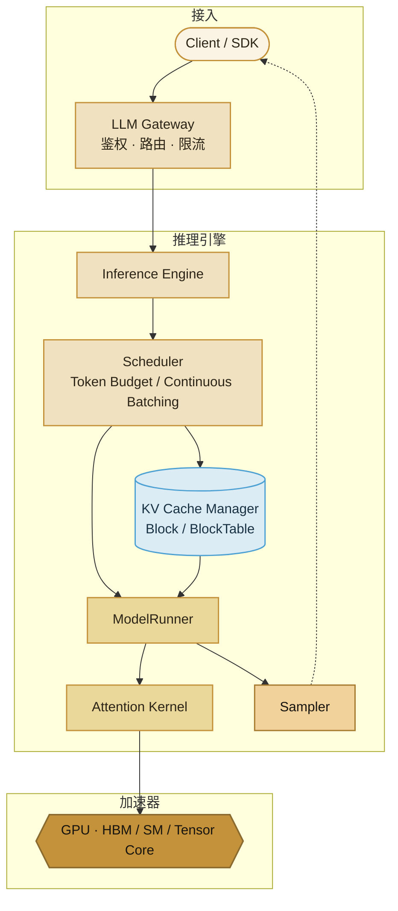
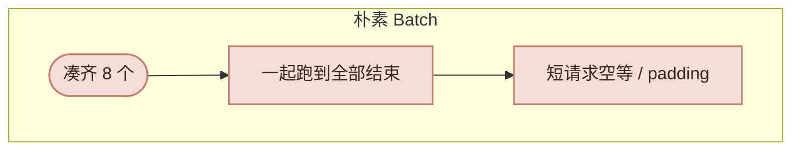
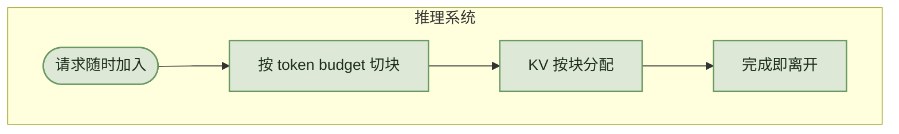
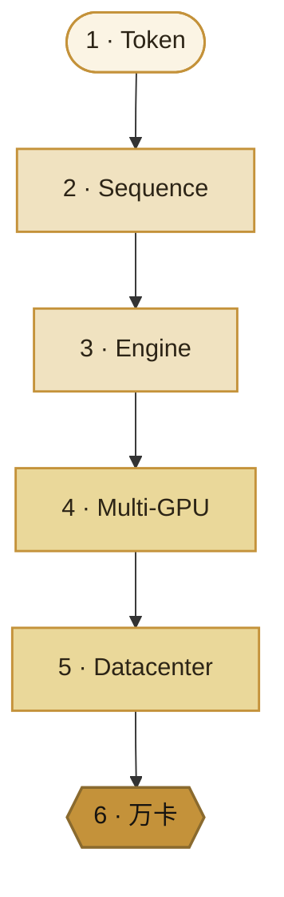

import ChapterMeta from "../../components/ChapterMeta.astro";

<ChapterMeta
  section="0"
  difficulty={1}
  readingTime={18}
  next={{ href: "/01-transformer/01-generate-one-token/", title: "大模型如何生成一个 Token" }}
/>

## 本章目标

本章解决的问题：**调用一次 LLM API 时，系统里有哪些层？为什么“把模型算快一点”解决不了线上推理？后面该按什么顺序读？**

读完应能：画出客户端到 GPU 的栈；用手算 70B 的权重和 KV；分清 TTFT 与 TPOT；知道自己在 token / 引擎 / 集群 哪一级。

---

## 1. 为什么需要这个东西

这几行能跑，但把真正昂贵的部分都藏起来了：

```python
stream = client.chat.completions.create(
    model="llama-3.1-70b-instruct",
    messages=[{"role": "user", "content": "用三句话解释 KV Cache"}],
    stream=True,
)
```

为什么第一个字要等几百毫秒，后面却一个一个往外蹦？为什么同样 70B，有人一张卡放不下，有人八张卡能跑几十路？为什么两个请求绑成普通深度学习 batch，短的要给长的买单？

如果你只看成 `model.generate()`，后面所有优化都会变成黑盒名词。先把角色分开。

:::tip[💡 核心概念]
推理系统不是模型本身。模型是其中一层计算；系统还要管请求、显存、调度、批处理和扩缩容。
:::

:::caution[⚠️ 常见误区]
“推理优化 = 写更快的 CUDA。”Kernel 很重要，但它只是一层。线上事故更多来自排队、KV 碎片、batch 策略和过载。
:::

---

## 2. 核心概念

**栈。** 一次对话像餐厅：顾客是客户端，前台是 Gateway，排号是 Scheduler，砧板位是 KV，主厨是 ModelRunner + GPU。一次请求穿过四层：Serving Platform → Inference Engine → 模型计算 → 硬件。生产路径几乎总是：

`HTTP` → `Tokenizer` → `队列` → `Scheduler` → `GPU forward` → `Sampler` → `流式返回`

vLLM、SGLang、TensorRT-LLM 产品形态不同，这条链是共用的。**Engine 不是平台，平台也不是 Kernel。**

**时间。** 一个在线请求：

$$
T = T_{\text{queue}} + T_{\text{prefill}} + N_{\text{out}} \times T_{\text{decode}}
$$

| 符号 | 含义 |
| --- | --- |
| $T_{\text{queue}}$ | 进引擎前排队 |
| $T_{\text{prefill}}$ | 整段 Prompt 一次算完，产出第一个 token |
| $N_{\text{out}}$ | 生成的输出 token 数，事先不知道 |
| $T_{\text{decode}}$ | 再生成 **一个** token 的平均时间 |

四件事实让它变成系统问题：Prefill 与 Decode 瓶颈不同；$N_{\text{out}}$ 未知；KV 随已生成长度涨，会挤掉别的请求；GPU 要凑 batch 才划算，但请求到达是随机的。所以会出现 Scheduler、Continuous Batching、Chunked Prefill、Paged KV——它们是推论，不是功能清单。

**用户指标**（Serving 口径；是否含 tokenize / 排队因系统而异）：

| 指标 | 全称 | 用户感觉到的是 | 系统里主要在做什么 |
| --- | --- | --- | --- |
| TTFT | Time To First Token | 按下发送后，**第一个字**要等多久 | 排队 + Prefill |
| TPOT | Time Per Output Token | 之后**每多一个字**平均再等多久 | 一步 Decode |
| ITL | Inter-Token Latency | 相邻两个字的单次间隔 | TPOT 常是它的平均 |
| Throughput | 吞吐 | 系统整体忙不忙 | 不是“我这条会不会快” |

定义见 [NVIDIA NIM 延迟指标](https://docs.nvidia.com/nim/large-language-models/latest/observability.html)（Last verified: 2026-09-03）。

**尺度。** 同一个 $x_t \sim p(\cdot\mid x_{<t})$，每升一级正确性不变，约束换一套：

| 尺度 | 新约束 |
| --- | --- |
| Token | 词表、温度、停止符 |
| Sequence | Prefill / Decode、KV 增长 |
| Engine | 多请求 iteration、分页 |
| 多 GPU | NVLink、AllReduce |
| 机房 | 路由、扩缩容 |
| 万卡 | 网络、故障、长尾、PD 分离 |

万卡不是 10000 张卡各跑一个 `generate()`。调度至少有三层：token、副本、全局。

---

## 3. 工作原理

**一次流式请求：** Gateway 校验 → Tokenizer → Engine 建 Request → Scheduler 决定本轮算谁、算多少 token → KV 按块分配 → ModelRunner 组 batch 跑 Transformer → Sampler 出一个 token → 流回客户端；未结束则留下一轮 Decode。关键是第 4–6 步在许多请求之间反复发生。

**朴素系统如何失败：** FIFO 凑满 `batch=8` 才开跑；长短 Prompt 绑在一起 Prefill；一起 Decode 直到最慢的结束；KV 按最大长度预留。短请求空等、padding、显存浪费。

Orca（OSDI 2022）把加入/离开 batch 做到 **iteration 级**；vLLM PagedAttention（SOSP 2023）不再按最大长度连续预留 KV。这是调度和虚拟内存，不是新的模型算法。

---

## 4. 架构图



<div class="arch-compare">





</div>



---

## 5. 数学原理

GQA 模型的 KV 体积：

$$
M_{\text{KV}} = 2 \times L \times H_{\text{kv}} \times d_h \times S \times B \times b_{\text{dtype}}
$$

| 符号 | 含义 | Llama 3.1 70B |
| --- | --- | --- |
| $2$ | K 与 V 各一份 | |
| $L$ | 层数 | 80，`num_hidden_layers` |
| $H_{\text{kv}}$ | KV 头数 | 8，`num_key_value_heads` |
| $d_h$ | 头维度 | $8192/64=128$ |
| $S$ | 当前序列长 | prompt + 已生成 |
| $B$ | 同时驻留的请求 | running batch |
| $b_{\text{dtype}}$ | 每元素字节 | BF16 = 2 |

代入 $S=8192,B=1$：$M_{\text{KV}}=2.5$ GiB。权重 $M_w \approx 70\times10^{9}\times 2$ B $\approx 130.4$ GiB。超参见 [Llama 3 Table 3](https://arxiv.org/abs/2407.21783)。公式不含激活、碎片、通信缓冲。

| 场景 | 权重 | KV |
| --- | --- | --- |
| 1 × 8K | ≈130.4 GiB | 2.5 GiB |
| 8 × 8K | 同上 | 20 GiB |
| 1 × 128K | 同上 | 40 GiB |

权重几乎是常数；KV 随 $S$、$B$ 线性涨。70B 尽管比教学 7B-like 更大，GQA 把 KV 头从 64 砍到 8，同样 `4×1024` 的 KV 反而是 1.25 GiB 对 2.0 GiB。容量规划不能只看参数量。

全书手算优先用：$B=4,S=1024,d_{\text{model}}=4096,H=32,d_h=128$，对照 Llama 3.1 70B 的 $L=80,H_q=64,H_{kv}=8,d_{\text{model}}=8192$。

Prefill 与 Decode 同尺寸下一层 Attention 的 score+AV，FLOPs 大约差一个序列长度倍数（教学 1024 vs 1 → 约 1000 倍），但 Decode 仍要按历史长度读 KV。**快慢不能用一个 FLOPs 数字概括。**

---

## 6. 代码实现

教学计数器：`examples/ch00/kv_cache_memory.py`。**不是** vLLM 源码。

```python
def kv_cache_bytes(spec, sequence_length, batch_size=1):
    return (
        2 * spec.num_layers * spec.num_kv_heads * spec.head_dim
        * sequence_length * batch_size * spec.dtype_bytes
    )
```

```bash
python3 examples/ch00/kv_cache_memory.py
python3 -m unittest tests.test_ch00_ch01 -v
```

`min_gpus_for_weights(70e9)` 返回 2 只是权重下界。生产 70B BF16 常用 TP=4 或 8，还要放 KV、激活、NCCL 缓冲。

---

## 7. 一个完整例子

Llama 3.1 70B BF16，单请求峰值 8K，H100 80GB 只比大小：

1. 权重 ≈ 130.4 GiB，一张 80GB 卡放不下，必须 TP 或量化。
2. KV @ 8K / batch=1 = 2.5 GiB；batch=8 则 20 GiB。
3. TP=2 时每卡权重约 65 GiB，再加上 KV 和激活，80GB 仍然很紧。

**第一道墙是权重，第二道墙是 KV 随并发和上下文上涨。** 这不是调一个 API 参数能消掉的。

---

## 8. 性能分析

Prefill 一次吃完整段 Prompt，容易把 **算力** 打满；Decode 每步只出一个 token，却反复读权重和 KV，容易被 **HBM 带宽** 卡住。TTFT 差，先看排队还是 Prefill；TPOT 差，先看 Decode 的 batch 与 KV；吞吐差，先问 batch、KV 碎片还是多卡通信。

吞吐可以靠更大 batch 堆出来，同时把 TTFT 打爆。单请求最优（batch=1）往往让 GPU 空转。升级尺度前先写清：要优化的是哪一级的计算、显存、通信还是调度。

---

## 9. 工程实现

| 层 | 典型实现 | 本书位置 |
| --- | --- | --- |
| 单条 / 实验 | Hugging Face `generate()` | 第一篇 |
| 引擎内调度与分页 | vLLM / SGLang / TensorRT-LLM | 第四–六篇 |
| 长 Prefill 阻塞 Decode | Chunked Prefill；PD 分离 | 第四、十一篇 |
| 多模型、副本 | Gateway、Router、GPU 池 | 第十二篇 |
| 万卡 | 全局路由、故障域、KV 传输 | 第十五篇 |

三级调度不要塞进同一个进程。教学脚本、第五篇 Mini-vLLM、生产框架必须分开标注；前两者都不能说成 vLLM。

---

## 10. 源码分析

:::note[🔎 源码]
Last verified: 2026-09-03。vLLM V1 的职责边界，不是行号承诺。
:::

| 职责 | 位置 |
| --- | --- |
| HTTP | `vllm/entrypoints/openai/api_server.py` |
| 忙循环 | `EngineCore`：`schedule()` → 执行 → `update_from_output()` |
| 调度 | `vllm/v1/core/sched/scheduler.py` |
| KV | `vllm/v1/core/kv_cache_manager.py` |
| 执行 | `gpu_model_runner.py` |

教学抽象是 `Engine → Scheduler → BlockManager → ModelRunner → Sampler`。这是职责对应，不是五个同名类。机房级路由不在 `scheduler.py` 里。第六篇再精读。

---

## 11. 实验

```bash
python3 examples/ch00/kv_cache_memory.py
```

应看到 8B @ 8K ≈ 1 GiB，70B @ 8K = 2.5 GiB，70B @ 128K = 40 GiB。把 70B 的 KV 头从 8 改成 64（假装没有 GQA），8K KV 变成 20 GiB。

过关（不看笔记）：一次 Chat API 经过哪些层？70B BF16 权重大约多少？为什么静态 batch 不适合 LLM？Prefill 的 Attention FLOPs 为什么大约是 Decode 的 $S$ 倍？

---

## 12. 常见误区

1. **“推理系统 = 调用 vLLM。”** vLLM 是引擎。限流、多模型、跨机房不在引擎里。
2. **“模型越大只是算得越慢 / OOM 就是模型太大。”** 70B 常常先放不下权重；放得下之后，许多 OOM 是 KV 随并发涨出来的。
3. **“KV 是可选优化 / Decode 计算量小所以一定快。”** 不用 KV 就要重算历史；计算量小加上访存量大，就是带宽瓶颈。
4. **“万卡 = 单卡优化 × 10000；DP 和 TP 一样。”** 网络和故障是新的时间尺度。TP 切一个模型，DP 复制一个模型。
5. **“先把 vLLM 跑起来 / Mini-vLLM 可当生产引擎。”** 前者是用户教程，后者是教学引擎。
6. **“可以跳过 KV 与 Scheduler 去谈万卡。”** 可以跳读，这条不能跳。

---

## 13. 本章小结

1. LLM 产品是系统，不是单次 `forward`。
2. 栈从 Gateway、Engine、Scheduler、KV、Runner 落到 GPU。
3. 延迟 = 排队 + Prefill + $N$ 步 Decode。TTFT 看第一个字，TPOT 看之后每个字。
4. 70B BF16 权重约 130 GiB；8K 单请求 KV 是 2.5 GiB，随 batch 与上下文线性涨。
5. Prefill 吃算力，Decode 吃带宽。静态 batch 会空等和浪费 KV。
6. 同一个 token 公式在六个尺度上变成六种系统。GQA 会改写 KV。
7. vLLM V1 的主循环是 schedule / execute / update。
8. 全书主链：模型计算 → KV → 调度 → GPU → Mini-vLLM → vLLM → 集群。现在进入第一篇。

---

## 14. 下一章

下一章把 $p(x_t\mid x_{<t})$ 拆成可执行步骤：Tokenizer、Embedding、Transformer、Logits、Sampling，并跑一个能打印张量的玩具模型。第一篇不讲 FlashAttention 和 PagedAttention。
