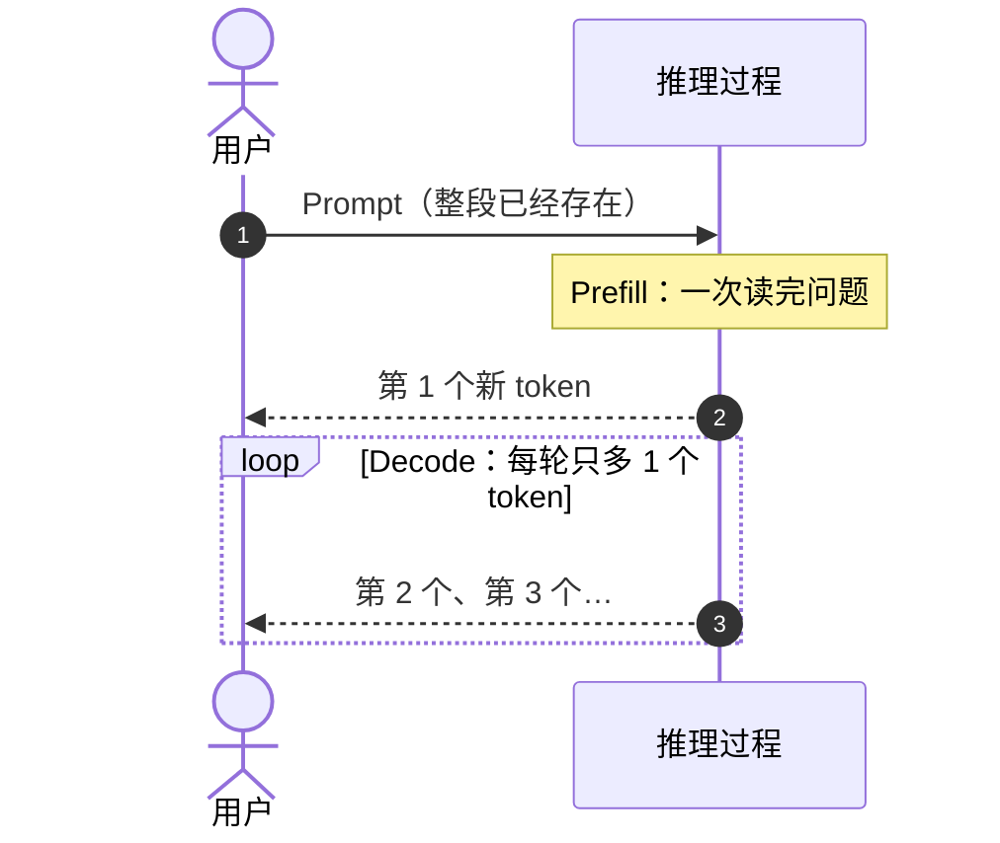
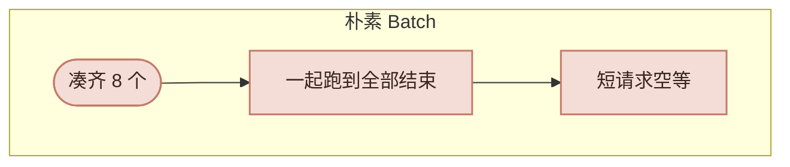
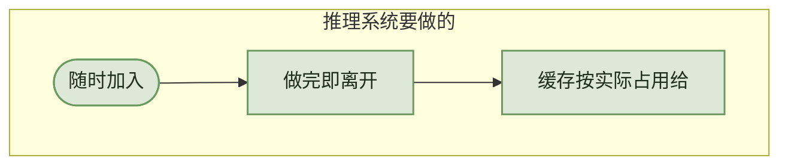
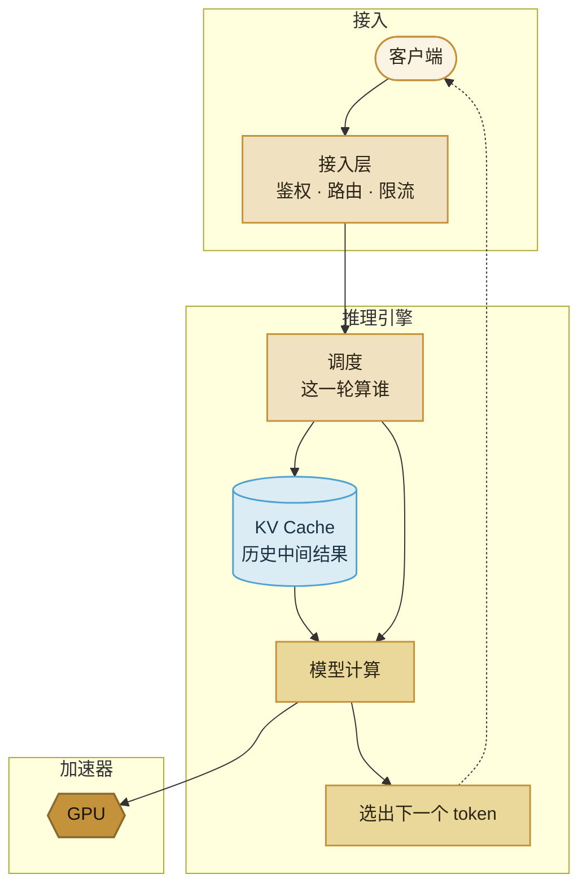
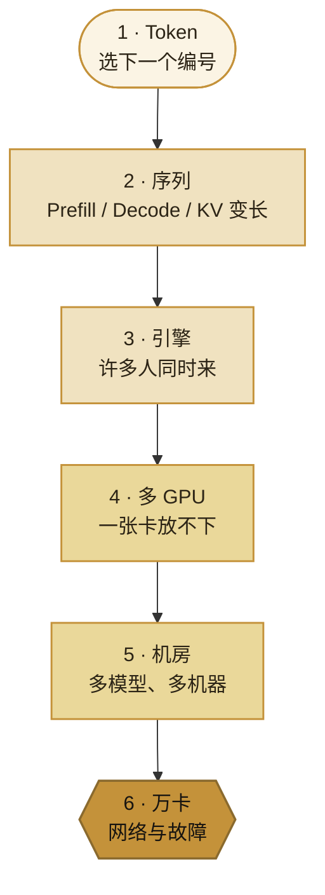

import ChapterMeta from "../../components/ChapterMeta.astro";

<ChapterMeta
  section="0"
  difficulty={1}
  readingTime={24}
  next={{ href: "/01-transformer/01-generate-one-token/", title: "大模型如何生成一个 Token" }}
/>

## 本章目标

本章解决的问题：**大模型推理到底在算什么？为什么线上服务不是调用一次 `generate()` 就结束？后面该按什么顺序读？**

读完应能：用自己的话区分训练和推理；解释为什么回答只能一个小块一个小块往外蹦；指出读问题和写回答不是同一种活；说明缓存历史、服务许多人，分别难在哪里；知道自己卡在全书哪一级。

本篇会按这个顺序带出词，前面没出现的名字先当它不存在：

训练 / 推理 → token → 自回归 → Prefill / Decode → KV Cache → 引擎与调度 → TTFT / TPOT → 显存的两道墙

第一篇才拆 Tokenizer、Transformer 内部和采样公式。GQA、分页、多卡切分、vLLM 文件路径放到更后面。

---

## 1. 先分清：训练和推理

你跟 ChatGPT 一类产品说话时，模型几乎不在学习。它用已经训练好的参数，根据你刚发的内容，算出后面该说什么。这一次计算叫 **推理（inference）**。

**训练**是另一件事：用海量文本改参数，离线、样本整齐、可以凑很大的 batch。工厂流水线和高峰期窗口叫号不是同一种调度。

这本书几乎全部在讲推理：一个请求进来之后，系统怎样把它变成可服务、可并发、最后能扩到很多卡的计算。

:::tip[💡 核心概念]
推理系统不是模型本身。模型是其中一层计算；系统还要管请求怎么进来、中间结果怎么放、许多人怎么共用 GPU。
:::

:::caution[⚠️ 常见误区]
“会调用 API / 会写 `model.generate()` 就是会推理。”那只看到了柜台。柜台后面还有读入、计算、缓存、排队。
:::

---

## 2. 模型吐出的不是整段话，是 token

用户看见的是字。系统内部的原子单位叫 **token**：词表里的一个编号，不是“一个汉字”或“一个英文单词”。

粗略直觉：

- `"Hello"` 常常是 **一个** token，不是 5 个字母。
- `"KV Cache"` 可能被切成几个编号。
- 中文一个字有时是一个 token，有时几个字拼成一个，有时一个字被拆开。

具体怎么切，第一篇用 Tokenizer 演示。现在只要记住一件事：**生成循环每走一轮，只新产出一个 token。** 流式界面上“一个字一个字出来”，是这个事实的用户可见后果，不是前端动画。

---

## 3. 下一个 token 只能看见已经有的东西

当代聊天模型是 **自回归** 的：它不写段落，只回答“已知前面这些编号，下一个最可能是谁”。选出一个，粘到后面，再问一次。

像手机输入法：已有“今天天气”，它给“很 / 真 / 不”打分；你选了“很”，它再对“今天天气很”打分。模型的候选集是十万级的词表，但规则一样。

所以系统 **不能** 一次把整段回答算完。第二个 token 在第一个被选出之前还不存在。这就是流式输出的根因。

教学示意（不是引擎，也不是 vLLM）：

```python
ids = tokenize("用三句话解释 KV Cache")
while not should_stop(ids):
    logits = model.forward(ids)   # 根据已经有的编号打分
    next_id = sample(logits)      # 选出 1 个编号
    ids.append(next_id)           # 粘回去，再问下一轮
    stream_out(detokenize(next_id))
```

第一篇会把 `forward` 和 `sample` 拆开，并打印张量。这里只建立循环。

---

## 4. 读你的问题，和写它的回答，是两段活

请求里其实有两段文本，性质不同：

| 这段 | 谁写的 | 系统面对它时 |
| --- | --- | --- |
| **Prompt**（你的问题、系统设定、对话历史） | 已经写好 | 可以一次读完 |
| **生成**（模型要说的新内容） | 还不存在 | 必须一个 token 一轮 |

因此一次对话天然分成两段活：

1. **先把 Prompt 全部读完**，才能吐出第一个新 token。
2. **之后每多一个 token**，都是在已有序列末尾再走一步。

这两段有名字：**Prefill** 和 **Decode**。


```mermaid
sequenceDiagram
  autonumber
  actor U as 用户
  participant E as 推理过程

  U->>E: Prompt（整段已经存在）
  Note over E: Prefill：一次读完问题
  E-->>U: 第 1 个新 token
  loop Decode：每轮只多 1 个 token
    E-->>U: 第 2 个、第 3 个…
  end
```

为什么要分：读整段 Prompt 时，模型可以同时处理很多已有位置，计算更饱满，用户却在干等第一个字；写回答时每步只新增 1 个 token，计算变少，但要把已经读过、已经写过的历史反复用上。**快慢不能用同一个“算了多少次”概括。** 第二篇用数字拆开。

:::tip[💡 核心概念]
Prefill 产出的是 **第一个** 新 token；Decode 产出的是 **之后每一个**。用户卡住的位置不同，系统里查的层也不同。
:::

---

## 5. 每多一个字，为什么不把前面全部重算一遍

看上一节的循环：朴素写法每轮都对 **整段** `ids` 做 `forward`。第 100 个新 token 时，问题和第二到第九十九个回答会被从头再算一遍。结果不变，电费会变。

正确做法是：Prompt 和已经生成的 token，它们在模型里用过的中间结果 **留下来**，下一轮只为最新那个 token 做新计算，查阅旧笔记。这份留下来的东西叫 **KV Cache**。

现在还不需要知道 K、V 是 Attention 里哪两个矩阵。只要建立这张对照：

| 做法 | 下一轮在干什么 | 后果 |
| --- | --- | --- |
| 不缓存 | 历史从头算 | 越写越慢，贵在重复劳动 |
| 缓存 KV | 查阅旧笔记，只算新 token | 显存随已有长度涨 |

:::caution[⚠️ 常见误区]
“KV Cache 是可选项 / 缓存模型输出就等于 KV。”不用它，Decode 就要重算历史。缓存的也不是最终那个字，而是后面查阅历史时还要用的中间结果。第一篇、第二篇会指到具体张量。
:::

---

## 6. 一个人聊天是 `generate()`，许多人同时聊是系统

单请求、单卡、实验室脚本，上面的循环就够用。产品上是许多人同时打字：有人 Prompt 很长、只要短标签；有人 Prompt 很短、要写八百个 token；到达时间随机；谁先结束事先不知道。

如果按普通深度学习那样绑成静态 batch：

1. 凑满 8 个才开跑——先到的 7 个空等。
2. 长短 Prompt 绑在一起读——短的给长的买单。
3. 一起写到最慢的那个结束——先写完的位置空着占位。
4. 缓存按“可能的最大长度”整段预留——短请求浪费显存，新请求进不来。

这时把某一层矩阵乘再快 20%，用户感知也可能不变。瓶颈在 **谁和谁绑在一起、显存放得下谁**，不在“模型聪明一点”。

推理引擎要做的事可以先说成一句人话：让请求 **做完就离开**，新请求 **随时可以加入**，缓存 **按实际用到的长度给**，不要按理论上限一次扣光。

<div class="arch-compare">


```mermaid
flowchart TB
  classDef naive fill:#f3ddd6,stroke:#c47a6a,color:#3a241e,stroke-width:1.5px
  subgraph Naive["朴素 Batch"]
    N1(["凑齐 8 个"]):::naive --> N2["一起跑到全部结束"]:::naive
    N2 --> N3["短请求空等"]:::naive
  end
```


```mermaid
flowchart TB
  classDef good fill:#dde8d6,stroke:#6a9a62,color:#1e2e1a,stroke-width:1.5px
  subgraph System["推理系统要做的"]
    S1(["随时加入"]):::good --> S2["做完即离开"]:::good
    S2 --> S3["缓存按实际占用给"]:::good
  end
```

</div>

这些做法后面会有工程名字（iteration 级组 batch、按块管理 KV）。现在先记住推论，不要背功能清单。第四篇、第六篇再展开。

---

## 7. 一次请求穿过哪几层

到这里，栈上的角色才有意义。一次对话像餐厅：

| 角色 | 系统里是谁 | 它不管什么 |
| --- | --- | --- |
| 顾客 | 你的程序 / SDK | 不管厨房怎么炒 |
| 前台 | 接入层：鉴权、限流、选哪个模型 | 不管下一个 token 怎么算 |
| 排号 | 引擎里的调度：这一轮算哪些请求 | 不管 GPU 指令 |
| 砧板位 | KV Cache：历史中间结果 | 不管 HTTP 状态码 |
| 主厨与炉灶 | 模型计算 + GPU | 不管用户配额 |

生产路径几乎总是：

`HTTP` → 文本切成 token → 排队 → 调度 → GPU 上算一轮 → 选出 1 个 token → 流式返回

vLLM、SGLang、TensorRT-LLM 产品形态不同，这条链是共用的。**引擎不是平台，平台也不是某一层 GPU 指令。**


```mermaid
flowchart TB
  classDef client fill:#fbf4e4,stroke:#c4923a,color:#2c2416,stroke-width:1.5px
  classDef control fill:#f0e2c0,stroke:#c4923a,color:#2c2416,stroke-width:1.5px
  classDef memory fill:#dcecf5,stroke:#4ea1d3,color:#1a3344,stroke-width:1.5px
  classDef compute fill:#ead89a,stroke:#c4923a,color:#2c2416,stroke-width:1.5px
  classDef device fill:#c4923a,stroke:#8a6a2e,color:#171410,stroke-width:1.8px

  subgraph Access["接入"]
    Client(["客户端"]):::client
    GW["接入层<br/>鉴权 · 路由 · 限流"]:::control
  end

  subgraph Engine["推理引擎"]
    Sched["调度<br/>这一轮算谁"]:::control
    KV[("KV Cache<br/>历史中间结果")]:::memory
    Runner["模型计算"]:::compute
    Sam["选出下一个 token"]:::compute
  end

  subgraph Device["加速器"]
    GPU{{"GPU"}}:::device
  end

  Client --> GW --> Sched
  Sched --> KV
  Sched --> Runner
  KV --> Runner
  Runner --> GPU
  Runner --> Sam
  Sam -.-> Client
```

---

## 8. 用户真正感觉到的三个数字

一个在线请求的时间可以先写成：

$$
T = T_{\text{queue}} + T_{\text{prefill}} + N_{\text{out}} \times T_{\text{decode}}
$$

| 符号 | 含义 | 现在对应哪一节 |
| --- | --- | --- |
| $T_{\text{queue}}$ | 还没轮到你 | 第 6 节：别人占着 GPU / 显存 |
| $T_{\text{prefill}}$ | 读完 Prompt、写出第一个新 token | 第 4 节前半 |
| $N_{\text{out}}$ | 还要写多少个 token | 事先不知道 |
| $T_{\text{decode}}$ | 再写 **一个** token 的平均时间 | 第 4 节后半 |

用户侧常用三个口径（Serving 统计窗口因系统而异；是否含切词、排队要看实现）：

| 指标 | 全称 | 你感觉到的是 | 系统里主要在做什么 |
| --- | --- | --- | --- |
| TTFT | Time To First Token | 按下发送后，**第一个字**要等多久 | 排队 + Prefill |
| TPOT | Time Per Output Token | 之后**每多一个字**平均再等多久 | 一步 Decode |
| Throughput | 吞吐 | 整个服务忙不忙 | 不是“我这条会不会快” |

定义见 [NVIDIA NIM 延迟指标](https://docs.nvidia.com/nim/large-language-models/latest/observability.html)（Last verified: 2026-09-03）。

吞吐可以靠同时服务更多人堆出来，同时把 TTFT 打爆。单请求最优（一次只服务一个人）往往让 GPU 空转。优化前先问：要改的是第一个字、后面每个字，还是整机产出。

---

## 9. 两道显存墙

GPU 上先要放得下两类东西，再谈快慢。

**第一道墙：权重。** 参数几乎不随对话变。数量级：

$$
M_{\text{w}} \approx P \times b_{\text{dtype}}
$$

| 符号 | 含义 | Llama 3.1 70B、BF16 |
| --- | --- | --- |
| $P$ | 参数个数 | 约 $70\times 10^{9}$ |
| $b_{\text{dtype}}$ | 每个参数几个字节 | 2 |

$70\times 10^{9}\times 2$ B $= 140$ GB $\approx 130.4$ GiB。一张 80GB 的卡 **只比大小也放不下** 70B BF16 权重。必须切到多张卡，或压缩参数（量化）。第九篇、第八篇再讲怎么切、怎么压。本章只要接受：第一道墙经常是权重，不是“模型算得慢”。

**第二道墙：KV Cache。** 第 5 节留下的笔记，份数随两件事线性涨：已经出现过的 token 数 $S$（Prompt + 已生成），以及同时占着显存的请求数 $B$。

GQA 模型（Llama 3.1 70B 属于这一类；设计细节第二篇再讲）的体积：

$$
M_{\text{KV}} = 2 \times L \times H_{\text{kv}} \times d_h \times S \times B \times b_{\text{dtype}}
$$

按出现顺序读符号：

| 符号 | 这一项在说什么 | Llama 3.1 70B |
| --- | --- | --- |
| $2$ | Key 一份、Value 一份 | |
| $L$ | 每一层都要记 | 80 |
| $H_{\text{kv}}\times d_h$ | 每层、每个 token 要记多宽 | $8\times 128$ |
| $S$ | 现在序列有多长 | 例如 8192 |
| $B$ | 同时驻留多少个请求 | 例如 1 |
| $b_{\text{dtype}}$ | 每个数字几个字节 | BF16 = 2 |

代入 $S=8192,B=1$：$M_{\text{KV}}=2.5$ GiB。超参见 [Llama 3 Table 3](https://arxiv.org/abs/2407.21783)。公式不含激活、碎片、通信缓冲。

| 场景 | 权重 | KV |
| --- | --- | --- |
| 1 路 × 8K | ≈130.4 GiB | 2.5 GiB |
| 8 路 × 8K | 同上 | 20 GiB |
| 1 路 × 128K | 同上 | 40 GiB |

权重几乎是常数；KV 随 $S$、$B$ 涨。如果把 70B 的 $H_{\text{kv}}$ 从 8 改成 64（假装每层按 64 个头全记），同样 8K 单请求 KV 会变成 20 GiB。**容量规划不能只看参数量。** 为什么 70B 可以只记 8 个 KV 头，第二篇讲 GQA。

教学手算后文统一用：$B=4,S=1024,d_{\text{model}}=4096,H=32,d_h=128$，对照 Llama 3.1 70B 的 $L=80,H_q=64,H_{kv}=8,d_{\text{model}}=8192$。

---

## 10. 同一件事，升一层就换成另一套约束

生成公式始终是“根据已经有的 token 预测下一个”。每升一层，**正确性不变，约束换一套**：


```mermaid
flowchart TB
  classDef client fill:#fbf4e4,stroke:#c4923a,color:#2c2416,stroke-width:1.5px
  classDef control fill:#f0e2c0,stroke:#c4923a,color:#2c2416,stroke-width:1.5px
  classDef compute fill:#ead89a,stroke:#c4923a,color:#2c2416,stroke-width:1.5px
  classDef device fill:#c4923a,stroke:#8a6a2e,color:#171410,stroke-width:1.8px

  T(["1 · Token<br/>选下一个编号"]):::client --> S["2 · 序列<br/>Prefill / Decode / KV 变长"]:::control
  S --> E["3 · 引擎<br/>许多人同时来"]:::control
  E --> MG["4 · 多 GPU<br/>一张卡放不下"]:::compute
  MG --> DC["5 · 机房<br/>多模型、多机器"]:::compute
  DC --> WK{{"6 · 万卡<br/>网络与故障"}}:::device
```

万卡不是 10000 张卡各跑一个 `generate()`。调度至少有三层：下一个 token、这一台机器上的许多请求、机房之间的路由。可以跳读，**不能跳过 KV 与调度直接谈万卡**。

---

## 11. 全书怎么读

主链：**先看清一个 token 怎么算 → 再看 Prefill / Decode / KV → GPU → 调度 → 自己写一个小引擎 → 对照生产引擎 → 集群。**

| 你现在的问题 | 去哪一篇 |
| --- | --- |
| 编号、向量、打分、采样是怎么接上的 | 第一篇 |
| 为什么 Prefill 和 Decode 快慢完全不同；KV 怎么算 | 第二篇 |
| GPU 上 Attention 为什么会变成带宽问题 | 第三篇 |
| 许多人如何组在一起跑 | 第四篇 |
| 自己实现一个能跑的教学引擎 | 第五篇 |
| 对照 vLLM 的模块边界 | 第六篇 |
| Kernel、量化、多卡 | 第七–九篇 |
| 接入层、容量、万卡 | 第十二–十五篇 |

读法：问题 → 直觉 → 图 → 数学 → 代码 → 实验 → 源码 → 性能 → 总结。教学脚本、第五篇 Mini-vLLM、生产框架会分开标注；前两者都不能说成 vLLM。

---

## 12. 代码与实验

教学计数器：`examples/ch00/kv_cache_memory.py`。**不是** vLLM 源码。它把第 9 节的乘法写成函数：

```python
def kv_cache_bytes(spec, sequence_length, batch_size=1):
    return (
        2 * spec.num_layers * spec.num_kv_heads * spec.head_dim
        * sequence_length * batch_size * spec.dtype_bytes
    )
```

```bash
python3 examples/ch00/kv_cache_memory.py
python3 -m unittest tests.test_ch00_ch01 -v
```

先看打印里的 `KV Cache` 和 `Weights` 两段：8B @ 8K ≈ 1 GiB，70B @ 8K = 2.5 GiB，70B @ 128K = 40 GiB，70B BF16 权重 ≈ 130.4 GiB。后面的 Attention FLOPs 是给第一篇、第二篇用的尺子，本篇不必先读懂。

过关（不看笔记）：

1. 推理和训练差在哪？
2. 为什么不能一次把整段回答算完？
3. Prefill 和 Decode 各在干什么？用户分别感觉到什么？
4. KV Cache 避免的是哪一种浪费？它为什么会把显存问题变成调度问题？
5. 70B BF16 权重为什么一张 80GB 卡放不下？KV 在 8K 和 128K 下差多少？
6. 静态凑满 8 个再跑，短请求会发生什么？

---

## 13. 常见误区

1. **“推理系统 = 调用 vLLM / 写更快的 CUDA。”** vLLM 是引擎。限流、多模型、跨机房不在引擎里。Kernel 是一层；线上事故更多来自排队、缓存占满和 batch 绑错人。
2. **“模型越大只是算得越慢 / OOM 就是模型太大。”** 70B 常常先放不下权重；放得下之后，许多 OOM 是 KV 随并发和上下文涨出来的。
3. **“KV 可关 / Decode 计算量小所以一定快。”** 关掉就要重算历史。计算量小、要反复读历史，后面会变成带宽问题。
4. **“先把 vLLM 跑起来就算读完；Mini-vLLM 可当生产引擎。”** 前者是用户教程，后者是教学引擎。
5. **“可以跳过 token、KV 与调度去谈万卡。”** 可以跳读，这条不能跳。

---

## 14. 本章小结

1. 训练改参数；推理用参数。这本书从推理开始。
2. 系统内部的原子单位是 token。生成每轮只新出一个。
3. 自回归：下一个 token 只能看见已经有的东西，所以必须流式。
4. Prefill 读完 Prompt、写出第一个新 token；Decode 写之后每一个。TTFT 看前者，TPOT 看后者。
5. KV Cache 避免 Decode 重算历史，同时让显存随长度和并发涨。
6. 许多人同时来时，静态 batch 会空等、绑错人、按最大长度浪费缓存。这是系统问题。
7. 70B BF16 权重约 130 GiB；8K 单请求 KV 是 2.5 GiB，128K 是 40 GiB。
8. 全书主链：一个 token → KV 与两段活 → GPU → 调度 → Mini-vLLM → vLLM → 集群。

---

## 15. 下一章

下一章把“选出下一个 token”拆成可执行步骤：文本怎样变成编号、编号怎样变成向量、向量怎样变成词表上的分数、分数怎样变成一个 id。会跑一个能打印张量的玩具模型。第一篇不讲 FlashAttention，也不讲分页。
