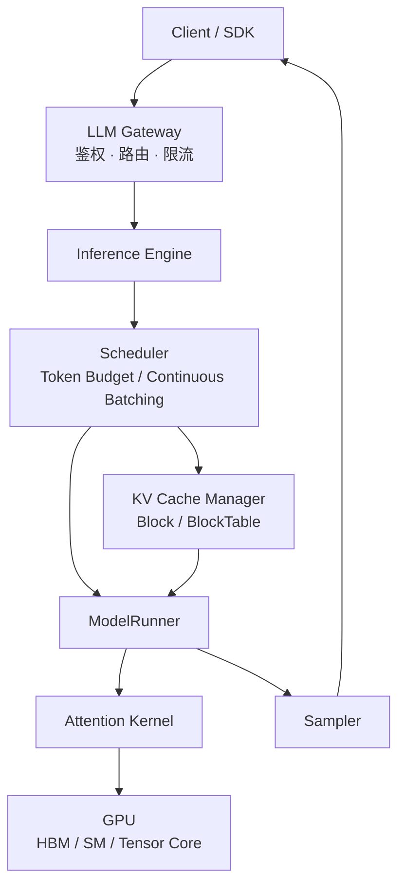
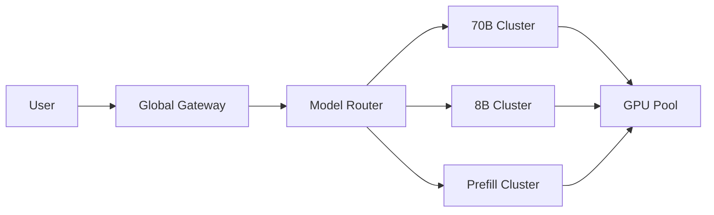

import ChapterMeta from "../../../components/ChapterMeta.astro";

<ChapterMeta
  section="0.1"
  difficulty={1}
  readingTime={22}
  next={{ href: "/00-introduction/02-systems-problem/", title: "为什么推理是一个系统问题" }}
/>

## 本章目标

本章解决的问题：**当你调用一次 LLM API 时，系统里到底有哪些层在工作？**

读完本章，读者应该能够：

- 画出从客户端到 GPU Kernel 的推理栈
- 区分模型权重、Tokenizer、Inference Engine 和 Serving Platform
- 用 Llama 3.1 70B 的数字说明为什么推理不是“跑一次 `forward()`”这么简单
- 指出 vLLM V1 里 EngineCore、Scheduler、Worker 大致对应哪一层

---

## 1. 为什么需要这个东西

假设你写了这样一段代码：

```python
from openai import OpenAI

client = OpenAI(base_url="http://localhost:8000/v1", api_key="none")
stream = client.chat.completions.create(
    model="llama-3.1-70b-instruct",
    messages=[{"role": "user", "content": "用三句话解释 KV Cache"}],
    stream=True,
)
for chunk in stream:
    print(chunk.choices[0].delta.content or "", end="")
```

这几行能跑，但把真正昂贵的部分都藏起来了：

- 为什么第一个字要等几百毫秒，后面却一个一个往外蹦？
- 为什么同样是 70B，有人一张卡都放不下，有人八张卡能跑几十路并发？
- 为什么加长 Prompt 会让排队爆炸，而不只是“算得久一点”？

如果你把 LLM 只看成 `model.generate()`，后面所有优化都会变成黑盒名词。全景图的作用，是先把角色分开。

:::tip[💡 核心概念]
推理系统不是模型本身。模型是其中一层计算；系统还要管请求、显存、调度、批处理和扩缩容。
:::

---

## 2. 核心概念

**直觉。** 把一次对话想成餐厅：

| 角色 | 系统组件 | 它不管什么 |
| --- | --- | --- |
| 顾客点餐 | 客户端 / SDK | 不管厨房怎么炒 |
| 前台接待 | API Gateway | 不管 Attention 怎么算 |
| 传菜与排号 | Scheduler | 不管 Tensor Core 指令 |
| 冰箱与砧板位 | KV Cache / BlockManager | 不管 HTTP 状态码 |
| 主厨 | ModelRunner + GPU Kernel | 不管用户配额 |

**模型。** 一次请求穿过四层：

1. **Serving Platform**：鉴权、路由、限流、多模型、多集群。
2. **Inference Engine**：把许多请求变成可以在 GPU 上执行的 batch。
3. **Model computation**：Transformer forward，产出下一个 token 的 logits。
4. **Hardware**：HBM、SRAM、Tensor Core、NVLink、IB。

**数学。** 本章只需要一个数量级公式，用来说明“系统”从哪里开始变难。对 grouped-query attention 模型：

$$
M_{\text{KV}} = 2 \times L \times H_{\text{kv}} \times d_h \times S \times B \times b_{\text{dtype}}
$$

**工程。** 生产路径几乎总是：

`HTTP` → `Tokenizer` → `Request 队列` → `Scheduler` → `GPU forward` → `Sampler` → `流式返回`

vLLM、SGLang、TensorRT-LLM 的产品形态不同，但这条链是共用的。

---

## 3. 工作原理

一次流式 Chat Completions 的执行顺序：

1. Gateway 校验模型名、配额、最大 token 数。
2. Tokenizer 把文本变成 token id。这一步在 CPU 上，通常不是瓶颈，但错误的 chat template 会直接毁掉质量。
3. Engine 创建 Request：记录 prompt 长度、已生成长度、停止条件。
4. Scheduler 决定：**这一轮 GPU 执行哪些请求、每个请求算多少 token**。
5. KV Cache 管理器给这些 token 分配块；不够就拒绝、抢占或等待。
6. ModelRunner 组 batch，跑一遍 Transformer。
7. Sampler 从最后位置的 logits 选出 1 个 token。
8. 把新 token 流回客户端；若未结束，Request 留在 running 队列，进入下一轮 Decode。

关键不是“模型很聪明”，而是第 4–6 步在几十、几百个请求之间反复发生。

---

## 4. 架构图



生产系统往往在 Gateway 之外再加一层：



第 0.3 节会把这条线从 1 个 token 拉到万卡。现在只要记住：**Engine 不是平台，平台也不是 Kernel。**

---

## 5. 数学原理

代入 Llama 3.1 70B 的官方超参（Grattafiori et al., 2024, Table 3）：

| 符号 | 含义 | 数值 |
| --- | --- | --- |
| $L$ | 层数 | 80 |
| $H_{\text{kv}}$ | KV 头数 | 8 |
| $d_h$ | 每头维度 $= 8192 / 64$ | 128 |
| $S$ | 序列长度 | 8192 |
| $B$ | batch | 1 |
| $b_{\text{dtype}}$ | BF16 字节 | 2 |

$$
\begin{aligned}
M_{\text{KV}}
&= 2 \times 80 \times 8 \times 128 \times 8192 \times 1 \times 2 \\
&= 2\,684\,354\,560 \ \text{B} \\
&= 2.5\ \text{GiB}
\end{aligned}
$$

权重侧用数量级估计：

$$
M_{\text{w}} \approx 70 \times 10^{9} \times 2\ \text{B} = 140\ \text{GB} \approx 130.4\ \text{GiB}
$$

:::note[📐 数学]
2.5 GiB 的 KV 看起来不大，但它随 $S$ 和 $B$ 线性涨。同一条 70B，128K 上下文单请求 KV 就是 40 GiB；8 路 8K 并发是 20 GiB。权重却几乎是常数。系统问题从这里开始：调度器要在“权重放得下”和“KV 放得下”之间做分配。
:::

公式不含：激活、CUDA Graph、碎片、通信缓冲。它只回答“KV 这一项有多大”。

---

## 6. 代码实现

下面是可运行的教学实现，对应 `examples/ch00/kv_cache_memory.py`。它不是 vLLM 源码。

```python
from dataclasses import dataclass

GIB = 1024 ** 3

@dataclass(frozen=True)
class ModelSpec:
    name: str
    num_layers: int
    num_q_heads: int
    num_kv_heads: int
    hidden_size: int
    dtype_bytes: int = 2

    @property
    def head_dim(self) -> int:
        return self.hidden_size // self.num_q_heads

def kv_cache_bytes(spec: ModelSpec, sequence_length: int, batch_size: int = 1) -> int:
    return (
        2 * spec.num_layers * spec.num_kv_heads * spec.head_dim
        * sequence_length * batch_size * spec.dtype_bytes
    )

LLAMA31_70B = ModelSpec("Llama 3.1 70B", 80, 64, 8, 8192)
assert kv_cache_bytes(LLAMA31_70B, 8192) == 2_684_354_560
```

运行：

```bash
python3 examples/ch00/kv_cache_memory.py
python3 -m unittest tests.test_ch00_ch01 -v
```

---

## 7. 一个完整例子

设定：

- 模型：Llama 3.1 70B，BF16
- 单请求，Prompt 4096 token，生成 4096 token，峰值上下文 8192
- GPU：H100 80GB 的显存预算（这里只比大小，不谈 PCIe 与功耗）

手算：

1. 权重 ≈ 130.4 GiB。一张 80GB 卡放不下，必须张量并行或量化。
2. KV @ 8K / batch=1 = 2.5 GiB。
3. 若 Engine 想跑 batch=8 的 8K 会话：KV = 20 GiB。
4. 粗算：TP=2 时每卡权重大约 65 GiB，再加上 20 GiB KV 和激活，80GB 仍然很紧。

结论已经是系统结论：**70B 的第一道墙是权重，第二道墙是 KV 随并发和上下文上涨。** 这不是调一个 API 参数能消掉的。

---

## 8. 性能分析

| 维度 | 这一层主要看什么 | 典型瓶颈 |
| --- | --- | --- |
| Compute | Prefill 的大 GEMM | Tensor Core 利用率 |
| Memory | Decode 读 KV、读权重 | HBM 带宽 |
| Communication | TP AllReduce、跨节点 PD | NVLink / IB |
| Scheduling | 哪些请求进入这一轮 | KV 块不够、token budget |

🚀 性能：全景阶段只要建立判断——延迟差，先问是 Gateway 排队、Prefill、Decode 还是采样；吞吐差，先问是 batch 太小、KV 碎片，还是多卡通信。

---

## 9. 工程实现

真实框架不会把上面四层做成一个 Python 函数：

- **Hugging Face `generate()`**：单进程、便于实验，调度很弱。
- **vLLM**：Engine 内做 continuous batching 与 paged KV。
- **SGLang**：在引擎里强调前缀复用与编程式控制流。
- **TensorRT-LLM**：更靠近编译与 Kernel 的部署栈。
- **生产平台**：在引擎前面加 Gateway、Router、GPU 池和自动扩缩。

同一套 Llama 权重，换一层包装，能力完全不同。

---

## 10. 源码分析

:::note[🔎 源码]
Last verified: 2026-09-03。以下是 vLLM V1 的模块边界，不是行号承诺。实现会变；读的是职责。
:::

| 职责 | 目录 / 类 | 调用关系 |
| --- | --- | --- |
| HTTP | `vllm/entrypoints/openai/api_server.py` | 把 OpenAI 协议变成引擎请求 |
| 引擎主循环 | `vllm/v1/engine/core.py` 中 `EngineCore` | `schedule()` → 执行 → `update_from_output()` |
| 调度 | `vllm/v1/core/sched/scheduler.py` | 决定本轮哪些 request、多少 token |
| KV | `vllm/v1/core/kv_cache_manager.py` | 按 block 分配，不按整段连续 tensor |
| 执行 | `vllm/v1/worker/gpu_model_runner.py` | 组 batch、跑模型、取 logits |
| Worker | `vllm/v1/worker/gpu_worker.py` | 一卡一进程，管显存与 forward |

教学抽象可以把它们画成 `Engine → Scheduler → BlockManager → ModelRunner → Sampler`。这是架构对应，不是说 vLLM 里一定有同名且同结构的五个类。

---

## 11. 实验

🔬 实验：不需要 GPU。

```bash
python3 examples/ch00/kv_cache_memory.py
```

预期看到：

```
Llama 3.1 8B: seq=8192 batch=1 ... (1.0000 GiB)
Llama 3.1 70B: seq=8192 batch=1 ... (2.5000 GiB)
Llama 3.1 70B: seq=131072 batch=1 ... (40.0000 GiB)
```

试着改：把 70B 的 `num_kv_heads` 从 8 改成 64（假装没有 GQA），8K KV 会变成 20 GiB。这就是后续 GQA 章节要解决的问题。

---

## 12. 常见误区

1. **“推理系统 = 调用 vLLM。”** vLLM 是引擎。限流、多模型路由、跨机房容灾都不在引擎里。
2. **“模型越大只是算得越慢。”** 70B 首先常常是放不下；放得下之后，Decode 还可能被带宽卡住。
3. **“KV Cache 是可选优化。”** 对自回归 Transformer，不用 KV 就要把历史重算一遍，Decode 会不可用。
4. **“一张图就能代表所有框架。”** 模块名字不同，但 Request / Scheduler / KV / Runner 这组职责几乎总是在。

---

## 13. 本章小结

1. LLM 产品是系统，不是单次 `forward`。
2. 栈从 Gateway、Engine、Scheduler、KV、Runner 一直落到 GPU Kernel。
3. 70B BF16 权重大约 140 GB，单卡通常放不下。
4. 70B 在 8K 上单请求 KV 是 2.5 GiB，随 batch 与上下文线性涨。
5. Prefill 和 Decode 会打到不同瓶颈，所以必须分层看。
6. vLLM V1 用 EngineCore 把调度和执行拆开。
7. 教学架构可以简化，但不能把简化数据结构说成框架源码。
8. 后面每一章都是在给这张全景图填实现。

---

## 14. 下一章

全景图解释了“有哪些层”。还没解释：**为什么这些层必须做成系统，而不能靠把模型写快一点解决。** 下一章用 TTFT、排队和 KV 增长说明推理是一个系统问题。
