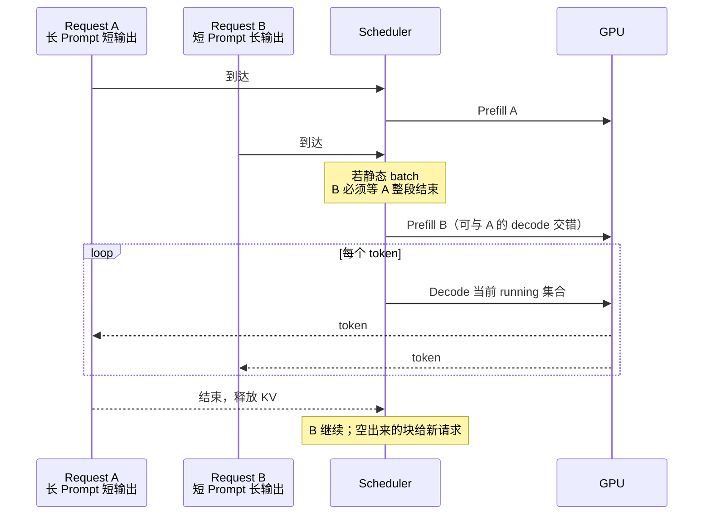
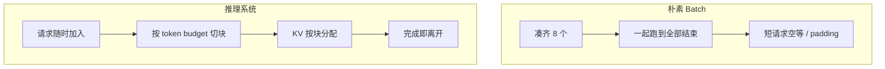

import ChapterMeta from "../../../components/ChapterMeta.astro";

<ChapterMeta
  section="0.2"
  difficulty={2}
  readingTime={24}
  prev={{ href: "/00-introduction/01-landscape/", title: "大模型推理系统全景" }}
  next={{ href: "/00-introduction/03-token-to-cluster/", title: "从一个 Token 到万卡集群" }}
/>

## 本章目标

本章解决的问题：**为什么“换一张更快的 GPU”或“换一个更快的 Kernel”仍然解决不了线上推理？**

读完本章，读者应该能够：

- 指出 LLM 请求的延迟由排队、Prefill、Decode 三段组成
- 解释静态 batch 为什么会浪费 GPU
- 说明 KV Cache 如何把显存问题变成调度问题
- 把 TTFT / TPOT / Throughput 对应到系统的不同层

---

## 1. 为什么需要这个东西

两个请求同时到达：

- A：Prompt 8K，只要再生成 8 个 token 的分类标签
- B：Prompt 32 token，要写 800 token 的长文

如果系统把它们绑成一个普通深度学习 batch：

- 必须等更慢的那个结束才能释放整个 batch
- A 的 8K Prefill 会拖住 B 的首字
- B 的长 Decode 会占着 KV，不让新的短请求进来

这时你即使把 Attention Kernel 再快 20%，用户感知也可能完全不变。因为瓶颈在**调度与资源耦合**，不在某一层矩阵乘。

:::caution[⚠️ 常见误区]
“推理优化 = 写更快的 CUDA。”Kernel 很重要，但它只是系统的一层。线上事故更多来自排队、KV 碎片、batch 策略和过载。
:::

---

## 2. 核心概念

**直觉。** 训练像工厂流水线：样本整齐、长度近似、可以大 batch。推理像高峰期的出租车调度：每单起点终点不同，有的只要开两分钟，有的要开一小时，还不能让早到的人空等。

**模型。** 一个在线请求从进队到结束，时间可以拆成：

$$
T = T_{\text{queue}} + T_{\text{prefill}} + N_{\text{out}} \times T_{\text{decode}}
$$

| 符号 | 含义 | 单位 | 谁决定它 |
| --- | --- | --- | --- |
| $T$ | 这次请求的端到端时间 | 秒 | 用户感知的总等待 |
| $T_{\text{queue}}$ | 进引擎前排队 | 秒 | Gateway / 限流 / 已有 running 请求 |
| $T_{\text{prefill}}$ | 处理完整 Prompt、产出首个 token 前的计算 | 秒 | Prompt 长度、GPU 算力；对应 TTFT 的计算部分 |
| $N_{\text{out}}$ | 生成的输出 token 数 | token | 用户、`max_tokens`、EOS |
| $T_{\text{decode}}$ | 平均再生成 **一个** token 的时间 | 秒/token | Decode batch、KV 长度；对应 TPOT / ITL |

TTFT / TPOT 的产品定义见 [NVIDIA NIM 延迟指标](https://docs.nvidia.com/nim/large-language-models/latest/observability.html) 与 vLLM 的 `ttft` / `tpot` 统计（Last verified: 2026-09-03）。不同系统的窗口（是否含 tokenize、是否含排队）可能不同，对比数字前要核对定义。

四件事实让它变成系统问题：

1. $T_{\text{prefill}}$ 和 $T_{\text{decode}}$ 的瓶颈不同。
2. $N_{\text{out}}$ 事先不知道。
3. KV 占用随已生成长度增长，会挤掉别的请求。
4. GPU 必须凑成 batch 才划算，但请求到达是随机的。

**数学。** 吞吐不是延迟的倒数。单请求 Decode 很快，并不代表 GPU 在做有用功；很多空闲 SM 等着下一个 token。

**工程。** 所以引擎里会出现 Scheduler、Continuous Batching、Chunked Prefill、Paged KV。它们不是功能点，而是上述四个事实的直接推论。

---

## 3. 工作原理

把一次失败的“朴素系统”跑一遍：

1. 请求进入 FIFO 队列。
2. 凑满 `batch=8` 才开始。第 8 个来得晚，前 7 个空等。
3. 8 个请求一起 Prefill。最短 20 token、最长 8K，短请求为长请求买单。
4. 一起 Decode，直到**最慢的那个**结束。先完成的位置在 batch 里变成 padding。
5. KV 按最大长度预分配。短请求浪费显存，新请求进不来。

Orca（Yu et al., OSDI 2022）指出：应该在 **iteration 级别** 让请求加入和离开 batch，而不是等整个序列结束。vLLM 的 PagedAttention（Kwon et al., SOSP 2023）继续指出：KV 还不能按最大长度连续预留。

这两步已经不是模型算法，而是操作系统意义上的调度与虚拟内存。

---

## 4. 架构图





---

## 5. 数学原理

定义三个用户能感知的量（名称以常见 Serving 口径为准，具体统计窗口因系统而异）：

| 指标 | 全称 | 含义 | 用户在等什么 |
| --- | --- | --- | --- |
| TTFT | Time To First Token | 从请求进入系统到发出**第一个**输出 token | 对话框开始出字 |
| TPOT | Time Per Output Token | 第一个 token 之后，平均每再生成 **一个** token 的时间 | 字一个一个往外蹦的节奏 |
| ITL | Inter-Token Latency | 相邻两个输出 token 的间隔；TPOT 常是 ITL 的平均 | 某一次突然卡顿 |
| Throughput | — | 单位时间产出的 token 数（可按请求或按集群计） | 系统整体忙不忙，不是“我这条会不会快” |

对应到上一节的时间分解：TTFT 主要是 $T_{\text{queue}}+T_{\text{prefill}}$；TPOT 接近 $T_{\text{decode}}$。排队、tokenize、是否把第一个 Decode 算进 TTFT，各家产品并不完全相同。对照时先核对窗口，不要直接比两个数字。见 [NVIDIA NIM 延迟指标](https://docs.nvidia.com/nim/large-language-models/latest/observability.html)（Last verified: 2026-09-03）。

对 Decode，每步的算术强度大致是：

$$
\text{AI} \approx \frac{F_{\text{step}}}{Q_{\text{bytes}}}
$$

| 符号 | 含义 | 单位 | 怎么理解 |
| --- | --- | --- | --- |
| $\text{AI}$ | 算术强度（Arithmetic Intensity） | FLOPs / 字节 | 每从 HBM 读 1 字节，GPU 能做多少计算 |
| $F_{\text{step}}$ | 这一步（通常 1 个新 token）的浮点运算量 | FLOPs | 教学里用 $2mnh$ 计一次 GEMM |
| $Q_{\text{bytes}}$ | 这一步从 HBM 读的字节 | 字节 | 至少包含层权重 + 历史 KV；还有激活、工作区 |

Roofline 的讲法见 [NVIDIA Nsight Compute Roofline](https://docs.nvidia.com/nsight-compute/ProfilingGuide/index.html#roofline) 与 Horace He 的 [Making Deep Learning Go Brrrr](https://horace.io/brrr_intro.html)。AI 低于 GPU 的「FLOPs/带宽」比值时，瓶颈在 Memory 而不是 Tensor Core。

计 FLOPs 时，一次 $(m,k)\times(k,n)$ GEMM 约定为：

$$
F_{\text{GEMM}} = 2mkn
$$

| 符号 | 含义 | 本仓库约定 |
| --- | --- | --- |
| $m,n,k$ | 矩阵乘的三个尺寸 | $(m,k)$ 乘 $(k,n)$ 得到 $(m,n)$ |
| $2$ | 每个输出元素一次乘再一次加 | 与 NVIDIA CUTLASS / 多数论文的 MAC=2 FLOPs 一致 |
| $F_{\text{GEMM}}$ | 这次矩阵乘的浮点运算量 | 见 `flop_matmul` in `examples/ch00/kv_cache_memory.py` |

教学 7B-like（$B=4,S=1024,H=32,d_h=128$）、只算一层 Attention 的 $QK^{\top}$ 与 $\alpha V$：

$$
\begin{aligned}
F_{QK^{\top}} &= 2 \times (B H S_{\text{q}}) \times S_{\text{kv}} \times d_h \\
F_{\alpha V} &= 2 \times (B H S_{\text{q}}) \times d_h \times S_{\text{kv}}
\end{aligned}
$$

| 符号 | 含义 | Prefill | Decode 一步 |
| --- | --- | --- | --- |
| $B$ | batch | 4 | 4 |
| $H$ | 头数 | 32 | 32 |
| $S_{\text{q}}$ | Query 长度 | 1024（整段） | 1（新 token） |
| $S_{\text{kv}}$ | Key/Value 长度 | 1024 | 1024（历史仍在） |
| $d_h$ | 头维度 | 128 | 128 |
| $F_{QK^{\top}}$ | score GEMM | $3.436\times 10^{10}$ | $3.355\times 10^{7}$ |
| $F_{\alpha V}$ | 加权 V 的 GEMM | 与 $F_{QK^{\top}}$ 相同（$n$ 与 $k$ 对调，乘积不变） | 同左 |

两段相加：

$$
F_{\text{prefill}}=2\times 34.36\times 10^{9},\qquad F_{\text{decode}}=2\times 33.55\times 10^{6}
$$

| 符号 | 含义 |
| --- | --- |
| $F_{\text{prefill}}$ | Prefill 一层 Attention 的 score + AV（不含 QKV 投影） |
| $F_{\text{decode}}$ | Decode 一步、同一层的 score + AV |
| 前导 $2\times$ | 把 $QK^{\top}$ 与 $\alpha V$ 两段加在一起，不是 GEMM 里的那个 $2mkn$ |

Decode 计算量掉了约 **1000 倍**，但 KV 仍要按 1024 长度去读。所以 Decode 很容易变成 Memory Bound。这是第 2、3 篇的主题；本章只要接受：**快慢不能用一个 FLOPs 数字概括。**

---

## 6. 代码实现

用上一章的计数器对比 Prefill / Decode。可运行文件：`examples/ch00/kv_cache_memory.py`。

```python
from kv_cache_memory import (
    attention_av_flops,
    attention_scores_flops,
)

batch, heads, seq, head_dim = 4, 32, 1024, 128
prefill = attention_scores_flops(batch, heads, seq, seq, head_dim)
decode = attention_scores_flops(batch, heads, 1, seq, head_dim)
print(prefill)  # 34359738368
print(decode)   # 33554432
print(prefill / decode)  # 1024
```

`prefill / decode == seq`，因为 Q 的长度从 1024 变成了 1。GPU 不会因为计算少了就自动变快——它可能在等内存。

---

## 7. 一个完整例子

数字沿用全书教学尺寸：

- `batch = 4`
- `sequence length = 1024`
- `hidden size = 4096`
- `num heads = 32`（MHA，教学模型）

场景：4 个请求同时 Decode。

1. 一层 Attention 的 QKᵀ+AV：Prefill 68.7 GFLOPs，Decode 67.1 MFLOPs。
2. 教学模型 4×1024 的 KV：2 GiB（见测试 `test_teaching_batch4_seq1024`）。
3. 若其中 1 个请求突然要生成到 8192，按线性外推，单请求 KV 会从 0.5 GiB 涨到 4 GiB，可能挤掉其他 3 个。
4. 若 Scheduler 不知情，轻则 OOM，重则整池请求被抢占重算。

系统必须把 **KV 剩余块数** 当成和 CPU 空闲时间一样硬的调度约束。

---

## 8. 性能分析

| 维度 | 朴素实现 | 系统实现要管的事 |
| --- | --- | --- |
| Compute | 越大越快 | Prefill 太猛会饿死 Decode |
| Memory | 按 max length 预留 | 碎片、抢占、前缀复用 |
| Communication | 单卡无 | 多卡时调度还要对齐通信 |
| Scheduling | FIFO + 固定 batch | token budget、优先级、抢占 |

🚀 性能：线上先画这张表，再决定是调 Kernel、调 batch，还是加卡。

---

## 9. 工程实现

| 问题 | 工程对策 | 本书位置 |
| --- | --- | --- |
| 请求长度不一 | Continuous Batching | 第四篇 |
| KV 连续预留浪费 | Paged KV / BlockManager | 第四、五篇 |
| 长 Prefill 阻塞 Decode | Chunked Prefill；更进一步 PD 分离 | 第四、十一篇 |
| 多模型争 GPU | Router + GPU Pool | 第十二篇 |
| 延迟 SLA | 限流、优先级、降级 | 第十二、十五篇 |

这些对策出现的原因都在本章：推理的工作单元是 **token-iteration**，不是 dataset epoch。

---

## 10. 源码分析

:::note[🔎 源码]
Last verified: 2026-09-03。vLLM V1。
:::

`EngineCore` 的忙循环（`vllm/v1/engine/core.py`）并不是 “收到一个 HTTP 就 `model.forward` 一次”。它反复做：

1. `scheduler.schedule()`：看 KV 块和 token budget，挑本轮请求。
2. 把 `SchedulerOutput` 交给 executor / ModelRunner。
3. `scheduler.update_from_output()`：追加新 token，完成的请求离开，释放块。

这就是“系统问题”在代码里的形状：主循环属于调度器，不属于模型文件。

Hugging Face `generate()` 的循环在 `GenerationMixin` 里，面向单条或静态 batch 序列。把它直接暴露成高并发 API，会重现本章第 3 节的朴素系统。

---

## 11. 实验

🔬 实验：

```bash
python3 -c "
from pathlib import Path
import sys
sys.path.insert(0, 'examples/ch00')
from kv_cache_memory import attention_scores_flops
print('ratio', attention_scores_flops(4,32,1024,1024,128) / attention_scores_flops(4,32,1,1024,128))
"
```

预期：`ratio 1024.0`。

再改 `seq=8192`，比值变成 8192。上下文越长，Prefill 与 Decode 的计算形态差得越远，调度就越不能把它们当成同一种作业。

---

## 12. 常见误区

1. **“吞吐上去了，用户就更快。”** 吞吐可以靠更大 batch 堆出来，同时把 TTFT 打爆。
2. **“Decode 计算量小，所以一定很快。”** 计算量小加上访存量大，就是带宽瓶颈。
3. **“OOM 就是模型太大。”** 很多 OOM 是 KV 随并发涨出来的，权重并没变。
4. **“先把单请求延迟调到极致再做服务。”** 单请求最优的策略（例如 batch=1）往往让 GPU 空转，线上不可用。

---

## 13. 本章小结

1. 推理延迟 = 排队 + Prefill + $N$ 步 Decode。
2. 请求长度未知，静态 batch 会制造空等和 padding。
3. Prefill 与 Decode 的 FLOPs 可以差一个序列长度倍数。
4. KV 把显存变成随时间变化的调度资源。
5. 指标要拆开：TTFT 看第一个字，TPOT / ITL 看后续每个字，吞吐看整池产出。三者可以朝相反方向动。
6. Kernel 优化不能替代调度。
7. 引擎主循环是 schedule / execute / update，不是单次 generate。
8. 后续所有组件都可以从这四个事实推出来。

---

## 14. 下一章

系统问题已经成立。下一章把尺度拉开：从 **一个 token 的计算**，到 **一张卡、一个引擎、一个机房、万卡集群**，看每一级新出现的约束。
