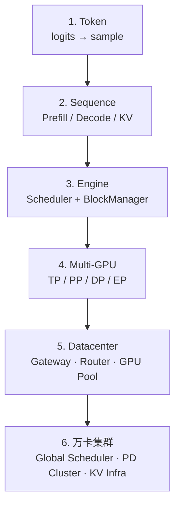
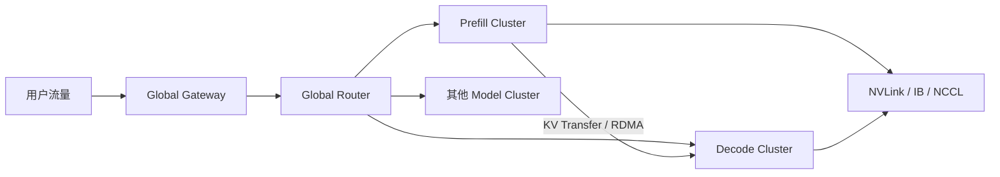

import ChapterMeta from "../../../components/ChapterMeta.astro";

<ChapterMeta
  section="0.3"
  difficulty={2}
  readingTime={26}
  prev={{ href: "/00-introduction/02-systems-problem/", title: "为什么推理是一个系统问题" }}
  next={{ href: "/00-introduction/04-roadmap/", title: "全书学习路线" }}
/>

## 本章目标

本章解决的问题：**同一个“生成下一个 token”，为什么在单卡笔记本和生产万卡集群里是完全不同的工程？**

读完本章，读者应该能够：

- 画出 token → 单卡 → 多卡 → 集群 的尺度阶梯
- 说明每一级新出现的瓶颈（算力、显存、调度、网络、故障）
- 用 70B 的权重和 KV 数字判断何时必须多卡、何时必须多机
- 预览 PD 分离、全局路由、KV 基础设施在地图上的位置

---

## 1. 为什么需要这个东西

一个 token 在数学上只是：

$$
x_{t} \sim p(\cdot \mid x_{<t})
$$

| 符号 | 含义 | 例子 |
| --- | --- | --- |
| $x_t$ | 第 $t$ 个 token（词表里的一个 id） | 刚采样出的 `id=15496` |
| $x_{<t}$ | 位置 $t$ 之前的全部 token | Prompt + 已经生成的前缀 |
| $p(\cdot\mid x_{<t})$ | 在该前缀下，词表上每个候选的概率分布 | softmax 之后长度为 $V$ 的向量 |
| $\sim$ | 按这个分布抽一个 | 贪心则取 $\arg\max$，采样则按概率抽 |

这是因果语言模型的标准分解，见 Bengio et al. 的神经语言模型设定，以及 [Hugging Face 文本生成](https://huggingface.co/docs/transformers/en/generation_strategies)。后面每一级系统都在实现同一次抽样，只是约束从「算对」变成「算得快、放得下、不排队」。
生产事故却很少长这样。更常见的是：

- 单卡跑 8B 很顺，70B 直接 OOM
- 八卡 TP 跑通了，一加并发 TTFT 从 200ms 变成 2s
- 单机房够用，流量翻十倍后出现长尾和 NCCL 超时
- Prefill 把 Decode 的 SLA 打穿，于是有人把集群拆成两类 GPU 池

如果你只盯着 $p(x_t\mid x_{<t})$，会觉得这些是运维问题。它们其实是 **同一个 token 在不同资源约束下的投影**。

---

## 2. 核心概念

**直觉。** 发电可以在手摇发电机上理解原理，但城市电网要处理的是调度、冗余和故障，不是更大的手摇把。

**模型。** 六个尺度：

| 尺度 | 工作单元 | 新约束 |
| --- | --- | --- |
| Token | 一次采样 | 词表、温度、停止符 |
| Sequence | Prefill + Decode | KV 增长 |
| Engine | 多请求 iteration | 调度、分页 |
| 多 GPU | 模型并行切片 | NVLink、同步 |
| 机房 | 多引擎副本 | 路由、扩缩容 |
| 万卡 | 全局集群 | 网络、故障、长尾、PD 分离 |

**数学。** 扩容不是线性的。设张量并行度（Tensor Parallel size）为 $P$：单步 Decode 往往要一次 AllReduce。若通信时间接近计算时间，再加卡会变慢。

| 符号 | 含义 | 典型来源 |
| --- | --- | --- |
| $P$ | 把一层矩阵切到多少张 GPU | vLLM `--tensor-parallel-size` |
| $T_{\text{comp}}$ | 这一步在 GPU 上的计算时间 | Kernel + GEMM |
| $T_{\text{comm}}$ | 这一步为同步切片付出的通信时间 | NVLink / IB 上的 AllReduce |
| $T_{\text{sched}}$ | 调度、拼 batch、准备输入的时间 | EngineCore / Scheduler |

并行度定义见 [Megatron-LM](https://arxiv.org/abs/1909.08053) 与 [vLLM Distributed Serving](https://docs.vllm.ai/en/stable/serving/distributed_serving.html)（Last verified: 2026-09-03）。
**工程。** 万卡不是 10000 张卡各跑一个 `generate()`。它是分层的控制系统。

---

## 3. 工作原理

沿一条 70B 请求往上走：

1. **Token。** Sampler 输出 id=15496。成本：一次 `lm_head` 和采样。
2. **单卡。** 发现权重 130+ GiB，H100 80GB 放不下。必须 TP 或量化。
3. **多卡 Engine。** TP=4 后权重能放下。Scheduler 开始在 8 个并发请求间分配 KV。
4. **多副本。** 一台 8 卡机器的 QPS 不够，起 32 个同样的引擎。Gateway 要选哪一台。
5. **Prefill 打满。** 长文档请求让 Decode 延迟抖动。把 Prefill 和 Decode 拆到不同机器，KV 通过 RDMA 传过去。
6. **万卡。** 全局 Router 看模型版本、KV 命中、队列、故障域；任何一层的长尾都会在用户侧变成“偶发卡顿”。

每升一级，**正确性约束不变**（下一个 token 的分布），**性能约束换一套**。

---

## 4. 架构图



万卡级的示意（第十五篇才会展开实现）：



---

## 5. 数学原理

用 Llama 3.1 70B、BF16：

| 场景 | 权重 | KV | 含义 |
| --- | --- | --- | --- |
| 1 × 8K | ≈130.4 GiB | 2.5 GiB | 单卡放不下权重 |
| 8 × 8K | 同上 | 20 GiB | 并发开始吃显存 |
| 1 × 128K | 同上 | 40 GiB | 长上下文是 KV 问题 |
| TP=8 切权重 | ~16.3 GiB/卡 | KV 也要按并行方式切 | 引入 AllReduce |

通信的下限（示意，不是某款 GPU 的实测）：

$$
T_{\text{step}} \ge \max(T_{\text{comp}}, T_{\text{comm}}, T_{\text{sched}})
$$

| 符号 | 含义 | 单位 |
| --- | --- | --- |
| $T_{\text{step}}$ | 引擎前进一步（通常生成 1 个 token）的墙钟时间 | 秒 |
| $T_{\text{comp}}$ | 计算耗时 | 秒 |
| $T_{\text{comm}}$ | 多卡 / 多机通信耗时 | 秒 |
| $T_{\text{sched}}$ | CPU 侧调度与张量准备 | 秒 |

取 $\max$ 是因为这三项在流水线里常常重叠不全：最慢的那一项决定用户看到的 ITL。重叠得越好，$T_{\text{step}}$ 越接近三项里的最大值而不是三者之和。NCCL 原语见 [NVIDIA NCCL](https://docs.nvidia.com/deeplearning/nccl/user-guide/docs/overview.html)。
万卡时 $T_{\text{sched}}$ 和故障恢复会进入这个 max。这就是为什么第十五篇要单独讲长尾。

---

## 6. 代码实现

尺度判断可以先写成函数，避免口头“大概要很多卡”。

```python
from examples.ch00.kv_cache_memory import (
    GIB,
    LLAMA31_70B,
    kv_cache_gib,
    weight_bytes_approx,
)

def min_gpus_for_weights(params=70e9, gpu_mem_gib=80, util=0.9):
    need = weight_bytes_approx(params) / GIB
    return int(need / (gpu_mem_gib * util) + 0.999)

print(min_gpus_for_weights())          # 2；实际还要给 KV/激活留空，常用 4 或 8
print(kv_cache_gib(LLAMA31_70B, 8192, 32))  # 80.0 GiB
```

`min_gpus_for_weights` 返回 2 只说明**权重下界**。生产 70B BF16 常用 TP=4 或 8，因为还要放 KV、激活、NCCL 缓冲。不要把下界当成部署方案。

把上面逻辑放进 notebook 或直接在 `python3` 里改 `batch` 看 KV 何时超过一张卡的剩余显存。

---

## 7. 一个完整例子

教学尺寸 vs 70B 对照：

| | 教学 7B-like MHA | Llama 3.1 70B GQA |
| --- | --- | --- |
| hidden | 4096 | 8192 |
| layers | 32 | 80 |
| Q heads | 32 | 64 |
| KV heads | 32 | 8 |
| batch=4, S=1024 KV | 2.0 GiB | 1.25 GiB |

70B 尽管更大，**GQA 把 KV 头从 64 砍到 8**，同样 4×1024 的 KV 反而更小。这解释了：

- 模型变大，不一定 KV 按比例变大
- 万卡集群的容量规划必须把 GQA/MQA/MLA 算进去，不能只看参数量

手算 70B、batch=4、S=1024：

$$
M_{\text{KV}} = 2 \times 80 \times 8 \times 128 \times 1024 \times 4 \times 2 / 1024^{3} = 1.25\ \text{GiB}
$$

| 因子 | 值 | 含义（与 [0.1 节 KV 公式](/00-introduction/01-landscape/#5-数学原理) 相同） |
| --- | --- | --- |
| $2$ | K 与 V 各一份 | |
| $80$ | $L$，层数 | `num_hidden_layers` |
| $8$ | $H_{\text{kv}}$ | GQA：`num_key_value_heads` |
| $128$ | $d_h$ | $8192/64$ |
| $1024$ | $S$ | 本例序列长 |
| $4$ | $B$ | 本例 batch |
| $2$ | $b_{\text{dtype}}$ | BF16 字节 |
| $1024^{3}$ | 字节 → GiB | |
---

## 8. 性能分析

| 尺度 | Compute | Memory | Communication | Scheduling |
| --- | --- | --- | --- | --- |
| Token | 一次 lm_head | 可忽略 | 无 | 无 |
| 单卡 Decode | 低 | HBM | 无 | 单请求 |
| 多卡 TP | 被切分 | 每卡一份分片 | 每步 AllReduce | 仍要 token budget |
| 多副本 DP | 近线性 | 每副本一份权重 | 几乎无模型通信 | 负载均衡 |
| PD 分离 | Prefill 吃算力 | Decode 吃 KV | KV Transfer | 两类集群 |
| 万卡 | 局部仍是上述 | KV 池化 | IB 故障域 | 全局队列与降级 |

🚀 性能：升级尺度前，先写清你要优化的是哪一行的哪一列。

---

## 9. 工程实现

- **单机引擎**：vLLM / SGLang / TensorRT-LLM。负责 iteration 级调度。
- **平台**：Gateway、Model Registry、Autoscaling。负责副本级调度。
- **万卡**：全局 Router、Prefill/Decode 集群、模型存储与故障域。负责集群级调度。

三级调度不要塞进同一个进程。Engine 里做请求级 token 调度；平台做 GPU 池；全局层做模型和机房。

---

## 10. 源码分析

:::note[🔎 源码]
Last verified: 2026-09-03。
:::

- **单引擎内**：`EngineCore` + `Scheduler` + `GPUModelRunner`。对应尺度 2–3。
- **多 GPU**：vLLM 的 `ParallelConfig`（TP/PP/DP）。Worker 数量约为 `DP × PP × TP`。对应尺度 4。
- **多副本**：通常在引擎外，用 Kubernetes、网关或推理平台复制进程。不要在 `scheduler.py` 里找机房级路由。
- **PD 分离 / KV Transfer**：vLLM 有 `kv_transfer` 相关配置与连接器；这是尺度 5–6 的入口，细节在第十一、十五篇。

教学模型到这里为止只实现尺度 1–3。Mini-vLLM 不会假装自己是万卡调度器。

---

## 11. 实验

🔬 实验：计算“KV 何时超过 16 GiB 剩余显存”。

```bash
python3 - <<'PY'
import sys
sys.path.insert(0, 'examples/ch00')
from kv_cache_memory import LLAMA31_70B, kv_cache_gib
for batch in [1, 4, 8, 16, 32]:
    print(batch, kv_cache_gib(LLAMA31_70B, 8192, batch))
PY
```

预期：1→2.5，4→10，8→20，16→40，32→80。若每卡只剩 16 GiB 给 KV，8K 会话在 TP 后仍可能只能撑很小的 batch。这就是容量规划的种子。

---

## 12. 常见误区

1. **“万卡 = 单卡优化乘以 10000。”** 网络和故障会引入单卡不存在的时间尺度。
2. **“能放下模型就能服务。”** 放下权重只是门票；并发和上下文买的是 KV。
3. **“DP 和 TP 都是多卡，效果一样。”** TP 切一个模型，DP 复制一个模型。解决的问题不同。
4. **“PD 分离是为了架构好看。”** 它出现是因为 Prefill 与 Decode 抢同一种 GPU 时 SLA 无法同时满足。

---

## 13. 本章小结

1. 同一个 token 公式，在六个尺度上变成六种系统。
2. 70B 的第一级升级通常是多卡，不是更快的 Python。
3. GQA 会显著改变 KV，不能只看参数量。
4. 多卡引入通信；多副本引入路由；万卡引入故障与长尾。
5. 调度至少有三层：token、副本、全局。
6. PD 分离是尺度问题，不是模型问题。
7. Mini-vLLM 覆盖引擎级，不覆盖机房级。
8. 读后续章节时，始终问：我在哪一级？

---

## 14. 下一章

地图已经展开。下一章给出 **全书学习路线**：先学什么、刻意推迟什么，以及如何从 Mini-vLLM 走到万卡，而不把自己淹没在名词里。
