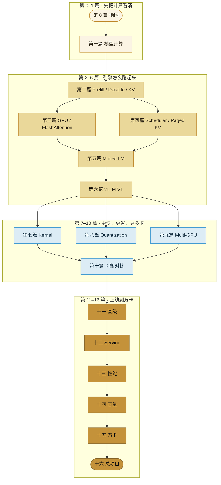

import ChapterMeta from "../../../components/ChapterMeta.astro";

<ChapterMeta
  section="0.4"
  difficulty={1}
  readingTime={18}
  prev={{ href: "/00-introduction/03-token-to-cluster/", title: "从一个 Token 到万卡集群" }}
  next={{ href: "/01-transformer/01-generate-one-token/", title: "大模型如何生成一个 Token" }}
/>

## 本章目标

本章解决的问题：**16 篇内容从哪读、读到什么程度算过关、哪些坑不要提前跳进去。**

读完本章，读者应该能够：

- 复述全书的主链：模型 → 推理 → KV → Scheduler → GPU → Engine → vLLM → 集群
- 知道第一篇结束后能解释什么、还不能解释什么
- 用检查清单判断自己是否可以进入下一篇
- 区分教学实现、Mini-vLLM 与生产框架

---

## 1. 为什么需要这个东西

LLM Inference 的资料呈两极：一边是 Attention 公式，一边是“如何启动 vLLM”。中间缺的是一条能自己推出来的设计链。

没有路线时常见的读法：

- 直接打开 `gpu_model_runner.py`，在 CUDA Graph 里迷路
- 先背 TP/PP/DP，却说不清 Decode 为什么慢
- 复制一段 FlashAttention 博客，却不会算 70B 的 KV

这本书反过来：**每个组件都要先回答它解决什么系统问题。** 路线图就是防止你跳步。

---

## 2. 核心概念

**直觉。** 像学操作系统：先懂进程，再懂调度器，再懂页表，最后才读 Linux 源码。不要先读 CFS 源码再问“什么是进程”。

**模型。** 主链只有一条：

```text
理解模型
 → 理解推理
 → 理解 KV Cache
 → 理解 Scheduler
 → 理解 GPU
 → 理解 Inference Engine
 → 自己实现 Mini-vLLM
 → 阅读 vLLM
 → 理解 Kernel
 → 理解 Multi-GPU
 → 理解 Production Serving
 → 理解万卡推理系统
```

**数学。** 过关标准不是“会写公式”，而是能对一个具体尺寸代入并得到数量级正确的显存 / FLOPs。

**工程。** 三套代码身份：

| 身份 | 位置 | 能不能说成 vLLM |
| --- | --- | --- |
| 教学脚本 | `examples/` | 不能 |
| Mini-vLLM | `mini-vllm/`（第五篇） | 不能 |
| 生产框架 | vLLM / SGLang / TRT-LLM | 可以，但必须标版本日期 |

---

## 3. 工作原理

推荐节奏：

1. **第 0 篇（本章及之前）**：建立地图。不写引擎。
2. **第一篇**：亲手算出一个 token。结束时能讲 Q/K/V、RoPE、logits、采样。
3. **第二篇**：Prefill/Decode/KV。结束时能手算 70B KV。
4. **第三、四篇**：GPU 与调度。结束时能解释 Continuous Batching 为何有效。
5. **第五篇**：实现 Mini-vLLM。结束时有一个能跑的教学引擎。
6. **第六篇**：对照 vLLM V1。结束时能画出 Request lifecycle。
7. **第七–九篇**：Kernel、量化、多卡。按需加深。
8. **第十–十六篇**：引擎对比、生产平台、容量、万卡、总项目。

刻意推迟：

- 第一篇不讲 FlashAttention 和 PagedAttention
- 实现 Mini-vLLM 之前不要求读完 vLLM
- 万卡章节不作为入门路径

---

## 4. 架构图



---

## 5. 数学原理

用一个贯穿全书的教学尺寸，减少每章换数字的成本：

$$
B=4,\quad S=1024,\quad d_{\text{model}}=4096,\quad H=32,\quad d_h=128
$$

以及一套真实对照：

$$
\text{Llama 3.1 70B: } L=80,\ H_q=64,\ H_{kv}=8,\ d_{\text{model}}=8192
$$

后面凡是手算，优先用这两组。若某章改用别的尺寸，会显式写出。

过关公式清单（现在只需认识，不必全会推）：

- KV 显存（第 0.1、第二篇）
- Attention FLOPs（第一、三篇）
- Roofline / 算术强度（第二、三篇）
- TP 通信量（第九篇）
- QPS → GPU 数（第十四篇）

---

## 6. 代码实现

仓库现在可运行的部分：

```bash
python3 -m unittest tests.test_ch00_ch01 -v
python3 examples/ch00/kv_cache_memory.py
python3 examples/ch01/attention.py
python3 examples/ch01/rope.py
python3 examples/ch01/sampling.py
python3 examples/ch01/generate_one_token.py
```

站点：

```bash
npm install
npm run dev    # http://localhost:43217
npm run build
```

`mini-vllm/` 在第五篇之前只有占位说明，避免空壳工程冒充引擎。

---

## 7. 一个完整例子

假设你每周只能读一章。一条最小可行路径：

| 周次 | 章节 | 过关动作 |
| --- | --- | --- |
| 1 | 0.1–0.4 | 能在白板上画出推理栈 |
| 2 | 1.1–1.2 | 能逐步说出生成一个 token 的数据流 |
| 3 | 1.3–1.4 | 手算 4 token Attention，并改温度看分布 |
| 4 | 第二篇前半 | 能解释为何 Decode 访存 |
| 5 | 第二篇后半 | 手算 70B 8K KV = 2.5 GiB |

如果第 3 周仍不能解释因果掩码，不要跳去 FlashAttention。

---

## 8. 性能分析

学习本身也有“瓶颈”：

| 维度 | 错误学法 | 本书做法 |
| --- | --- | --- |
| Compute | 一上来推导全部矩阵微积分 | 先形状与数据流 |
| Memory | 背“KV 很占显存” | 每次代入数字 |
| Communication | 先背 NCCL 原语 | 先问 70B 为何要多卡 |
| Scheduling | 先读调度源码 | 先看静态 batch 如何失败 |

🚀 性能：读到任何优化声明，问 Baseline 的模型、GPU、batch、输入/输出长度、精度和框架版本。没有这些，数字无效。

---

## 9. 工程实现

本书工程产物分三期：

1. **现在**：`examples/` 教学脚本 + 网站第 0、1 篇。
2. **第五篇**：`mini-vllm/` 最小引擎（Engine / Scheduler / BlockManager / ModelRunner / Sampler）。
3. **第十六篇**：Gateway + 流式 API + 监控的生产练习，仍然不是替换 vLLM。

---

## 10. 源码分析

现阶段不要精读 vLLM。只建立索引：

- 引擎循环：`vllm/v1/engine/core.py`
- 调度：`vllm/v1/core/sched/scheduler.py`
- KV：`vllm/v1/core/kv_cache_manager.py`
- 模型：Hugging Face `modeling_llama.py` 或 vLLM 的模型实现

第六篇才会按“架构 → lifecycle → 数据结构 → 调用链 → 设计原因 → 与 Mini-vLLM 对比”精读。

Last verified: 2026-09-03。

---

## 11. 实验

🔬 实验：给自己做一次定位测验（不看笔记）：

1. 一次 Chat API 经过哪些层？
2. 70B BF16 权重大约多少 GB？
3. 为什么静态 batch 不适合 LLM？
4. Prefill 的 Attention FLOPs 为什么大约是 Decode 的 $S$ 倍？

全对再进入第一篇。错了回 0.1–0.3。

---

## 12. 常见误区

1. **“先把 Transformer 论文逐行看懂再碰推理。”** 推理工程师要懂推理时计算了什么，不是训练时如何反传。
2. **“先把 vLLM 跑起来就算会推理系统。”** 那是用户教程，不是设计能力。
3. **“Mini-vLLM 可以当生产引擎。”** 它是教学引擎，刻意缺少大量工程。
4. **“后面的篇可以随便跳。”** 可以跳读，但不能跳过 KV 与 Scheduler 去谈万卡。

---

## 13. 本章小结

1. 全书是构建路径，不是术语百科。
2. 主链从模型计算走到万卡系统。
3. 教学代码、Mini-vLLM、生产框架必须分开标注。
4. 贯穿数字：教学 4/1024/4096/32 与 Llama 3.1 70B。
5. 第一篇结束只要求会生成一个 token。
6. 过关看能否手算和画图，不看是否背过论文年份。
7. 优化数字必须带实验条件。
8. 现在进入第一篇：模型到底怎样吐出下一个 token。

---

## 14. 下一章

地图和路线已经够用。下一章把抽象的 $p(x_t\mid x_{<t})$ 拆成可执行步骤：Tokenizer、Embedding、Transformer、Logits、Sampling，并跑一个能打印全部张量的玩具模型。
