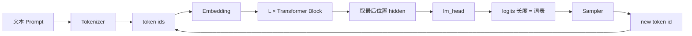
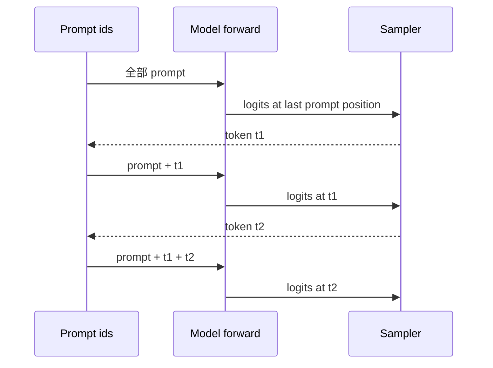

import ChapterMeta from "../../../components/ChapterMeta.astro";

<ChapterMeta
  section="1.1"
  difficulty={2}
  readingTime={28}
  prev={{ href: "/00-introduction/04-roadmap/", title: "全书学习路线" }}
  next={{ href: "/01-transformer/02-transformer-inference/", title: "Transformer 在推理时做了什么" }}
/>

## 本章目标

本章解决的问题：**模型一次前向，究竟怎样从已有文字里冒出下一个 token？**

读完本章，读者应该能够：

- 按执行顺序列出生成一个 token 的步骤
- 区分 token id、hidden state、logits 和 sampled token
- 解释为什么生成 $N$ 个 token 通常要 $N$ 次 Decode forward
- 跑通 `examples/ch01/generate_one_token.py` 并指出每一层的输出形状

---

## 1. 为什么需要这个东西

用户看到的是流式字符串。工程师如果也停在字符串，就无法回答：

- 为什么不能一次把整段回答算完？
- 为什么中途改温度会影响**后面的**字，而不是已经发出去的字？
- 为什么服务要在每个 token 之后检查 stop 条件？

根因：当代主流 LLM 是 **自回归** 的。它们不生成段落，只生成“下一个 id”，然后把这个 id 粘回去再问一次。

:::tip[💡 核心概念]
一次推理 forward 的产品不是一段话，而是词表上的一组分数。话是很多轮分数被采样之后拼出来的。
:::

---

## 2. 核心概念

**直觉。** 像手机输入法：已有“今天天气”，系统给“很/真/不”打分，你选出“很”，再对“今天天气很”打分。模型更夸张——词表有十万级候选。

**模型。** 一条因果语言模型定义：

$$
p(x_1,\ldots,x_T)=\prod_{t=1}^{T} p(x_t \mid x_{<t})
$$

| 符号 | 含义 |
| --- | --- |
| $T$ | 整段序列的长度（prompt + 回答） |
| $x_t$ | 第 $t$ 个 token id |
| $x_{<t}$ | $(x_1,\ldots,x_{t-1})$，位置 $t$ 能看到的全部历史 |
| $p(x_t\mid x_{<t})$ | 在这段历史上，下一个 token 取各个词表项的概率 |

推理时 $x_{<t}$ 已知，只要估计 $p(x_t\mid x_{<t})$。分解方式与 [Hugging Face 生成策略](https://huggingface.co/docs/transformers/en/generation_strategies) 中 `generate()` 的逐步循环一致。

**数学。** 网络输出的是 logits $z\in\mathbb{R}^{V}$，再变成概率：

$$
p_i = \frac{e^{z_i/\tau}}{\sum_j e^{z_j/\tau}}
$$

| 符号 | 含义 | 单位 / 形状 | 出处 |
| --- | --- | --- | --- |
| $z_i$ | 词表第 $i$ 项的未归一化分数（logit） | 无量纲标量 | `lm_head` 的输出 |
| $V$ | 词表大小 | 个 token | Llama 3.1 `vocab_size=128256` |
| $i,j$ | 词表下标 | $0\ldots V-1$ | |
| $\tau$ | 温度 temperature | 正实数；$\tau=1$ 为原分布 | HF `temperature`；见 [GenerationConfig](https://huggingface.co/docs/transformers/main_classes/text_generation) |
| $p_i$ | 抽中第 $i$ 个 token 的概率 | $\sum_i p_i=1$ | softmax |

$\tau$ 是温度。贪心则取 $\arg\max z_i$，不必经过采样。$\tau\to 0$ 时分布变尖，行为接近贪心；$\tau>1$ 变平。HF 默认 `generate` 是贪心，需 `do_sample=True` 才走这条 softmax。
**工程。** 真实系统把这一步拆开，因为 Tokenizer、GPU forward、采样、detokenize 的硬件和延迟模型都不同。

---

## 3. 工作原理

生成一个新 token 的完整流程：

1. **Tokenize。** 字符串 → token id 列表。`"Hello"` 可能是 `[9906]`，不是 5 个字母 id。
2. **Embed。** 每个 id 查表变成 $d_{\text{model}}$ 维向量。Llama 3.1 8B 是 4096 维。
3. **Transformer。** $L$ 层 block 更新这些向量。当前层的每个位置只能看它及它左边（因果）。
4. **取最后位置。** Decode 时我们只要最新那个位置的 hidden state。Prefill 时所有 prompt 位置都会算，但采样只用最后一个。
5. **lm_head。** 线性层：$d_{\text{model}}\rightarrow V$。Llama 3.1 的 $V=128256$。
6. **Sample。** 贪心 / 温度 / top-k / top-p。
7. **Append。** 新 id 接到序列末尾；若未命中 EOS 且未到 `max_new_tokens`，回到第 3 步。

第 3 步在没有 KV Cache 时会对整个序列重算。这就是第二篇要消灭的浪费。本章先允许玩具模型重算，把数据流看清。

---

## 4. 架构图



时序（三个输出 token）：



有 KV Cache 时，后两轮不必把 prompt 再算一遍。本章玩具代码仍整段重算，便于打印。

---

## 5. 数学原理

词表 $V=8$ 的玩具 logits（来自 `ToyLM` 一次真实前向，seed=0，prompt=`[1,3,4]`）：

$$
z=\big[-2.095,-1.157,-0.160,0.106,-0.493,-0.283,-0.771,-0.129\big]
$$

| 符号 | 含义 | 本例 |
| --- | --- | --- |
| $z$ | 最后一个位置的 logits 向量 | 长度 $V=8$ |
| $z_i$ | 候选 id $=i$ 的分数 | 最大项 $z_3=0.106$，贪心会选 3 |
| $p$ | $\mathrm{softmax}(z)$（$\tau=1$） | 见下一行 |

Softmax 后（$\tau=1$，与上一节 $p_i=e^{z_i}/\sum_j e^{z_j}$ 相同）：

$$
p \approx [0.024,0.062,0.167,0.218,0.120,0.148,0.091,0.172]
$$

| 符号 | 含义 | 本例 |
| --- | --- | --- |
| $p$ | 词表上的概率向量 | 长度 8，各项之和 $=1$ |
| $p_i$ | 抽中 token id $=i$ 的概率 | 最大项 $p_3\approx0.218$ |
| 下标 | 与 $z$ 对齐 | $p_0$ 对应 $z_0=-2.095$ |

贪心选中 index 3。形状检查（教学 7B-like）：

| 张量 | 形状 | 例子 $B=4,S=1024$ |
| --- | --- | --- |
| input_ids | $(B,S)$ | $(4,1024)$ |
| hidden | $(B,S,d)$ | $(4,1024,4096)$ |
| logits | $(B,S,V)$ | 若 $V=128256$，约 $4\times1024\times128256$ 个分数 |

:::note[📐 数学]
生产引擎几乎从不把 $(B,S,V)$ 的完整 logits 留给所有位置。Decode 只要最后一行。这是工程对数学的裁剪，不是换了模型。
:::

---

## 6. 代码实现

可运行教学模型：`examples/ch01/generate_one_token.py`。NumPy 实现，不依赖 GPU。它 **不是** Hugging Face `LlamaForCausalLM`。

```python
def generate(self, prompt_ids: list[int], max_new_tokens: int) -> list[int]:
    ids = list(prompt_ids)
    for _ in range(max_new_tokens):
        logits = self.next_token_logits(ids)  # 只用最后位置
        ids.append(int(logits.argmax()))
    return ids
```

`forward` 内部顺序与 Llama 同类 Decoder 一致：**Embedding →（RMSNorm → Attention → 残差 → RMSNorm → FFN → 残差）→ RMSNorm → lm_head**。FFN 用 ReLU 代替 SwiGLU，避免本章引入门控线性单元。

运行：

```bash
python3 examples/ch01/generate_one_token.py
```

预期：`generated: [1, 3, 4, 3, 3, 3, 3]`。玩具权重会塌缩到重复 token，这正好说明：**采样与训练质量是后面的问题，循环结构已经正确。**

---

## 7. 一个完整例子

教学尺寸下，生成 **1 个** 新 token、Prefill 已完成 $S=1024$ 时，主要张量：

- 输入：$4\times1024$ 个 id
- Embedding：$4\times1024\times4096$
- 每层 Attention 输出：同形状
- `lm_head`：$(4096, V)$。若 $V=32000$，权重 262 MB（FP16）；Llama 3.1 的 $V=128256$，仅 lm_head 就约 1.0 GiB（$4096\times128256\times2$）。

手算 lm_head 体积：

$$
M_{\text{lm}} = d_{\text{model}} \times V \times b_{\text{dtype}}
$$

| 符号 | 含义 | Llama 3.1 8B |
| --- | --- | --- |
| $M_{\text{lm}}$ | 输出投影（lm_head）权重体积 | ≈ 0.98 GiB |
| $d_{\text{model}}$ | 隐状态宽度 | 4096，`hidden_size` |
| $V$ | 词表大小 | 128256，`vocab_size`；见 [Llama 3.1 model card](https://github.com/meta-llama/llama-models/blob/main/models/llama3_1/MODEL_CARD.md) |
| $b_{\text{dtype}}$ | 每元素字节 | 2（BF16/FP16） |

$$
4096 \times 128256 \times 2 / 1024^{3} \approx 0.98\ \text{GiB}
$$

三项依次是 $d_{\text{model}}$、$V$、$b_{\text{dtype}}$，再除以 $1024^{3}$ 换成 GiB。

有的实现把 embedding 与 lm_head **绑权**（weight tying），这时这块不重复占显存。Llama 3.1 通常不绑，所以 Decode 每步都要读这近 1 GiB。
所以“生成一个 token”在 8B 上已经包含一次对接近 1 GiB 矩阵的乘法——Decode 带宽压力不完全来自 Attention。

---

## 8. 性能分析

| 维度 | Prefill 一个 token 的摊销 | Decode 一个 token |
| --- | --- | --- |
| Compute | 高，序列可并行 | 低，逐步 |
| Memory | 激活大 | 反复读权重 + KV |
| Communication | 多卡时几次大 AllReduce | 每 token 都要通信 |
| Scheduling | 一次大作业 | 高频率小作业 |

🚀 性能：用户感知的“一个字” ≈ 一次 Decode step 的尾延迟。合并 tokenizer 或 HTTP 帧不能减少 GPU step 次数，只能减少开销。

---

## 9. 工程实现

Hugging Face：

```python
outputs = model.generate(**inputs, max_new_tokens=20)
```

默认策略是贪心搜索（官方 Generation strategies 文档）。内部仍是循环：每次取 `logits[:, -1, :]`。

vLLM 不会让每个 HTTP 请求独占一次 `generate()` 循环，而是很多 Request 共享一次 `execute_model()`。对**单个 Request** 而言，语义仍然是“每次一个新 token”。

流式 API 在 Sampler 之后就把 token 发出去，不必等整句。

---

## 10. 源码分析

:::note[🔎 源码]
Last verified: 2026-09-03。
:::

| 系统 | 位置 | 做什么 |
| --- | --- | --- |
| HF Transformers | `GenerationMixin.generate` | 外层循环、logits processor、停止条件 |
| HF Llama | `LlamaForCausalLM.forward` | 出 logits |
| vLLM V1 | `GPUModelRunner.execute_model` | 一批请求的一步 forward |
| vLLM V1 | Sampler 相关模块 | 从 logits 取 token |
| 教学 | `examples/ch01/generate_one_token.py` | 可读的最小循环 |

不要把 `ToyLM.generate` 说成 `generate()` 源码。HF 还要处理 cache、beam、约束解码、多模态。

---

## 11. 实验

🔬 实验：

```bash
python3 examples/ch01/generate_one_token.py
python3 -m unittest tests.TestGenerateTests -q 2>/dev/null || python3 -m unittest tests.test_ch00_ch01.GenerateTests -v
```

试着改：

1. 把 `greedy` 换成 `sample(..., temperature=1.2)`，输出应开始变化。
2. 打印 `model.forward(prompt).shape`，确认是 `(seq, vocab)`。
3. 对同一 prompt 跑两次 `forward`，确认玩具模型无 dropout 时结果相同。

---

## 12. 常见误区

1. **“模型一次生成整句。”** 训练目标与推理循环都是下一个 token。
2. **“logits 就是概率。”** logits 是未归一化分数；概率要经过 softmax（以及温度、截断）。
3. **“Tokenizer 按空格或按字切。”** 它按词表切子词，中英混合时长度很难目测。
4. **“重复输出一定是 bug。”** 贪心 + 玩具权重或真实模型的 degenerate 循环都可能重复；要用采样或惩罚，而不是先怀疑循环写错。

---

## 13. 本章小结

1. 自回归：每次只决定一个 token。
2. 数据流：id → hidden → logits → sample → append。
3. 采样只用最后位置的 logits。
4. $N$ 个输出 token ≈ $N$ 次 Decode step（加上一次 Prefill）。
5. 词表投影本身就可能有接近 GiB 的权重。
6. 流式输出发生在采样之后。
7. 教学循环可以整段重算；生产必须上 KV Cache。
8. 下一层问题：Transformer block 里 hidden 到底怎么更新。

---

## 14. 下一章

现在你看到了循环。下一章打开循环内部：一层 Decoder block 在推理时计算什么，RMSNorm、残差、FFN 各干什么，以及为什么聊天模型几乎都是 Decoder-only。
