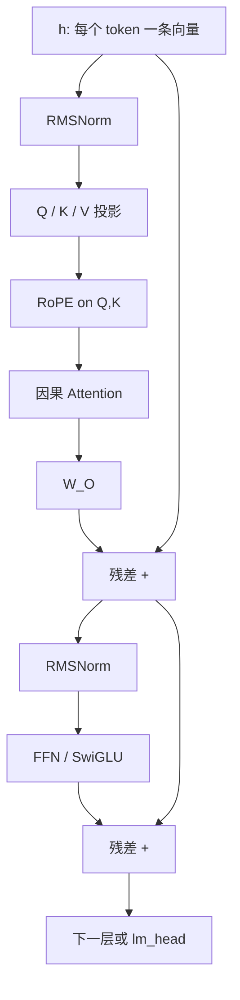
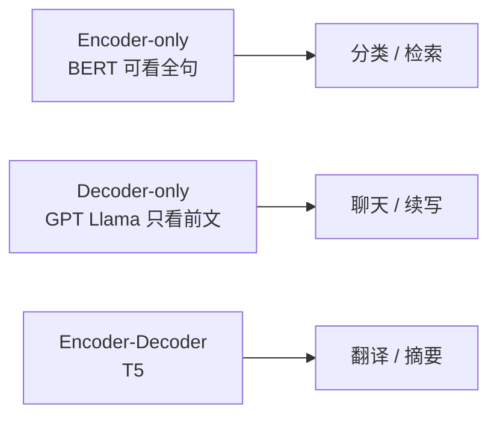

import ChapterMeta from "../../../components/ChapterMeta.astro";

<ChapterMeta
  section="1.2"
  difficulty={2}
  readingTime={30}
  prev={{ href: "/01-transformer/01-generate-one-token/", title: "大模型如何生成一个 Token" }}
  next={{ href: "/01-transformer/03-attention/", title: "Attention 到底在计算什么" }}
/>

## 本章目标

本章解决的问题：**生成循环里那一次 `forward`，在 Transformer 内部究竟走过哪些固定步骤？**

读完本章，读者应该能够：

- 区分 Encoder-only、Decoder-only、Encoder-Decoder 在推理时能看哪些位置
- 画出 Llama 风格 Pre-Norm Decoder block
- 用 $B=4,S=1024,d=4096$ 写出每一步的张量形状
- 说明推理时哪些计算可以跨 token 缓存，哪些不能

---

## 1. 为什么需要这个东西

如果只说“模型有很多层”，你无法判断：

- 量化该打 Attention 还是 FFN？
- Tensor Parallel 该切哪张矩阵？
- 为什么 Decode 每层都要读一遍几乎全部权重？

这些问题的答案都在 **一层 block 的数据流** 里。先把层看清楚，Kernel 和多卡才不是魔法。

---

## 2. 核心概念

**直觉。** 把每个 token 当成会议上的一个人。Attention 是他查阅别人的发言；FFN 是他回到座位上自己消化；残差是把原笔记留着，避免新摘要把旧信息盖掉。

**模型。** 当代聊天 / 代码模型（GPT、Llama、Qwen）是 **Decoder-only**：预测位置 $t$ 时不能读 $t+1,t+2,\ldots$。这不是功能残缺，而是与训练目标一致——真实生成时未来还不存在。

**数学。** Llama 类 Pre-Norm block（教学写法）：

$$
\begin{aligned}
h &\leftarrow h + \mathrm{Attn}(\mathrm{RMSNorm}(h)) \\
h &\leftarrow h + \mathrm{FFN}(\mathrm{RMSNorm}(h))
\end{aligned}
$$

| 符号 | 含义 | 形状（教学尺寸） |
| --- | --- | --- |
| $h$ | 这一层的隐状态 | $(B,S,d_{\text{model}})=(4,1024,4096)$ |
| $\mathrm{RMSNorm}$ | 按向量 RMS 缩放，再乘可学习增益 | 见下节公式 |
| $\mathrm{Attn}$ | 因果自注意力 + 输出投影 $W_O$ | 输入输出同形状 |
| $\mathrm{FFN}$ | 逐位置前馈（Llama 为 SwiGLU） | 中间维 `intermediate_size` |
| $\leftarrow$ 里的 $+$ | 残差连接：把输入加回子层输出 | 与 $h$ 同形状 |

这是 Pre-Norm：先归一化再进 Attn/FFN。Llama 3 文档与 Hugging Face `LlamaDecoderLayer` 都是这个顺序。原始 Transformer 论文是 Post-Norm。
Llama 3 的 FFN 是 SwiGLU，不是原始 Transformer 的两层 ReLU MLP。

**工程。** 权重按层存放：Q/K/V/O 投影、三个 FFN 矩阵（SwiGLU）、两套 RMSNorm 参数。Decode 时几乎每层都要全部读一遍。

---

## 3. 工作原理

以 Llama 3.1 风格 Decoder 为例，一次 Prefill forward：

1. `input_ids → embedding`。位置信息不加在 embedding 上，而用 RoPE 打进 Q/K（下一章和 1.4）。
2. 对 $L$ 层重复：
   1. RMSNorm
   2. 计算 Q、K、V
   3. 对 Q/K 做 RoPE
   4. 因果 Attention
   5. 输出投影 $W_O$，加残差
   6. RMSNorm
   7. SwiGLU FFN，加残差
3. 最后 RMSNorm
4. `lm_head` 得到 logits

Decode 一步的差别只有：**序列维对 Q 来说是 1**，K/V 会带上历史（若有 KV Cache）。Block 公式不变。

停止条件不属于 Transformer：EOS、`max_new_tokens`、stop string 在 Sampler / 引擎里。

---

## 4. 架构图



三类 Transformer：



---

## 5. 数学原理

RMSNorm（Zhang & Sennrich, [Root Mean Square Layer Normalization](https://arxiv.org/abs/1910.07467)；Llama 使用）：

$$
\mathrm{RMSNorm}(x)=\frac{x}{\sqrt{\frac{1}{d}\sum_i x_i^2+\varepsilon}}\odot \gamma
$$

| 符号 | 含义 | Llama 3.1 典型值 |
| --- | --- | --- |
| $x$ | 一个 token 的隐向量 | 长度 $d=d_{\text{model}}$ |
| $d$ | 该向量维度 | 8B 为 4096 |
| $x_i$ | $x$ 的第 $i$ 个分量 | |
| $\varepsilon$ | 防止除零的小数 | `rms_norm_eps=1e-5` |
| $\gamma$ | 可学习的逐维增益 | 长度 $d$，checkpoint 里的 `weight` |
| $\odot$ | 逐元素相乘 | |

它没有均值中心化，比 LayerNorm 少一些计算，推理里每层两次。

SwiGLU FFN（Shazeer, [GLU Variants](https://arxiv.org/abs/2002.05202)；Llama 3 Table 3，8B）：

$$
\mathrm{FFN}(x)=W_2\bigl(\mathrm{SiLU}(W_1 x)\odot (W_3 x)\bigr)
$$

| 符号 | 含义 | 8B 形状 |
| --- | --- | --- |
| $x$ | 归一化后的隐状态 | $(B,S,4096)$ |
| $W_1,W_3$ | 升维门控 / 升维线性 | $(4096,14336)$，`intermediate_size=14336` |
| $W_2$ | 降维 | $(14336,4096)$ |
| $\mathrm{SiLU}(u)=u\cdot\sigma(u)$ | Swish 激活 | $\sigma$ 为 sigmoid |
| $\odot$ | 门控：两路逐元素相乘 | |

一次 FFN 的 GEMM FLOPs（忽略激活；每次乘加计 2 FLOPs）：

$$
F_{\text{FFN}} = 2 \times B \times S \times (2 \times d_{\text{model}} \times d_{\text{ff}} + d_{\text{ff}} \times d_{\text{model}})
$$

| 符号 | 含义 | 本例 |
| --- | --- | --- |
| $F_{\text{FFN}}$ | 一层 FFN 的浮点运算量 | $\approx 1.443\times 10^{12}$ |
| $B,S$ | batch、序列长 | 4, 1024 |
| $d_{\text{model}}$ | 隐宽度 | 4096 |
| $d_{\text{ff}}$ | FFN 中间维 | 14336 |

代入 $B=4,S=1024$：

| 项 | 公式里的矩阵 | 计算 | FLOPs |
| --- | --- | --- | --- |
| $W_1$ | $(d_{\text{model}},d_{\text{ff}})$ | $2\times4\times1024\times4096\times14336$ | $4.810\times10^{11}$ |
| $W_3$ | 同上 | 同上 | $4.810\times10^{11}$ |
| $W_2$ | $(d_{\text{ff}},d_{\text{model}})$ | $2\times4\times1024\times14336\times4096$ | $4.810\times10^{11}$ |
| 合计 | $F_{\text{FFN}}$ | 三路相加 | $\approx1.443\times10^{12}$ |

同尺寸下，1.0 节统计的 Attention QKV+score+AV+O 约 $6.18\times 10^{11}$ FLOPs。**Prefill 时 FFN 往往比 Attention 更吃计算。** Decode 时两者都变成读大矩阵。

:::note[📐 数学]
原始 “Attention Is All You Need” 用 Post-Norm 和正弦位置编码。Llama 3.1 用 Pre-Norm、RMSNorm、RoPE、SwiGLU、GQA。讲“Transformer 推理”时必须说清是哪一家。
:::

---

## 6. 代码实现

`ToyLM.forward` 把一层压到最小，便于对照：

```python
x = self.embed[np.array(token_ids)]
x_norm = self.rmsnorm(x)
q, k, v = x_norm @ self.w_q, x_norm @ self.w_k, x_norm @ self.w_v
# RoPE on q, k ...
attn, _ = scaled_dot_product_attention(q, k, v, causal=True)
h = x + attn @ self.w_o
ff = np.maximum(self.rmsnorm(h) @ self.w_ff1, 0.0)
h = h + ff @ self.w_ff2
logits = self.rmsnorm(h) @ self.lm_head
```

与 Llama 的差异（必须标明）：

- 单层、单头规模的 hidden
- ReLU 而不是 SwiGLU
- 无 GQA
- 无 KV Cache

完整文件：`examples/ch01/generate_one_token.py`。

---

## 7. 一个完整例子

教学尺寸 $B=4,S=1024,d=4096,H=32,d_h=128$，一层：

| 步骤 | 张量形状 |
| --- | --- |
| $h$ | $(4,1024,4096)$ |
| Q,K,V | 各 $(4,1024,4096)$，reshape 成 $(4,32,1024,128)$ |
| Attention 权重 | $(4,32,1024,1024)$ |
| Attn 输出 | $(4,32,1024,128)$ → $(4,1024,4096)$ |
| FFN 中间（若 11008，Llama 2 7B） | $(4,1024,11008)$ |
| FFN 中间（14336，Llama 3.1 8B） | $(4,1024,14336)$ |

Attention 权重矩阵一项的体积：

$$
M_{\alpha} = B \times H \times S \times S \times b_{\text{dtype}}
$$

| 符号 | 含义 | 本例 |
| --- | --- | --- |
| $M_{\alpha}$ | 物化后的注意力权重 $\alpha$ | 256 MiB |
| $B$ | batch | 4 |
| $H$ | 头数 | 32 |
| $S\times S$ | 每个头一张因果注意力图 | $1024\times1024$ |
| $b_{\text{dtype}}$ | 每元素字节 | 2 |

$$
4 \times 32 \times 1024 \times 1024 \times 2\ \text{B} = 256\ \text{MiB}
$$

代入顺序与上一张表相同：$B\times H\times S\times S\times b_{\text{dtype}}$。$256\ \text{MiB}=256\times1024^{2}$ 字节。
这只是一层、一种精度、不含 softmax 工作区。FlashAttention 要解决的正是 **不要把这张 256 MiB 的矩阵写回 HBM**。第三篇再讲；这里只要看见形状已经危险。

---

## 8. 性能分析

| 维度 | Prefill | Decode（无融合） |
| --- | --- | --- |
| Compute | FFN GEMM 常占大头 | 每层都小 |
| Memory | 激活与 Attention 矩阵 | 反复读全部层权重 |
| Communication | 大块 AllReduce | 每 token 每层通信 |
| Scheduling | 一个大 kernel 序列 | 需要 CUDA Graph 降低 launch 开销 |

🚀 性能：层数 $L$ 对 Decode 延迟近似线性。70B 的 80 层对 8B 的 32 层，不是 70/8 的关系，而是 80/32≈2.5 再叠加更宽的 GEMM。

---

## 9. 工程实现

- Hugging Face `LlamaModel`：Python 层循环 `for decoder_layer in self.layers`。
- vLLM：同样按层执行，但会把 KV 写入分页缓存，并选择 Attention backend（FlashAttention、FlashInfer 等）。
- TensorRT-LLM：常把图编译、融合，层循环不一定还在 Python 里可见。

推理引擎优化的是 **同一张计算图的执行方式**，不是换一种 Transformer 定义。

---

## 10. 源码分析

:::note[🔎 源码]
Last verified: 2026-09-03。对照 Hugging Face Transformers 的 Llama 实现思路，不粘贴大段源码。
:::

典型文件：`transformers/src/transformers/models/llama/modeling_llama.py`

| 类 | 职责 |
| --- | --- |
| `LlamaRMSNorm` | 上面的 RMSNorm |
| `LlamaRotaryEmbedding` | 产生 cos/sin |
| `LlamaAttention` | QKV、RoPE、GQA、因果注意力 |
| `LlamaMLP` | SwiGLU |
| `LlamaDecoderLayer` | Pre-Norm + 残差 |
| `LlamaModel` | embedding + 层叠 + 最终 norm |
| `LlamaForCausalLM` | `lm_head` |

调用链：`LlamaForCausalLM.forward` → `LlamaModel` → 逐层 `LlamaDecoderLayer` → `lm_head`。

vLLM 会替换 Attention 实现，但层公式仍要对齐权重名字，否则 checkpoint 对不上。

---

## 11. 实验

🔬 实验：在玩具模型里打印残差前后范数。

```python
# 在 ToyLM.forward 里临时打印
import numpy as np
print(np.linalg.norm(x), np.linalg.norm(h))
```

试着注释掉残差（`h = attn @ self.w_o`），玩具模型的 logits 会马上数值劣化或爆炸。这能直观说明残差不是装饰。

再算一遍：教学尺寸 Attention 权重 256 MiB。若 $B=1,S=4096$，仍用上一节 $M_{\alpha}=B\times H\times S\times S\times b_{\text{dtype}}$：

$$
1\times32\times4096\times4096\times2 = 1\ \text{GiB}
$$

| 因子 | 值 | 含义 |
| --- | --- | --- |
| $1$ | $B=1$ | 单条请求 |
| $32$ | $H$ | 头数，与教学 7B-like / Llama 3.1 8B 的 Q 头一致 |
| $4096\times4096$ | $S\times S$ | 每个头一张注意力图；序列从 1024 拉到 4096，面积 $\times 16$ |
| $2$ | $b_{\text{dtype}}$ | BF16/FP16 每元素 2 字节 |
| 右边 $1\ \text{GiB}$ | $M_{\alpha}/1024^{3}$ | 仅一层、仅权重矩阵，不含 softmax 工作区 |

仅一层 softmax 输入就 1 GiB。这是第三篇 FlashAttention 的动机。

---

## 12. 常见误区

1. **“一层 = 生成一个 token。”** 生成一个 token 要跑完所有层。
2. **“Decoder-only 不能做理解任务。”** 它可以，只是预训练目标是续写；很多 chat 模型用指令微调补齐。
3. **“FFN 不重要，Attention 才是 Transformer。”** Prefill FLOPs 里 FFN 经常更大。
4. **“位置编码加在 embedding 上。”** Llama 家族用 RoPE 作用于 Q/K，不是加性绝对位置向量。

---

## 13. 本章小结

1. 聊天 LLM 主要是 Decoder-only。
2. Llama 风格：Pre-Norm、RMSNorm、RoPE、SwiGLU、残差。
3. 一层里 Attention 管混合上下文，FFN 管逐位置非线性。
4. 教学尺寸下 Attention 权重矩阵就可能达到数百 MiB。
5. Prefill 常受 FFN GEMM 驱动；Decode 受读权重驱动。
6. 推理引擎替换的是执行，不是层公式。
7. 玩具 ReLU FFN 是教学简化，不是 Llama 源码。
8. 下一章专攻 Attention：Q/K/V 到底在算什么。

---

## 14. 下一章

Block 图里最贵、也最容易被说玄的部分是 Attention。下一章用 4 个 token 的手算，把因果掩码、缩放点积和多头拆开，并接到后续 KV Cache 的接口上。
