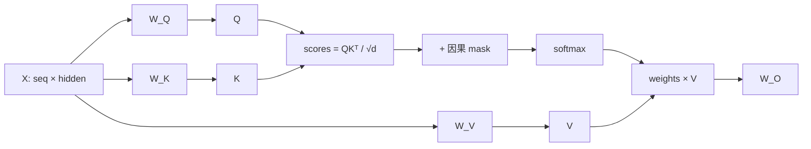

import ChapterMeta from "../../../components/ChapterMeta.astro";

<ChapterMeta
  section="1.3"
  difficulty={3}
  readingTime={35}
  prev={{ href: "/01-transformer/02-transformer-inference/", title: "Transformer 在推理时做了什么" }}
  next={{ href: "/01-transformer/04-rope-logits-sampling/", title: "RoPE、Logits 与 Sampling" }}
/>

## 本章目标

本章解决的问题：**当前 token 如何从前面的 token 里取出信息？为什么要拆成 Q、K、V 三份？**

读完本章，读者应该能够：

- 用图书馆索引的比喻解释 Q/K/V
- 手算一个 4×2 的因果 Attention
- 写出 Scaled Dot-Product Attention 公式并说明 $\sqrt{d_k}$ 的作用
- 指出 KV Cache 缓存的是哪两个张量、为什么不能只缓存 Attention 输出

---

## 1. 为什么需要这个东西

句子：`订单号 A17 已退款，给用户发通知。` 模型正在生成下一个词。

如果只看最后一个字“知”，无法知道通知里要不要写订单号。当前位置必须 **回看** 前面的“A17”“退款”。

朴素做法：把前面所有 hidden 拼起来做一个大 MLP。序列一长，权重无法固定。Attention 的发明是：用同一套投影，让每个位置自己决定看谁。

:::tip[💡 核心概念]
Q 是当前的问题，K 是每张卡片上的索引，V 是卡片内容。Attention 是软选择，不是 SQL。
:::

---

## 2. 核心概念

**直觉。** 一叠索引卡。当前 token 提出 Query；每张旧卡用 Key 回答“我可能相关吗”；按匹配程度把 Value 掺起来。

**模型。** Self-Attention：Q、K、V 都来自同一段序列的线性投影。

$$
Q=XW_Q,\quad K=XW_K,\quad V=XW_V
$$

| 符号 | 含义 | 形状（一个序列，未分头前） |
| --- | --- | --- |
| $X$ | 这一层的输入隐状态 | $(S, d_{\text{model}})$ |
| $W_Q,W_K,W_V$ | 三个可学习投影矩阵 | $(d_{\text{model}}, d_{\text{model}})$（MHA） |
| $Q,K,V$ | Query / Key / Value | 与 $X$ 同形状，再 reshape 成 $H$ 个头 |

GQA 时 $W_K,W_V$ 的输出宽度是 $H_{\text{kv}}\times d_h$，小于 $H_q\times d_h$。字段见 Hugging Face `LlamaAttention` 的 `q_proj` / `k_proj` / `v_proj`。

**数学。** Vaswani et al. 2017, [§3.2.1 Scaled Dot-Product Attention](https://arxiv.org/abs/1706.03762)：

$$
\mathrm{Attention}(Q,K,V)=\mathrm{softmax}\!\left(\frac{QK^{\top}}{\sqrt{d_k}}+M\right)V
$$

| 符号 | 含义 | 备注 |
| --- | --- | --- |
| $Q$ | 当前要“提问”的向量们 | Prefill 时有 $S$ 行；Decode 常为 1 行 |
| $K$ | 用来匹配的索引 | 长度 = 可见历史 |
| $V$ | 匹配上之后取回的内容 | 与 $K$ 行数相同 |
| $d_k$ | 每个头的维度 | Llama 一般为 128；$QK^{\top}$ 后除以 $\sqrt{d_k}$ |
| $M$ | 因果掩码 | 不允许的位置为 $-\infty$，softmax 后为 0 |
| $\mathrm{softmax}$ | 沿 Key 轴做成概率 | 每一行 Query 对可见 Key 归一化 |

论文原话：illegal connections 在 softmax 前被设为 $-\infty$。PyTorch 对应 API 是 [`scaled_dot_product_attention`](https://docs.pytorch.org/docs/stable/generated/torch.nn.functional.scaled_dot_product_attention.html) 的 `is_causal=True`。
**工程。** 多头把 $d_{\text{model}}$ 切成 $H$ 个 $d_k$，让不同头可以学不同的“阅读视角”。Llama 3.1 8B：$H_q=32,d_k=128$。GQA 则让多个 Q 头共享一套 K/V 头——那是第二篇的 KV 故事，本章先按 MHA 算。

---

## 3. 工作原理

对一个头、Prefill 整段序列：

1. 每个位置的 hidden 乘 $W_Q,W_K,W_V$，得到 $q_t,k_t,v_t$。
2. 算分数 $s_{tq}= q_t\cdot k_q / \sqrt{d_k}$。若 $q>t$，置为 $-\infty$。
3. 对 $q\le t$ 做 softmax，得到权重 $\alpha_{tq}$。
4. 输出 $o_t=\sum_{q\le t}\alpha_{tq} v_q$。
5. 各头拼接，乘 $W_O$。

| 符号 | 含义 |
| --- | --- |
| $t$ | 当前 Query 的位置 |
| 下标 $q$ | Key/Value 的位置（这里不是 Query；论文里常用 $j$） |
| $q_t,k_q,v_q$ | 位置 $t$ 的 Query、位置 $q$ 的 Key/Value |
| $s_{tq}$ | 未归一化注意力分数 |
| $\alpha_{tq}$ | softmax 之后的权重，$\sum_{q\le t}\alpha_{tq}=1$ |
| $o_t$ | 该头在位置 $t$ 的输出 |
| $W_O$ | 多头拼接后的输出投影 |

下标 $q$ 与矩阵 $Q$ 同名容易混：步骤里的 $q$ 是 **位置**，大写 $Q$ 是 **Query 张量**。
Decode 新位置 $T+1$：

- 只需新的 $q_{T+1},k_{T+1},v_{T+1}$
- 需要与 **所有历史 $k_{1:T},v_{1:T}$** 做点积与加权
- 因此历史的 K、V 值得缓存；Q 不必缓存（下一步的 Q 会变）
- Attention **输出** $o_t$ 也不值得当 KV 用：下一步新的 $q$ 会改变所有权重

---

## 4. 架构图



因果可见性（行=Query 位置，列=Key 位置）：

```text
      k0   k1   k2   k3
q0    ✓    ✗    ✗    ✗
q1    ✓    ✓    ✗    ✗
q2    ✓    ✓    ✓    ✗
q3    ✓    ✓    ✓    ✓
```

Decode 只有最后一行，列数等于已缓存长度。

---

## 5. 数学原理

为什么除以 $\sqrt{d_k}$？论文 §3.2.1：若 $q,k$ 各维独立、均值 0 方差 1，则点积方差为 $d_k$。$d_k=128$ 时点积很容易把 softmax 推到饱和区。缩放是为了训练稳定，推理必须沿用同一缩放，否则权重对不上。

多头（Vaswani et al. §3.2.2）：

$$
\mathrm{head}_i=\mathrm{Attention}(QW_i^Q,KW_i^K,VW_i^V)
$$

$$
\mathrm{MultiHead}=\mathrm{Concat}(\mathrm{head}_1,\ldots,\mathrm{head}_H)W^O
$$

| 符号 | 含义 | 教学 / Llama 3.1 8B |
| --- | --- | --- |
| $i$ | 头的编号 | $1\ldots H$ |
| $H$ | 头数 | 32，`num_attention_heads` |
| $W_i^Q,W_i^K,W_i^V$ | 第 $i$ 头的投影 | 宽度 $d_k=d_{\text{model}}/H=128$ |
| $W^O$ | 把各头拼回 $d_{\text{model}}$ | `o_proj`，$(d_{\text{model}},d_{\text{model}})$ |
| $\mathrm{Concat}$ | 在特征维拼接 | $(S, H\cdot d_k)$ |

教学实现里常把 $W_i^Q$ 做成一块 $(d,d)$ 再 split heads，与“每个头单独一张小矩阵”等价。

---

## 6. 代码实现

可运行实现：`examples/ch01/attention.py`。这是 NumPy 教学代码，**不是** FlashAttention，也 **不是** vLLM PagedAttention。

```python
def scaled_dot_product_attention(q, k, v, *, causal=True):
    d_k = q.shape[-1]
    scores = q @ np.swapaxes(k, -1, -2) / math.sqrt(d_k)
    if causal:
        scores = scores + causal_mask(q.shape[-2], k.shape[-2])
    weights = softmax(scores, axis=-1)
    return weights @ v, weights
```

`causal_mask` 用位置比较：Decode 时 `q_len=1, kv_len=T`，新 token 能看见全部缓存 Key。

运行：

```bash
python3 examples/ch01/attention.py
```

---

## 7. 一个完整例子

取 $d_k=2$，四个 token，数值来自仓库测试（seed 固定的手算例）：

$$
Q=\begin{bmatrix}1&0\\0&1\\1&1\\0.5&0.5\end{bmatrix},
\quad
K=\begin{bmatrix}1&0\\0&1\\1&0\\0&1\end{bmatrix},
\quad
V=\begin{bmatrix}1&0\\2&0\\3&0\\4&0\end{bmatrix}
$$

| 符号 | 形状 | 怎么读 |
| --- | --- | --- |
| $d_k$ | 标量 $=2$ | 本例把头维度压到 2，便于手算；Llama 一般为 128 |
| $Q,K,V$ | 各 $(4,2)$ | 行 = token 位置 $0\ldots3$，列 = 该头的两个特征维 |
| $Q$ 第 0 行 $[1,0]$ | 位置 0 的 Query | 后面分数矩阵的第 0 行由它与各 $k$ 点积得到 |
| $V$ 第一列 $[1,2,3,4]^{\top}$ | 位置 $0\ldots3$ 的内容 | 加权平均后得到输出的第一维 |

$\sqrt{d_k}=\sqrt{2}\approx1.414$，裸分数 $QK^{\top}/\sqrt{d_k}$（尚无掩码）：

$$
\begin{bmatrix}
0.707 & 0 & 0.707 & 0 \\
0 & 0.707 & 0 & 0.707 \\
0.707 & 0.707 & 0.707 & 0.707 \\
0.354 & 0.354 & 0.354 & 0.354
\end{bmatrix}
$$

| 读法 | 含义 |
| --- | --- |
| 行 $t$ | Query 位置 $t$ |
| 列 $q$ | Key 位置 $q$ |
| 元素 $(t,q)$ | $q_t\cdot k_q/\sqrt{d_k}$ |
| 例如 $(0,0)=0.707$ | $[1,0]\cdot[1,0]/\sqrt{2}$ |

加因果掩码后 softmax（保留四位）：

$$
\alpha=\begin{bmatrix}
1 & 0 & 0 & 0 \\
0.330 & 0.670 & 0 & 0 \\
0.333 & 0.333 & 0.333 & 0 \\
0.250 & 0.250 & 0.250 & 0.250
\end{bmatrix}
$$

| 符号 | 含义 |
| --- | --- |
| $\alpha_{tq}$ | 位置 $t$ 对位置 $q$ 的注意力权重；每行和为 1 |
| 上三角 $0$ | 因果掩码：不能看未来 Key，softmax 后严格为 0 |
| 第 1 行 $[0.330,0.670,0,0]$ | 位置 1 把约 $1/3$ 的质量给位置 0，约 $2/3$ 给自己 |

输出第一列（V 的第一维是 1,2,3,4）：

- $o_0=1$
- $o_1=0.330\times1+0.670\times2=1.670$
- $o_2=(1+2+3)/3=2$
- $o_3=(1+2+3+4)/4=2.5$

与 `python3 examples/ch01/attention.py` 打印的 `out` 一致。

教学尺寸 $B=4,S=1024,H=32,d_h=128$ 的 FLOPs（一层）：

| 运算 | FLOPs |
| --- | --- |
| QKV 三投影 | $4.123\times10^{11}$ |
| $QK^{\top}$ | $3.436\times10^{10}$ |
| $\alpha V$ | $3.436\times10^{10}$ |
| $W_O$ | $1.374\times10^{11}$ |
| 合计 | $6.185\times10^{11}$ |

Decode 一步的 $QK^{\top}$ 只有 $3.355\times10^{7}$，是 Prefill 的 $1/1024$。

---

## 8. 性能分析

| 维度 | Prefill | Decode |
| --- | --- | --- |
| Compute | $O(B H S^2 d_h)$ 二次项 | $O(B H S d_h)$ |
| Memory | 可能物化 $S\times S$ 矩阵 | 读取 $S$ 长的 K/V |
| Communication | TP 时切头或切 hidden | 每步仍要同步 |
| Scheduling | 长 prompt 会占满 token budget | 步频高，launch 开销敏感 |

🚀 性能：二次项在长上下文 Prefill 变主导；Decode 的矛盾是 **计算变少、历史 KV 变长**。这正是“Memory Bound”的入口，第三篇用 Roofline 形式化。

---

## 9. 工程实现

- **PyTorch SDPA**：`scaled_dot_product_attention`，后端可能是 math / flash / mem-efficient。
- **FlashAttention**：不写回完整 $\alpha$ 矩阵，用分块 online softmax。第三篇。
- **PagedAttention**：K/V 不在连续 buffer，而在 block 表指向的页。第四篇。
- **GQA**：`num_kv_heads < num_q_heads`，repeat K/V。第二篇。

教学代码物化完整权重矩阵，S=1024 还能跑；S=128K 会先爆内存。这不是模型错了，是实现不能再直白。

---

## 10. 源码分析

:::note[🔎 源码]
Last verified: 2026-09-03。
:::

Hugging Face Llama Attention 的逻辑顺序：

1. `q_proj / k_proj / v_proj`
2. reshape 成 heads
3. `apply_rotary_pos_emb`
4. 若 GQA，把 K/V repeat 到 Q 头数
5. SDPA 或 eager attention + causal mask
6. `o_proj`

vLLM 在 ModelRunner 里不会对每个请求 Python 级套一层 for-token Attention；它组好 Q 和 paged K/V，交给 Attention backend。

教学 `scaled_dot_product_attention` 对应步骤 5 的数学，不对应 vLLM 的 kernel 入口函数名。

---

## 11. 实验

🔬 实验：

```bash
python3 examples/ch01/attention.py
python3 -m unittest tests.test_ch00_ch01.AttentionTests -v
```

试着改：

1. `causal=False`，第一行权重将不再是 `[1,0,0,0]`，位置 0 会看到未来。那是训练泄漏，生成时禁止。
2. 只取 `q[-1:]` 与全部 `k,v`，模拟 Decode；权重形状应变为 `(1,4)`。
3. 把 $V$ 改成单位矩阵，输出应等于权重本身（加权选择的可视化）。

---

## 12. 常见误区

1. **“Attention 是在搜索训练语料。”** 它混合的是 **当前上下文里的 V**，不是磁盘上的训练集。
2. **“权重最大的位置就是原因。”** 高权重是线索，不是因果证明。
3. **“缓存 Attention 输出就等于 KV Cache。”** 下一步 Q 会变，旧的 $o_t$ 不能替代 K/V。
4. **“多头 = 多个人类可解释的专家。”** 头可能专门化，但不保证可命名。

---

## 13. 本章小结

1. Q 提问，K 索引，V 给内容。
2. 缩放点积 + softmax + 加权 V 就是 Attention。
3. 因果掩码禁止看未来。
4. 多头是并行的多组 QKV。
5. 4 token 手算与仓库脚本一致。
6. Prefill 二次、Decode 线性（对序列）。
7. KV Cache 存的是 K 和 V，不是 Q，也不是输出。
8. 直白实现会在长序列上先爆显存，这才需要 Flash / Paging。

---

## 14. 下一章

Attention 还缺两块才能变成可上线的生成：位置（否则打乱词序分数不变）以及从 logits 里选出实际 token。下一章讲 RoPE、logits 与 Sampling。
