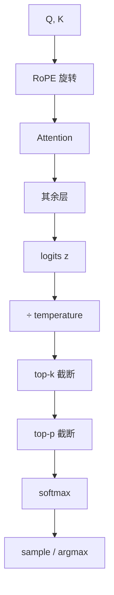

import ChapterMeta from "../../../components/ChapterMeta.astro";

<ChapterMeta
  section="1.4"
  difficulty={3}
  readingTime={32}
  prev={{ href: "/01-transformer/03-attention/", title: "Attention 到底在计算什么" }}
  next={{ href: "/02-prefill-decode-kv-cache/", title: "第二篇 Prefill、Decode 与 KV Cache" }}
/>

## 本章目标

本章解决的问题：**没有位置信息时 Attention 分不清词序；有了 logits 之后，系统怎样选出那一个 id？**

读完本章，读者应该能够：

- 说明 RoPE 旋转的是 Q/K，不是把位置向量加到 embedding
- 区分论文的偶奇成对旋转与 Llama `rotate_half` 布局
- 用手算说明温度如何改变 softmax 锐度
- 实现 greedy / top-k / top-p，并标明这是教学代码

---

## 1. 为什么需要这个东西

把“狗咬人”和“人咬狗”的 token 向量打乱顺序，若没有任何位置信号，Attention 的 $QK^{\top}$ 可以对换后保持同一组无序匹配。语言模型必须知道 **谁在前**。

另一种失败：logits 已经偏向正确 JSON 键，但 `temperature=1.5` 且没有 top-p，模型仍可能采样到胡言。位置编码管“结构”，采样管“选择”；两者都在推理热路径上。

---

## 2. 核心概念

**直觉。** RoPE 把一对维度看成平面上的点，按 token 位置旋转。两个位置相差 $\Delta$ 时，它们的夹角差也是 $\Delta$ 的函数，于是点积自然带上相对位置。

**模型。** Su et al., 2021, [RoFormer](https://arxiv.org/abs/2104.09864)：对位置 $m$ 的向量乘旋转矩阵 $R_m$。相对位置出现在：

$$
(R_m q)^{\top}(R_n k)=q^{\top} R_{n-m} k
$$

| 符号 | 含义 |
| --- | --- |
| $m,n$ | Query、Key 所在的 **绝对位置**（从 0 起的 token 下标） |
| $q,k$ | 旋转前的 Query / Key 向量（一个头） |
| $R_m$ | 由位置 $m$ 决定的分块旋转矩阵；$\|R_m v\|=\|v\|$，只改方向不改模长 |
| $n-m$ | 相对距离；点积只依赖这个差，不依赖绝对起点 |

**数学。** 2D 平面上（一对维度）：

$$
\begin{pmatrix} x' \\ y' \end{pmatrix}
=
\begin{pmatrix}
\cos m\theta & -\sin m\theta \\
\sin m\theta & \cos m\theta
\end{pmatrix}
\begin{pmatrix} x \\ y \end{pmatrix}
$$

| 符号 | 含义 | 例子 |
| --- | --- | --- |
| $(x,y)$ | 该平面里旋转前的两个分量 | 教学里 $q$ 的偶奇维 |
| $(x',y')$ | 旋转后 | 再拿去和 Key 做点积 |
| $m$ | token 位置 | 0, 1, 2, … |
| $\theta$ | 这一对维度的基频 | $\theta_i=\theta_{\text{base}}^{-2i/d}$ |

频率公式（RoFormer §3.2.2 的常用写法；HF 实现为 `inv_freq`）：

$$
\theta_i = \theta_{\text{base}}^{-2i/d},\qquad i=0,1,\ldots,d/2-1
$$

| 符号 | 含义 | Llama 取值 |
| --- | --- | --- |
| $\theta_i$ | 第 $i$ 对维度的角频率 | 越大转得越快 |
| $\theta_{\text{base}}$ | 基数，HF 字段 `rope_theta` | Llama 2 常用 $10^{4}$；Llama 3.1 为 $5\times10^{5}$ |
| $i$ | 频率编号 | 从 0 到 $d/2-1$ |
| $d$ | 头维度 `head_dim` | 一般为 128 |

Llama 3.1 把 base 提到 $5\times10^{5}$ 以服务长上下文（[Llama 3 Table 3](https://arxiv.org/abs/2407.21783)）。HF 实现见 [`modeling_rope_utils.py`](https://github.com/huggingface/transformers/blob/main/src/transformers/modeling_rope_utils.py)（Last verified: 2026-09-03）。
**工程。** 只旋转 Q 和 K，不旋转 V。V 是被取出的内容，位置已经通过 QK 匹配进来。

Logits 是 `lm_head` 的原始分数。Hugging Face 默认 `generate` 为贪心；`do_sample=True` 才按概率抽。

---

## 3. 工作原理

RoPE 在一层 Attention 中的位置：

1. 算出 Q、K
2. 按 token 绝对位置取 cos/sin
3. 旋转 Q、K
4. 再做缩放点积

采样在全部层之后：

1. 取最后位置 logits $z\in\mathbb{R}^{V}$
2. 可选：$z\leftarrow z/\tau$
3. 可选：top-k 把第 k 名以下设为 $-\infty$
4. 可选：top-p（nucleus）按概率从高到低累计，超过 $p$ 的丢掉
5. softmax → multinomial，或贪心 argmax
6. 检查 EOS / max tokens / stop string

:::caution[⚠️ 常见误区]
top-k 与 top-p 的顺序会影响集合。教学代码按 **先温度，再 top-k，再 top-p**。真实框架以当时版本的 logits processor 链为准，不要把教学顺序说成 Hugging Face 的永久实现。
:::

---

## 4. 架构图



两种 RoPE 布局（同一组频率，不同维度配对）：

```text
论文 / 交错对:   (0,1) (2,3) (4,5) ...
Llama rotate_half: (0, d/2) (1, d/2+1) ...
```

它们差一个固定置换，都是 RoPE。**不要把教学交错实现对标成 Llama 源码。**

---

## 5. 数学原理

频率（`head_dim=4`, $\theta_{\text{base}}=10000$）：

$$
\theta_0=\theta_{\text{base}}^{0}=1,\quad \theta_1=\theta_{\text{base}}^{-2/4}=0.01
$$

| 符号 | 含义 | 本例 |
| --- | --- | --- |
| $\theta_{\text{base}}$ | RoPE 基数，HF 叫 `rope_theta` | 10000 |
| $d$ | 头维度 `head_dim` | 4 |
| $\theta_i$ | 第 $i$ 对维度的角频率 | $i=0\Rightarrow 1$；$i=1\Rightarrow 0.01$ |
| 角度 | 位置 $\times$ 频率 | 位置 2、低频：$2\times 1=2$ rad |

位置 0,1,2 的角度（行 = 位置，列 = 频率对）：

$$
\begin{bmatrix}0&0\\1&0.01\\2&0.02\end{bmatrix}
$$

| 行列 | 含义 | 本例 |
| --- | --- | --- |
| 行 $m$ | token 绝对位置 | $0,1,2$ |
| 列 $i$ | 第 $i$ 对维度的角度 $m\theta_i$ | 列 0 用 $\theta_0=1$；列 1 用 $\theta_1=0.01$ |
| 例如 $(2,0)=2$ | 位置 2、低频对 | $2\times 1=2$ rad |
| 例如 $(2,1)=0.02$ | 位置 2、高频对 | $2\times 0.01=0.02$ rad |

向量 $q=[1,0,0,1]$ 在位置 1、交错布局下：

$$
(x_0,x_1)=(1,0)\ \text{转 }1\ \text{rad} \Rightarrow (0.5403,0.8415)
$$

$$
(x_2,x_3)=(0,1)\ \text{转 }0.01\ \text{rad} \Rightarrow (-0.0100,0.99995)
$$

| 符号 | 含义 | 本例 |
| --- | --- | --- |
| $q$ | 旋转前的 4 维向量 | $[1,0,0,1]$，位置 $m=1$ |
| $(x_0,x_1)$ | 交错布局的第 0 对（维 0 与维 1） | $(1,0)$，转 $m\theta_0=1$ rad |
| $(x_2,x_3)$ | 第 1 对（维 2 与维 3） | $(0,1)$，转 $m\theta_1=0.01$ rad |
| 箭头右侧 | 乘 $2\times2$ 旋转矩阵后的坐标 | $\cos1\approx0.5403,\sin1\approx0.8415$ |

与 `examples/ch01/rope.py` 的 `q_paper[1]` 一致。教学是交错对；Llama 的 `rotate_half` 配对方式不同，见下节。

温度：$\tau\to0$ 时 softmax 趋近 one-hot（数值上还受浮点限制）；$\tau>1$ 变平。符号与 [1.1 节 softmax](/01-transformer/01-generate-one-token/#2-核心概念) 相同。

Nucleus / top-p（Holtzman et al., [The Curious Case of Neural Text Degeneration](https://arxiv.org/abs/1904.09751)；HF 文档称 top-p）：

$$
\mathcal{V}_p=\Bigl\{x_{\pi(1)},\ldots,x_{\pi(k)}\Bigr\}
\quad\text{其中 }k=\min\bigl\{k':\sum_{i=1}^{k'} p_{\pi(i)}\ge p\bigr\}
$$

| 符号 | 含义 |
| --- | --- |
| $p_i$ | softmax 之后、截断之前的概率 |
| $\pi$ | 把概率从大到小排序的排列，$\,p_{\pi(1)}\ge p_{\pi(2)}\ge\cdots$ |
| $p$ | top-p 阈值（HF `top_p`），例如 0.9 |
| $k$ | 从最大项起、累计质量刚达到 $p$ 时的集合大小 |
| $\mathcal{V}_p$ | 保留下来的词表子集；其余 logits 在 softmax 前被打成 $-\infty$ |

它丢掉的是累计概率之外的 **尾部质量**，不是固定比例的「种类」。实现顺序见 Hugging Face [Generation strategies](https://huggingface.co/docs/transformers/en/generation_strategies)（Last verified: 2026-09-03）。

---

## 6. 代码实现

RoPE 教学文件：`examples/ch01/rope.py`  
采样教学文件：`examples/ch01/sampling.py`

```python
def rotate_interleaved(x, cos, sin):
    even, odd = x[..., 0::2], x[..., 1::2]
    out = np.empty_like(x)
    out[..., 0::2] = even * cos - odd * sin
    out[..., 1::2] = even * sin + odd * cos
    return out

def apply_rope_llama(x, cos, sin):
    return x * cos + rotate_half(x) * sin
```

```python
def sample(logits, *, temperature=1.0, top_k=None, top_p=None, rng=None):
    z = logits / temperature
    if top_k is not None:
        z = top_k_mask(z, top_k)
    if top_p is not None:
        z = top_p_mask(z, top_p)
    probs = softmax(z)
    return int(rng.choice(len(probs), p=probs))
```

相对位置检验：RoPE 后 `q[i]·k[j]` 应等于 `q[i+1]·k[j+1]`。测试 `test_relative_inner_product_depends_on_offset` 覆盖这一点。

---

## 7. 一个完整例子

词表四字 `["是","很","的","猫"]`，logits `[4, 2, 1, 0]`：

| 处理 | 概率（四位） | 注释 |
| --- | --- | --- |
| $\tau=1$ | 0.831, 0.113, 0.041, 0.015 | 原分布 |
| $\tau=0.7$ | 0.931, 0.054, 0.013, 0.003 | 更尖 |
| $\tau=0.2$ | ≈ 1, 0, 0, 0 | 近贪心 |
| top-k=2 | 只留 4 与 2 | 后两个 $-∞$ |
| top-p=0.9 | 同样只留前两个 | 因为 0.831+0.113>0.9 |

贪心结果永远是“是”。`temperature=0.7, top_k=3`、种子 0..7 的 8 次抽样里，7 次仍是 index 0，1 次 index 1。低温度下多样性有限——这是机制，不是实现错误。

教学尺寸下 RoPE 的额外 FLOPs 相对 GEMM 可忽略：每个 Q/K 元素几次乘加。它影响的是 **质量与长上下文外推**，不是 7B Prefill 的算力排行榜。

---

## 8. 性能分析

| 维度 | RoPE | Sampling |
| --- | --- | --- |
| Compute | 很低 | softmax 在 $V$ 维，70B 约 12.8 万 |
| Memory | 存 cos/sin 表或现场算 | logits 一行 $V$ |
| Communication | 无额外 | 采样通常在 driver / 指定 rank |
| Scheduling | 无 | 约束解码会拉长 CPU 侧 |

🚀 性能：采样很少成为 70B Decode 的主因；但 **结构化输出 / 文法约束** 可能变成 CPU 瓶颈。那是第十一、十二篇的话题。RoPE 的长上下文变体（YaRN、Llama 3 scaling）改变频率，不改变 Attention 二次复杂度。

---

## 9. 工程实现

- **Llama 3.1**：`rope_theta=500000`，长上下文还有 frequency scaling（HF `rope_type='llama3'`）。教学脚本只用 default $\theta=10000$ 的短例子。
- **Hugging Face generate**：贪心默认；`temperature`、`top_k`、`top_p`、`do_sample` 见 Generation strategies 文档。Last verified: 2026-09-03。
- **vLLM**：采样在引擎的 Sampler 中，与 batch 中每个请求的独立随机状态绑定。不要假设全局一个 `np.random`。
- **temperature=0**：有的服务把它映射成贪心；有的仍走采样路径。以提供方文档为准，不要宣传“数学上绝对确定”——并列最大值与非确定性 kernel 仍可能造成差异。

---

## 10. 源码分析

:::note[🔎 源码]
Last verified: 2026-09-03。
:::

| 主题 | 位置 | 注意 |
| --- | --- | --- |
| RoPE 频率 | HF `modeling_rope_utils.py` | 多种 `rope_type` |
| Llama 旋转 | `apply_rotary_pos_emb` + `rotate_half` | 前半/后半配对 |
| 采样 | HF `TemperatureLogitsWarper`、`TopKLogitsWarper`、`TopPLogitsWarper` | processor 链 |
| vLLM | Sampler + 各请求的 `sampling_params` | 与 HF 参数名相近，默认值可能不同 |

教学 `rotate_interleaved` **不是** Llama 的数据结构。两者都在测试里给出，就是为了防止这种张冠李戴。

---

## 11. 实验

🔬 实验：

```bash
python3 examples/ch01/rope.py
python3 examples/ch01/sampling.py
python3 -m unittest tests.test_ch00_ch01.RopeTests tests.test_ch00_ch01.SamplingTests -v
```

试着改：

1. `theta=500000` 再打印 `inv_freq[1]`，应远大于 0.01，低频旋转更慢。
2. `top_p=0.5`，对 `[4,2,1,0]` 应只留下第一名。
3. 在 `ToyLM.generate` 里换 `sample`，重复 token 应减少（不一定消失）。

---

## 12. 常见误区

1. **“RoPE 是加在 embedding 上的位置向量。”** 它乘在 Q/K 上。
2. **“Llama 源码按偶奇维成对旋转。”** HF Llama 使用 `rotate_half`；教学交错布局是 RoFormer 公式的直接写法。
3. **“temperature=0 在所有框架都比特级确定。”** 并列 logits、GPU 归约顺序、服务端映射都会破坏这个神话。
4. **“top-p=0.9 表示丢掉 10% 的 token 种类。”** 它丢掉的是累计概率之外的 **尾部质量**，种类数随分布变。

---

## 13. 本章小结

1. RoPE 用旋转把相对位置写进 QK 点积。
2. 只转 Q/K，不转 V。
3. 论文布局与 Llama `rotate_half` 等价到置换，必须分开标注。
4. Llama 3.1 的 $\theta=5\times10^5$ 服务于长上下文。
5. Logits 不是概率；softmax 之前可以温度和截断。
6. 贪心稳定，采样多样；截断防止长尾胡话。
7. 采样教学顺序未必等于某框架 processor 链。
8. 第一篇结束：你已经能从 id 走到下一个 id。下一步是 Prefill/Decode 与 KV。

---

## 14. 下一章

第一篇把 **计算语义** 讲完了。第二篇回答性能分叉：为什么 Prompt 可以一次算完，生成却必须一步一步；以及如果不缓存 K/V，生成 1000 个 token 会发生什么。那是推理系统真正开始的地方。
