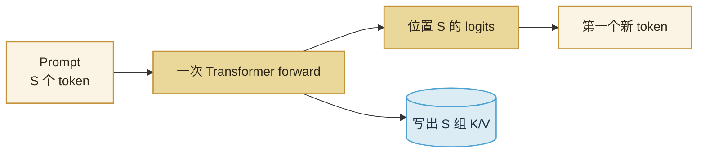

import ChapterMeta from "../../../components/ChapterMeta.astro";

<ChapterMeta
  section="2.1"
  difficulty={2}
  readingTime={18}
  prev={{ href: "/01-transformer/04-rope-logits-sampling/", title: "RoPE、Logits 与 Sampling" }}
  next={{ href: "/02-prefill-decode-kv-cache/02-decode/", title: "Decode：每次只生成一个 token" }}
/>

## 本章目标

本章解决的问题：**用户的问题已经全部写完了，为什么系统还要先做一轮和“生成”不一样的前向？**

读完应能：画出 Prefill 时 Q、K、V 的长度；说明因果掩码如何挡住“未来”；指出这一步产出的不只是第一个 token，还有整段 Prompt 的 K/V。

---

## 1. 为什么需要这个东西

第一篇的玩具循环每次都把**已有全部 id**再算一遍。Prompt 有 2000 个 token 时，那是在对已经写死的问题做 2000 次重复劳动。

服务端把生成拆成两段：

1. **Prefill**：Prompt 一次性读完，得到第一个新 token，并留下历史 K/V。
2. **Decode**：之后每来一个新 token，只算这一步。

用户感知的 **TTFT**（第一个 token 何时出现）主要卡在 Prefill。后面每个 token 的间隔是 **TPOT**，主要卡在 Decode。两段活的形状不同，优化手段也不同。本章只把 Prefill 的形状讲清楚。

:::tip[💡 核心概念]
Prefill 不是“预热”。它是对整段已写文字做一次带因果掩码的前向，并缓存每个位置的 K 和 V。
:::

---

## 2. 核心概念

**输入。** 长度为 $S$ 的 Prompt：$x_1,\ldots,x_S$。

**计算形状。** 每个注意力头上：

| 张量 | Prefill 形状（单请求、单头） |
| --- | --- |
| $Q$ | $S \times d_h$ |
| $K$ | $S \times d_h$ |
| $V$ | $S \times d_h$ |
| 分数 $QK^\top$ | $S \times S$ |

教学尺寸 $B=4,S=1024,H=32,d_h=128$ 时，分数矩阵是 $4\times 32\times 1024\times 1024$。

**因果。** 位置 $i$ 只能看见 $j\le i$。位置 $S$ 的输出才对应“Prompt 读完后的下一个 token”。前面 $S-1$ 个位置的 logits 在生成里通常丢掉，但它们的 K/V 必须留下。

---

## 3. 工作原理



1. Tokenizer 把字符串变成 $S$ 个 id。
2. 整段做 Embedding → 各层 Attention / FFN。
3. 每一层把该层的 K、V 写入 KV Cache。
4. 只拿**最后一个位置**的 logits 去采样，得到回答的第一个 token。
5. 系统切到 Decode。

第四篇会把过长的 Prompt 切成 chunk。数学上仍是 Prefill：Q 的长度等于这一块，K/V 长度等于已经读过的前缀加上这一块。

---

## 4. 数学原理

一层、一个头的分数：

$$
\mathrm{Attn}(Q,K,V)=\mathrm{softmax}\!\left(\frac{QK^\top}{\sqrt{d_h}}+M\right)V
$$

$M$ 是因果掩码：$j>i$ 处置 $-\infty$。Prefill 的乘加次数按 $2BHd_h S^2$ 计（见 `attention_scores_flops`）。$S$ 翻倍，这一项按平方涨。这也是长 Prompt 首字变慢的直接原因。

---

## 5. 代码实现

`examples/ch02/prefill_decode.py` 里的 `CachedToyLM.prefill` 一次算出整段 Q/K/V，存下 K/V，只返回最后一行 logits。教学实现，不是 vLLM。

```bash
python3 examples/ch02/prefill_decode.py
```

应看到教学尺寸下 Prefill 分数 FLOPs 是 Decode 的 **1024** 倍——比值恰好是 $S$，因为 Decode 的 $Q$ 长度是 1。

---

## 6. 常见误区

1. **“Prefill 就是把权重加载到 GPU。”** 加载权重是另一步。Prefill 是对 Prompt 做 Transformer。
2. **“Prefill 只算最后一个 token。”** 每个位置的 K/V 都要算；丢掉的是中间位置的 logits。
3. **“Prompt 越长只是多读一点字。”** Attention 分数是 $S\times S$，不是线性扫一眼。

---

## 7. 本章小结

1. Prefill 一次吃完整段 Prompt，形状是 $S\times S$ 的注意力。
2. 输出是第一个新 token，以及每层的 K/V。
3. TTFT 主要反映这一步。
4. 下一节：之后每一步为什么必须 $Q$ 长度为 1。
