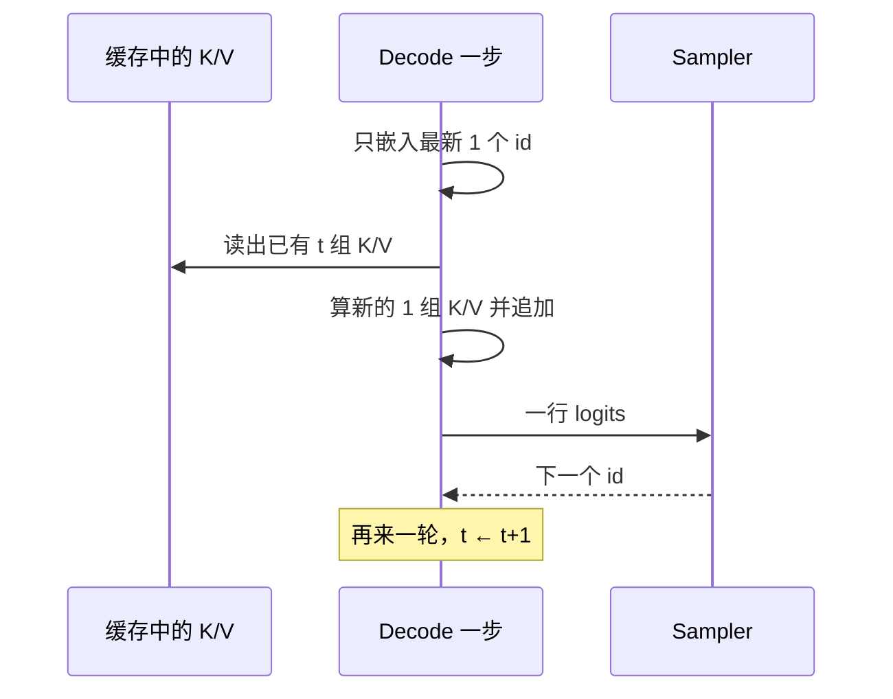

import ChapterMeta from "../../../components/ChapterMeta.astro";

<ChapterMeta
  section="2.2"
  difficulty={2}
  readingTime={16}
  prev={{ href: "/02-prefill-decode-kv-cache/01-prefill/", title: "Prefill：一次性读完 Prompt" }}
  next={{ href: "/02-prefill-decode-kv-cache/03-compute-vs-bandwidth/", title: "Prefill 吃算力、Decode 吃带宽" }}
/>

## 本章目标

本章解决的问题：**已经有了 Prompt 的 K/V，生成下一个字时还要重算整段吗？**

读完应能：写出 Decode 一步的 Q/K/V 形状；解释为什么生成 $N$ 个 token 通常要 $N$ 次 Decode；说明流式输出为什么天然发生在这一步之后。

---

## 1. 为什么需要这个东西

若每次生成都把 Prompt + 已写出的回答全部再跑一遍 Prefill，第 100 个新 token 要对长度 $S+99$ 做一次 $O(n^2)$ 注意力。用户每多等一个字，历史就被完整重算一次。

Decode 的约定：只为**新 token** 算 Q、K、V，Q 去点积**已经缓存的全部 K**，得到一个新的隐状态，再采样。旧位置的 Q 不再出现。

:::tip[💡 核心概念]
Decode 一步的产品仍是一个 token。它复用历史 K/V，不再复用历史的 Q。
:::

---

## 2. 核心概念

设缓存里已有 $t$ 个位置（Prompt 加已经写出的回答）。新来一个 token：

| 张量 | Decode 形状（单请求、单头） |
| --- | --- |
| $Q$ | $1 \times d_h$ |
| 新 $K,V$ | $1 \times d_h$（追加到缓存） |
| 用于点积的 $K,V$ | $t \times d_h$（读缓存）再变成 $(t+1)\times d_h$ |
| 分数 | $1 \times (t+1)$ |

和 Prefill 的 $S\times S$ 比：Q 的长度从 $S$ 掉到 1，分数从方阵变成一行。

**步数。** 要 $N$ 个新 token，就要 $N$ 次这样的 forward（第一次常由 Prefill 末尾的采样给出，之后 $N-1$ 次纯 Decode；教学代码两种数法都会标清）。

---

## 3. 工作原理



流式接口（SSE / WebSocket）在**每次采样之后**就能把这段增量发给客户端。这不是额外功能，是 Decode 一步一 token 的直接后果。

没有缓存时，`ToyLM.generate` 每次对全部 `ids` 做 forward，数学上应与“缓存 + 只算新位置”一致。`examples/ch02/prefill_decode.py` 用同一套权重对比这两条路径。

---

## 4. 数学原理

Decode 一步的分数 FLOPs（教学约定 $2BHd_h\cdot 1\cdot t$）相对 Prefill（$2BHd_h S^2$）约为 $t/S^2$。取 $t=S$：

$$
\frac{\mathrm{FLOPs}_{QK^\top}^{\text{prefill}}}{\mathrm{FLOPs}_{QK^\top}^{\text{decode}}}=S
$$

教学脚本在 $S=1024$ 时打印的比值就是 1024。注意力不是 Decode 的全部：每一步仍要把**整份权重**过一遍。权重这项不随 $S$ 变成 $S\times S$，但每步都在，带宽压力从这里开始——下一节展开。

---

## 5. 代码实现

`CachedToyLM.decode_one` 只对 1 个新 id 做 QKV，拼到缓存上，再跑注意力。`generate_with_cache` 应与 `ToyLM.generate` 得到同一串 id（同一 seed）。这是在断言：**缓存改的是重复计算，不是采样数学。**

```bash
python3 -m unittest tests.test_ch02_prefill.PrefillDecodeTests.test_cached_matches_naive_recompute -v
```

---

## 6. 常见误区

1. **“Decode 可以一次算出后面 50 个字。”** 自回归下一步依赖上一步的 id。投机解码（第十一篇）是猜+验，不是取消这个依赖。
2. **“有了 KV，Decode 就不再读模型。”** 权重每步都要读。缓存省的是历史 token 的 QKV 与中间激活，不是权重。
3. **“第一个回答 token 算 Decode。”** 它通常在 Prefill 结束时采样。服务指标里它计入 TTFT，不计入后续 TPOT。

---

## 7. 本章小结

1. Decode 的 $Q$ 长度为 1，K/V 长度等于当前上下文。
2. $N$ 个新 token ≈ $N$ 次 Decode forward。
3. 流式输出跟在每一步采样后面。
4. 缓存与重算必须给出同一串 token；否则是实现 bug，不是加速。
