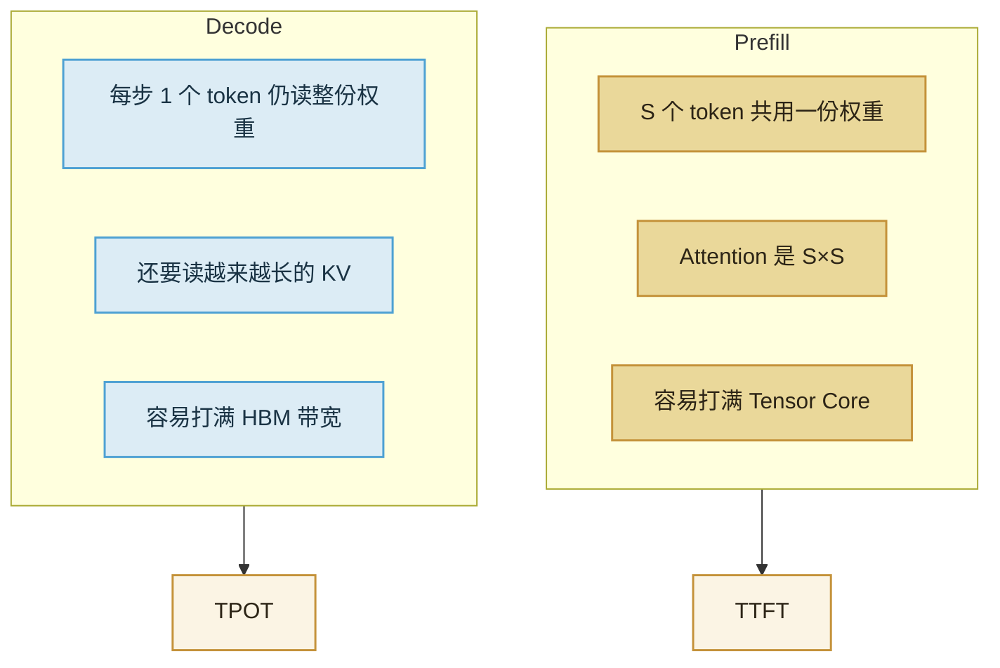

import ChapterMeta from "../../../components/ChapterMeta.astro";

<ChapterMeta
  section="2.3"
  difficulty={3}
  readingTime={16}
  prev={{ href: "/02-prefill-decode-kv-cache/02-decode/", title: "Decode：每次只生成一个 token" }}
  next={{ href: "/02-prefill-decode-kv-cache/04-what-kv-stores/", title: "KV Cache 缓存的是什么" }}
/>

## 本章目标

本章解决的问题：**同样是 Transformer，为什么读问题像在算，写回答像在搬内存？**

读完应能：用“每字节算多少次”解释分叉；指出 Decode 每步都要扫权重；知道第三篇会把这句话对到 GPU 的 Roofline，本章不引入 SM。

---

## 1. 为什么需要这个东西

只说“Prefill 慢、Decode 也慢”无法选型。有人加卡想加快首字，有人换带宽更高的卡想加快后续字。对错取决于你卡在哪一段。

分叉来自**同一套权重、两种复用次数**：

- Prefill：每个权重被 $S$ 个 Prompt token 共用。
- Decode：每个权重每步只服务 1 个新 token，然后下一步再读一遍。

:::tip[💡 核心概念]
算力瓶颈 = 算术单元来不及乘。带宽瓶颈 = 数据从显存来不及送到计算单元。Prefill 常是前者，Decode 常是后者。
:::

---

## 2. 核心概念

把权重 GEMM 的算术强度写成：

$$
I \approx \frac{2\cdot \text{tokens}}{\text{dtype bytes}}
$$

BF16 下 Decode（tokens $=1$）是 $1$ FLOP/byte。Prefill（tokens $=S$）是 $S$ FLOP/byte。$S=1024$ 时强度差三个数量级。

注意力还有 $S^2$ 项，会让长 Prompt 的 Prefill 更偏算力。Decode 的注意力是一行点积，通常仍小于“整网权重再读一遍”。

第三篇用 H100 的屋顶线：脊点大约几百 FLOP/byte。$I=1$ 在脊点左侧（带宽），$I=1024$ 在右侧（算力）。本章只要记住这张草图。

---

## 3. 工作原理

工程上的直接后果：

| 你想改善 | 先动什么 | 乱动能发生什么 |
| --- | --- | --- |
| TTFT | 缩短 Prompt、切块 Prefill、更快的计算 | 只加 Decode batch，首字可能更慢 |
| TPOT | 减权重流量（量化）、减 KV、提高带宽利用率 | 只堆 Prefill 并行，后续字不一定快 |

---

## 4. 一个完整例子

Llama 3.1 70B BF16，单请求，Prompt 8K，再写 128 个 token：

1. Prefill：8K 行共用 130.4 GiB 量级的权重，外加 $8\text{K}\times 8\text{K}$ 注意力。首字慢，GPU 利用率往往不低。
2. Decode：128 步，每步再扫一遍权重，并读当时的 KV（2.5 节给出 8K 时约 2.5 GiB，且随回答变长）。
3. 用户看见的“模型在打字”是第 2 段。第 1 段是空白等待。

数字的硬件屋顶放到 3.3。这里只要求能分开两段活。

---

## 5. 常见误区

1. **“利用率低就是模型太小。”** Decode 利用率低常常是带宽墙，不是卡闲着没事。
2. **“加 batch 一定让 Decode 更吃算力。”** 会提高强度，同时提高 KV 和延迟；第四篇再讲。
3. **“KV 很大所以 Prefill 也是带宽墙。”** Prefill 写 KV 一次；真正反复读 KV 的是 Decode。

---

## 6. 本章小结

1. Prefill 复用权重大、注意力是方阵，偏向算力。
2. Decode 每步重读权重、顺带读 KV，偏向带宽。
3. TTFT 对 Prefill，TPOT 对 Decode，不要用一个“快”字混过去。
4. 下一节：缓存里到底躺着什么。
