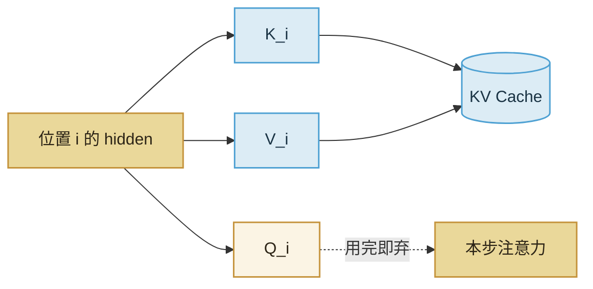

import ChapterMeta from "../../../components/ChapterMeta.astro";

<ChapterMeta
  section="2.4"
  difficulty={2}
  readingTime={14}
  prev={{ href: "/02-prefill-decode-kv-cache/03-compute-vs-bandwidth/", title: "Prefill 吃算力、Decode 吃带宽" }}
  next={{ href: "/02-prefill-decode-kv-cache/05-kv-memory/", title: "KV 显存怎么乘到 2.5 GiB" }}
/>

## 本章目标

本章解决的问题：**名字里有 Cache，里面到底缓存了哪几个张量？**

读完应能：指出 K、V 来自哪一次线性变换；列出不进缓存的东西；说明改温度不必作废 KV，改 Prompt 必须作废。

---

## 1. 为什么需要这个东西

“Cache”容易让人联想到网页缓存或权重缓存。KV Cache 两者都不是。把它想成**已经算过的注意力左侧材料**：以后的 Q 还要来点积这些 K，再去加权这些 V。

搞错身份会派生一串错：

- 以为缓存的是输出词，于是去“缓存 Sampler”。
- 以为缓存的是全部 hidden，于是按 $d_{\text{model}}$ 的 10 倍估显存。
- 以为量化权重会自动缩小 KV。

:::tip[💡 核心概念]
KV Cache 存的是每一层、每一个已出现位置的 Key 和 Value。不存 Query，不存 FFN 激活，不存已经发出去的字面量。
:::

---

## 2. 核心概念

每一层 Attention：

$$
Q=xW_Q,\quad K=xW_K,\quad V=xW_V
$$

位置 $i$ 的 $K_i,V_i$ 只依赖该位置的输入（以及该层之前的计算）。后面位置的 $Q_{i+k}$ 还要和 $K_i$ 做点积，所以 $K_i,V_i$ 值得留下。$Q_i$ 只在位置 $i$ 自己那一步用，不必留下。

| 留下 | 不留下 |
| --- | --- |
| 每层的 $K$、$V$ | $Q$ |
| 对应的位置 / 块号 | FFN 中间激活 |
| 层号、头号（逻辑上） | logits、概率、采样结果 |
| | 词表 embedding 本身（那是权重） |

RoPE 加在 Q/K 上。教学实现把旋转后的 K 写入缓存，Decode 只旋转新位置。不要缓存未旋转的 K 却忘记在读取时补旋转——两种算法都能做对，混用就错。

---

## 3. 工作原理

**何时必须作废：**

- Prompt 变了（包括系统提示、工具结果插回）。
- 层数、头数、精度、RoPE 配置变了。
- 你从缓存里删掉了中间一段却还当上下文连续（除非模型支持这种编辑）。

**何时可以保留：**

- 只改温度、top-p、stop 词——Sampler 在 KV 之后。
- 同一前缀上继续写（Prefix Cache，第四篇）。

---

## 4. 常见误区

1. **“KV 是模型输出的缓存。”** 输出是 token id。KV 是层内中间量。
2. **“缓存了 hidden state。”** 只缓存投影后的 K 和 V，形状跟头数、头维走，不跟残差流的全部激活走。
3. **“权重量化了，KV 就小了。”** 默认 KV 仍是 BF16/FP16。KV 量化是另一件事（第八篇）。

---

## 5. 本章小结

1. 缓存 = 每层每位置的 K 与 V。
2. Q、FFN、logits、字面输出都不进这份缓存。
3. Prompt 变则 KV 废；采样参数变则 KV 可以留。
4. 下一节用公式把它乘成 GiB。
