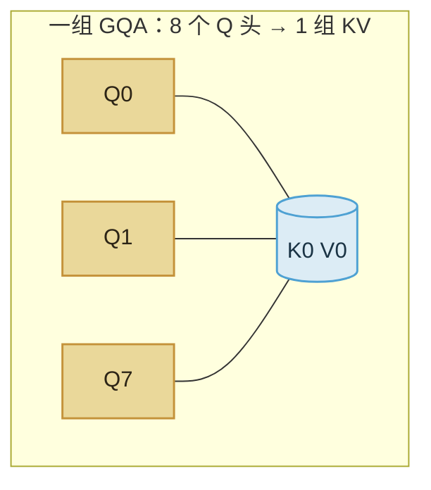

import ChapterMeta from "../../../components/ChapterMeta.astro";

<ChapterMeta
  section="2.6"
  difficulty={3}
  readingTime={16}
  prev={{ href: "/02-prefill-decode-kv-cache/05-kv-memory/", title: "KV 显存怎么乘到 2.5 GiB" }}
  next={{ href: "/03-gpu/01-hardware/", title: "GPU 是什么、现在有哪些卡" }}
/>

## 本章目标

本章解决的问题：**Q 有 64 个头，凭什么 K/V 只存 8 组？**

读完应能：区分 MHA / GQA / MQA；算出“假如 70B 仍是 64 个 KV 头”的 20 GiB；说明 GQA 改的是 KV 占用，不是层数。

---

## 1. 为什么需要这个东西

多头注意力（MHA）里每个 Q 头配自己的 K 头、V 头。70B 有 64 个 Q 头。若 KV 头也是 64，8K 单请求 KV 就是：

$$
2.5\ \text{GiB}\times\frac{64}{8}=20\ \text{GiB}
$$

只换一种头的共享方式，KV 缩小 8 倍。这是 Llama 2/3 70B 能在合理显存里做长上下文的前提之一，不是推理引擎的发明。

:::tip[💡 核心概念]
GQA：若干 Q 头共用同一组 K/V。共享发生在**头**上，序列长度和层数不变。
:::

---

## 2. 核心概念

| 名称 | $H_q$ 与 $H_{kv}$ | 70B 对照 |
| --- | --- | --- |
| MHA | 相等 | 若 64=64，8K KV = 20 GiB |
| **GQA** | $H_q=g\cdot H_{kv}$，$g>1$ | 64=8×8，8K KV = 2.5 GiB |
| MQA | $H_{kv}=1$ | 更省，表达力通常更弱 |

计算时：第 $i$ 个 Q 头使用第 $\lfloor i\cdot H_{kv}/H_q\rfloor$ 组 K/V。实现上常把 K/V **沿头维重复**到 $H_q$，再走普通注意力。重复的是视图，不是再存 8 份。

---

## 3. 工作原理



Prefill / Decode 形状：K/V 的头维是 $H_{kv}$ 不是 $H_q$。公式里必须用 $H_{kv}$。引擎若按 Q 头分配 KV 页，会多占 8 倍页。

MQA（$H_{kv}=1$）是 GQA 的极端。Llama 3.1 70B 选 $H_{kv}=8$，是论文里质量和显存的折中（Grattafiori et al., 2024, Table 3）。Last verified: 2026-09-03。

---

## 4. 代码实现

```python
gqa, mha = gqa_vs_mha_kv_gib()
# 2.5 , 20.0
```

见 `examples/ch02/prefill_decode.py`。假想 MHA 只改 `num_kv_heads=64`，其余与 70B 相同。

```bash
python3 -m unittest tests.test_ch02_prefill.PrefillDecodeTests.test_70b_gqa_is_2_5_and_mha_is_20 -v
```

---

## 5. 常见误区

1. **“GQA 是 vLLM 的分页技巧。”** GQA 是模型结构。分页是第四篇的分配器。
2. **“头少了，上下文就短了。”** 长度 $S$ 不变；变的是每个位置存多少头。
3. **“重复 K/V 到 64 头会把显存乘回去。”** 那是计算视图。存盘/驻留仍按 $H_{kv}$。

---

## 6. 本章小结

1. 70B：$H_q=64$，$H_{kv}=8$，8K KV = 2.5 GiB；若 MHA 则 20 GiB。
2. GQA 让一组 K/V 服务多组 Q。
3. 估显存必须用 KV 头，不能用 Q 头偷懒。
4. 第二篇结束。第三篇把“吃算力 / 吃带宽”对到真实的卡。
