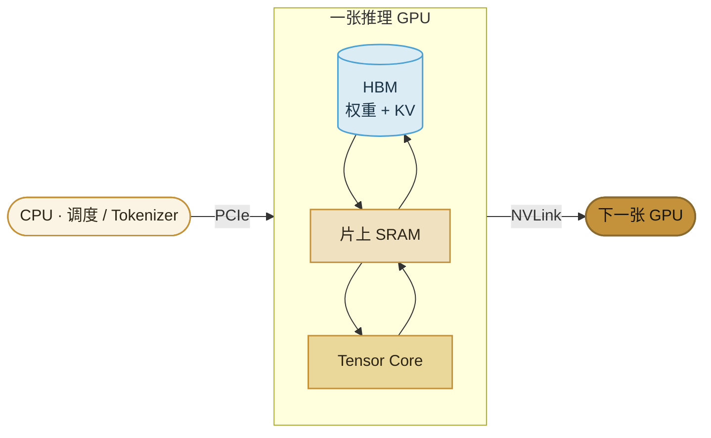

import ChapterMeta from "../../../components/ChapterMeta.astro";

<ChapterMeta
  section="3.1"
  difficulty={2}
  readingTime={26}
  prev={{ href: "/02-prefill-decode-kv-cache/06-gqa/", title: "GQA：为什么 KV 头是 8" }}
  next={{ href: "/03-gpu/02-forward/", title: "GPU 执行一次 forward 时发生了什么" }}
/>

## 本章目标

本章解决的问题：**大模型推理为什么跑在 GPU 上？看一张卡的规格表时，到底该看哪几列？现在数据中心常见的卡差在哪里？**

读完应能：指出 GPU 上和推理最相关的三块（计算、HBM、互连）；把厂商写的 GB 换成 GiB 再和 70B 权重比；说明 H200 相对 H100 主要加的是显存和带宽，不是另一套数学。

下一节才讲 SM、Kernel launch、Roofline 和 FlashAttention。本章不写 CUDA。

---

## 1. 为什么需要这个东西

第二篇会证明：Prefill 容易把算力打满，Decode 容易在读权重和 KV 上排队。那些结论如果没有硬件对象，就只是口号。

一张卡的规格表通常有几十行。推理真正先问的只有三句：

1. **放得下吗？** 权重 + KV + 工作区，有没有超过显存。
2. **读得动吗？** Decode 每步都要扫权重和历史 KV，瓶颈经常是带宽。
3. **算得完吗？** Prefill 和大 batch 才主要吃 Tensor Core 的 TFLOPS。

:::tip[💡 核心概念]
选卡不是选“最贵的型号”。先看显存能不能装下模型和 KV，再看带宽能不能喂饱 Decode，最后才看各精度算力。
:::

---

## 2. 核心概念

**CPU 和 GPU。** CPU 核少、擅长不规则的控制流（Tokenizer、调度、采样可以在 CPU）。GPU 有成千上万个小核，擅长把同一件乘加做很多遍——Transformer 里几乎全是这种矩阵乘。所以 **模型计算** 放 GPU，**请求怎么排队** 仍在 CPU 上的引擎里。

**一张推理卡上有什么：**

| 名称 | 它是什么 | 推理时你为什么在乎 |
| --- | --- | --- |
| Tensor Core | 专门做混合精度矩阵乘的计算单元 | Prefill、大 batch 的算力 |
| SM | 计算单元的组；Kernel 发到这里跑 | 占用率；后面 3.2 展开 |
| SRAM / Cache | 芯片上的小而快的暂存 | FlashAttention 要尽量把中间结果留在这里 |
| **HBM** | 板载高带宽显存 | 权重和 KV 住在这里；Decode 每步来读 |
| GDDR | 另一种显存，带宽通常低于同代 HBM | L40S 用它；不要和 H100 的 HBM 混为一谈 |
| NVLink | GPU 与 GPU 之间的专用互连 | 多卡切模型；第九篇 |
| PCIe | GPU 与 CPU / 主机内存的通道 | 比 NVLink 慢一个数量级以上 |

**SXM 和 PCIe。** 同一代常见两种封装：SXM 插在 HGX/DGX 板上，NVLink 更完整、功耗上限更高；PCIe 是插槽卡，更好买、更好混部，带宽和互连往往更弱。**下面对照表默认数据中心 SXM（L40S 只有 PCIe）。**

**GB 和 GiB。** 厂商规格写 80GB、141GB，按 $10^9$ 字节。全书手算权重用 GiB（$1024^3$）。80GB $\approx$ 74.5 GiB，不是 80 GiB。比大小之前先换单位。

---

## 3. 工作原理

一次 Decode 在硬件上的粗路径：

1. 引擎在 CPU 上决定这一轮算哪些请求。
2. GPU 启动一个（或一组）Kernel。
3. Tensor Core 做矩阵乘；要用的权重和 KV 从 **HBM** 读进来。
4. 写出很小的一块结果（一个 token 的 logits 方向）。
5. 新的 K、V 写回 HBM。

Prefill 时第 3 步的计算量很大，HBM 来得及喂。Decode 时第 3 步变少，第 3 步前后的 **读 HBM** 仍在，于是带宽变成主角。这就是“Decode 吃带宽”在硬件上的意思。FlashAttention、量化、切卡，都是在改这张图里的某一跳。



---

## 4. 看规格表时的四列

| 列 | 单位 | 主要回答 | 典型误读 |
| --- | --- | --- | --- |
| 显存容量 | GB（厂商） | 模型和 KV 放不放得下 | 把 80GB 当成 80 GiB；忘了 KV 还会涨 |
| 显存带宽 | TB/s | Decode 能不能把权重扫完 | 只比 TFLOPS |
| Tensor TFLOPS | TFLOPS / 精度 | Prefill、大 batch | 把带稀疏标记的数字当成稠密峰值 |
| 互连 | GB/s | 多卡切分时通信会不会变成新瓶颈 | 以为 PCIe 等于 NVLink |

NVIDIA 的 Tensor 算力表常带星号：**结构化稀疏下的峰值，稠密时大约减半。** [H200 规格表](https://www.nvidia.com/en-us/data-center/h200/) 脚注写明 *With sparsity*。对比卡与卡，先看有没有这颗星。

本章对照表 **先写显存和带宽**。算力只在需要时点一下，避免一上来比无法对照的 FLOPS。

---

## 5. 现在常见的数据中心 GPU

Last verified: 2026-09-10。数字抄自厂商页面；同一型号还有 PCIe / NVL / 液冷差异，**以你机器上的 SKU 手册为准。**

| 卡 | 架构 | 显存 | 带宽 | 互连要点 | 来源 |
| --- | --- | --- | --- | --- | --- |
| A100 80GB SXM | Ampere | 80GB HBM2e | 2.039 TB/s | NVLink 600 GB/s | [NVIDIA A100](https://www.nvidia.com/en-us/data-center/a100/) |
| H100 SXM | Hopper | 80GB HBM3 | 3.35 TB/s | NVLink 900 GB/s | [NVIDIA H100](https://www.nvidia.com/en-us/data-center/h100/) |
| H200 SXM | Hopper | 141GB HBM3e | 4.8 TB/s | NVLink 900 GB/s | [NVIDIA H200](https://www.nvidia.com/en-us/data-center/h200/) |
| B200 | Blackwell | 180GB HBM3e | 8 TB/s | NVLink 第 5 代 | 由 [DGX B200](https://www.nvidia.com/en-us/data-center/dgx-b200/) 整机 1,440 GB / 64 TB/s ÷ 8 |
| L40S | Ada Lovelace | 48GB GDDR6 | 0.864 TB/s | 无 NVLink，PCIe | [NVIDIA L40S](https://www.nvidia.com/en-us/data-center/l40s/) |
| MI300X | CDNA 3 | 192GB HBM3 | 5.3 TB/s | Infinity Fabric | [AMD MI300X](https://www.amd.com/en/products/accelerators/instinct/mi300/mi300x.html) |

换算成 GiB（$\times 10^9 / 1024^3$）：

| 卡 | 厂商 GB | $\approx$ GiB |
| --- | --- | --- |
| A100 / H100 80GB | 80 | 74.5 |
| H200 | 141 | 131.3 |
| B200 | 180 | 167.6 |
| L40S | 48 | 44.7 |
| MI300X | 192 | 178.8 |

**怎么读这张表：**

- **H100 → H200** 是同代 Hopper：计算峰值几乎不变，显存从 80GB 到 141GB，带宽从约 3.35 TB/s 到 4.8 TB/s。对 Decode 和长上下文，这比“再快一点的 Tensor Core”更关键。
- **B200** 换代 Blackwell。NVIDIA 公开的是 [DGX B200](https://www.nvidia.com/en-us/data-center/dgx-b200/) 八卡整机：1,440 GB 显存、64 TB/s HBM3e，单卡份额 180GB / 8 TB/s。并带 FP4 Tensor。单卡稠密 BF16 以你拿到的 HGX 手册为准，不要用整机 PFLOPS 去除错。
- **L40S** 是 48GB GDDR6、带宽不到 1 TB/s、没有 NVLink。适合更小的模型或图形/多模态混部，**不是** 70B BF16 的默认对照。
- **MI300X** 192GB HBM3、5.3 TB/s，软件栈是 ROCm。大显存对“一张卡装下 70B”很友好；生态和 Kernel 路径与 CUDA 不同。
- **消费卡**（如 RTX 4090 24GB）可以做玩具和蒸馏小模型。全书默认对照是上表的数据中心卡。
- **其他加速器**（如昇腾）走各自软件栈。需要用时查该型号手册，不要把上表的 CUDA 假设搬过去。

:::caution[⚠️ 常见误区]
“H200 比 H100 算力翻倍，所以 Decode 一定翻倍。”H200 相对 H100 的公开升级是 **HBM 容量和带宽**。Decode 若本来就被 80GB 和 3.35 TB/s 卡住，升级才对得上；若瓶颈在调度或排队，换卡帮不上。
:::

---

## 6. 数学原理

70B BF16 权重大约：

$$
M_{\text{w}} \approx 70\times 10^{9}\times 2\ \text{B} = 140\times 10^{9}\ \text{B} \approx 130.4\ \text{GiB}
$$

| 符号 | 含义 |
| --- | --- |
| $70\times 10^{9}$ | 参数个数的数量级，不是精确计数 |
| $2$ | BF16 / FP16 每参数 2 字节 |
| $130.4$ GiB | $140\times 10^{9} / 1024^{3}$ |

和单卡比（只比权重大小，不含 KV、激活、碎片）：

| 卡 | 显存 GiB | 70B BF16 权重 |
| --- | --- | --- |
| A100 / H100 80GB | 74.5 | 放不下 |
| H200 141GB | 131.3 | 刚放下，KV 几乎没剩 |
| B200 180GB | 167.6 | 权重放下，仍要给 KV 留空 |
| MI300X 192GB | 178.8 | 同上 |
| L40S 48GB | 44.7 | 放不下 |

H200 的 131.3 GiB 减 130.4 GiB 只剩约 **0.9 GiB**。第二篇的 8K 单请求 KV 就是 2.5 GiB。所以“H200 能装下 70B BF16 权重”**不等于**“H200 能当单卡 70B 推理箱”。要嘛量化，要嘛多卡切分，要嘛接受更短上下文、更小 batch。

这不是调一个 API 参数能消掉的。第八篇压位数，第九篇切卡。

---

## 7. 一个完整例子

任务：Llama 3.1 70B，BF16，单请求，峰值上下文 8K。

1. 权重 $\approx 130.4$ GiB。A100/H100 80GB 直接出局。
2. H200 纸面能装下权重，但 8K KV 还要 2.5 GiB，已经超过剩余显存。还没算激活。
3. 所以这条负载在 H200 上仍然要：**量化权重或 KV**，或 **TP 切到两张以上**，或把上下文/并发砍掉。
4. B200 / MI300X 的显存余量够装权重 + 2.5 GiB KV，但仍会被更大 batch、更长上下文吃掉。余量不是无限。

**第一道墙是权重，第二道墙是 KV。** 规格表上的 GB 数字要同时对着这两道墙看。

---

## 8. 代码实现

教学规格表：`examples/ch03/gpu_spec_sheet.py`。**不是** `nvidia-smi`，也不是驱动查询。

```python
def vendor_gb_to_gib(vendor_gb):
    return vendor_gb * 10**9 / 1024**3

# 80GB → 74.51 GiB；141GB → 131.32 GiB
```

```bash
python3 examples/ch03/gpu_spec_sheet.py
python3 -m unittest tests.test_ch03_gpu -v
```

应看到 70B BF16 在 A100/H100/L40S 上 `too small`，在 H200/B200/MI300X 上 `fits`（只比权重，不含 KV）。

---

## 9. 性能分析

把第二篇的两段活对到规格列：

| 你卡在 | 规格上先看 | 换卡可能有用的方向 |
| --- | --- | --- |
| 权重都放不下 | 显存容量 | 更大 HBM，或量化、多卡 |
| 第一个 token 极慢、GPU 利用率高 | Tensor TFLOPS、以及 Prompt 是否太长 | 更快的计算；也可能该切 Prefill |
| 后续每个 token 慢、利用率低 | **带宽** 和 KV 是否太大 | H200/B200 这类加带宽的卡；或减 KV |
| 多卡几乎不比单卡快 | NVLink / 机内互连 | 第九篇；不要先怪 Kernel |

吞吐可以靠更大 batch 堆出来，同时把 TTFT 打爆。换一张带宽更高的卡，如果调度仍按静态 batch 绑人，用户感知也可以不变。

---

## 10. 工程实现

| 场景 | 常见选择 | 本章要记住的 |
| --- | --- | --- |
| 实验室 / 8B 级 | 单张 24–48GB 也能起步 | 不要把结论外推到 70B |
| 70B BF16 服务 | 多张 80GB，或单张 141GB+ 再量化 | 先算权重和 KV |
| 混部小模型 + 图形 | L40S 一类 PCIe | 无 NVLink，切卡方式不同 |
| 非 CUDA 集群 | MI300X 等 | 软件栈从引擎到 Kernel 都要换 |

`nvidia-smi` 看到的是 **你这张具体卡**。和上表对不上时，以机器为准：可能是 PCIe 版、MIG 切分、或驱动显示的可用显存小于标称。

---

## 11. 实验

过关（不看笔记）：

1. 推理为什么主要在 GPU 上算，却仍要 CPU 上的引擎？
2. HBM 和 Tensor Core 各主要服务 Prefill 还是 Decode？
3. 80GB 为什么装不下 130.4 GiB 的权重？
4. H200 相对 H100，公开规格上主要多了什么？
5. “H200 能装下 70B 权重”为什么还不一定能单卡跑 8K？

---

## 12. 常见误区

1. **“GPU = 显卡 = 游戏卡。”** 数据中心 SXM 卡的封装、互连、功耗和驱动与消费卡不同。
2. **“规格表上的 TFLOPS 就是线上 token/s。”** 峰值是理论上界；Decode 常常碰不到。
3. **“带星号的 1,979 TFLOPS 可以直接和别人的稠密峰值比。”** 先看是不是稀疏峰值。
4. **“换下一代卡，调度和 KV 问题会消失。”** 卡只提供容量和带宽；请求怎么绑在一起仍是系统问题。
5. **“MI300X 显存更大所以就是更快的 H100。”** 先比软件栈和实际 Kernel，再比纸面 GB。

---

## 13. 本章小结

1. GPU 用大量并行乘加跑 Transformer；引擎仍在 CPU 上做请求级决定。
2. 推理先看显存、带宽、互连，再看各精度 TFLOPS。
3. 厂商 GB 要换成 GiB 再和权重比。80GB $\approx$ 74.5 GiB。
4. 70B BF16 权重约 130.4 GiB：A100/H100 80GB 放不下；H200 刚放下权重，8K KV 仍可能把剩余显存吃光。
5. H200 相对 H100 主要是 HBM3e 的容量和带宽。B200 的单卡份额来自 DGX 整机规格除以 8。
6. L40S 是 GDDR、无 NVLink；MI300X 是大 HBM + ROCm。消费卡不作全书默认对照。
7. 下一节把这张卡接到一次 forward：SM、访存和 FlashAttention。

---

## 14. 下一章

下一节仍在第三篇：GPU 执行一次 Transformer forward 时发生了什么，为什么 Decode 容易 Memory Bound，FlashAttention 减少的是哪一次写回。那时才会用到 SM、算术强度这些词。PagedAttention 是显存管理，不是另一种 Tensor Core，放到第四篇。
