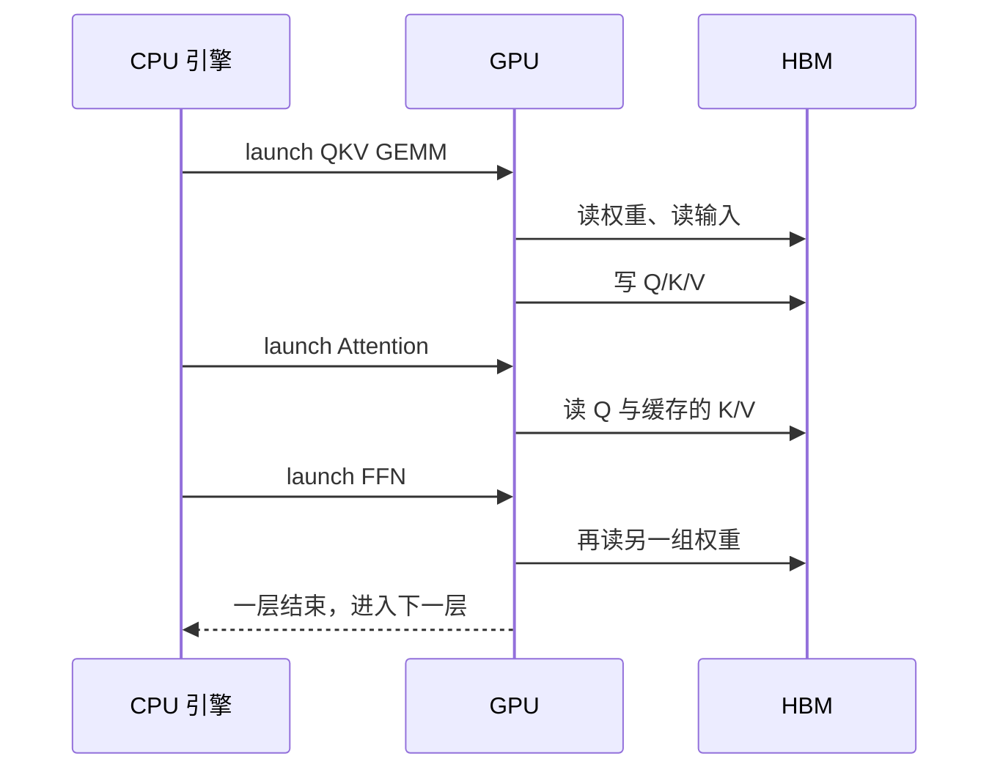

import ChapterMeta from "../../../components/ChapterMeta.astro";

<ChapterMeta
  section="3.2"
  difficulty={2}
  readingTime={16}
  prev={{ href: "/03-gpu/01-hardware/", title: "GPU 是什么、现在有哪些卡" }}
  next={{ href: "/03-gpu/03-roofline/", title: "算力、带宽和算术强度" }}
/>

## 本章目标

本章解决的问题：**Python 里一次 `forward`，在 GPU 上究竟启动了什么？**

读完应能：把 Kernel、SM、HBM 对上 3.1 的硬件图；说明 Decode 一步也会 launch 很多次小任务；知道占用率低不等于“没在算”。

---

## 1. 为什么需要这个东西

3.1 认识了卡。若停留在“GPU 很快”，就无法理解为什么 Decode 的利用率经常上不去，以及为什么 FlashAttention 值得单独一节。

引擎在 **CPU** 上决定算哪些请求。真正的矩阵乘在 **GPU** 上，以 Kernel 为单位启动。一次 Transformer 层 = 一串 Kernel（QKV、注意力、输出投影、FFN、归一化……），不是一个魔法函数。

:::tip[💡 核心概念]
Kernel 是 GPU 上一次可调度的程序。SM 是跑它的计算组。数据从 HBM 进来，经片上 SRAM，进 Tensor Core。
:::

---

## 2. 核心概念

| 词 | 一句话 |
| --- | --- |
| Host / Device | CPU 侧与 GPU 侧 |
| Kernel launch | CPU 把一项工作交给 GPU |
| SM | Streaming Multiprocessor，Kernel 的驻地 |
| Warp / Thread | SM 内部的并行粒度；本书不要求会写 |
| Occupancy | SM 上同时活着的工作有多少；高不一定快，低常说明 launch 或数据不够 |

Prefill 的矩阵大，一个 GEMM Kernel 就能喂饱许多 SM。Decode 的矩阵“瘦”（序列维是 1），每个 Kernel 干的活少，launch 开销和启动填充相对更刺眼。这就是“一步一 token”在硬件上的形状。

---

## 3. 工作原理

生产引擎会把相邻 Kernel 融掉或用 CUDA Graph 减少 CPU 往返。第五篇的 Mini-vLLM **没有**这些：它在 NumPy 里按层写循环，只为暴露“一层接着一层、一步接着一步”。不要把教学循环的耗时说成 H100 的 Kernel 时间。

---

## 4. 常见误区

1. **“一次 forward = 一次 Kernel。”** 一层里就有一串。
2. **“SM 越多 Decode 一定越快。”** Decode 常先碰到 HBM，见下一节。
3. **“Python 很慢所以推理慢。”** 大模型上，时间应在 GPU Kernel。若 profiler 显示时间在 Python，那是工程事故（第七篇）。

---

## 5. 本章小结

1. Forward 被拆成许多 Kernel，发到 SM 上跑。
2. 权重和 KV 住在 HBM，计算前要先搬。
3. Decode 的工作颗粒小，更容易露出 launch 与带宽问题。
4. 下一节用屋顶线给“算得动 / 搬得动”一个数。
