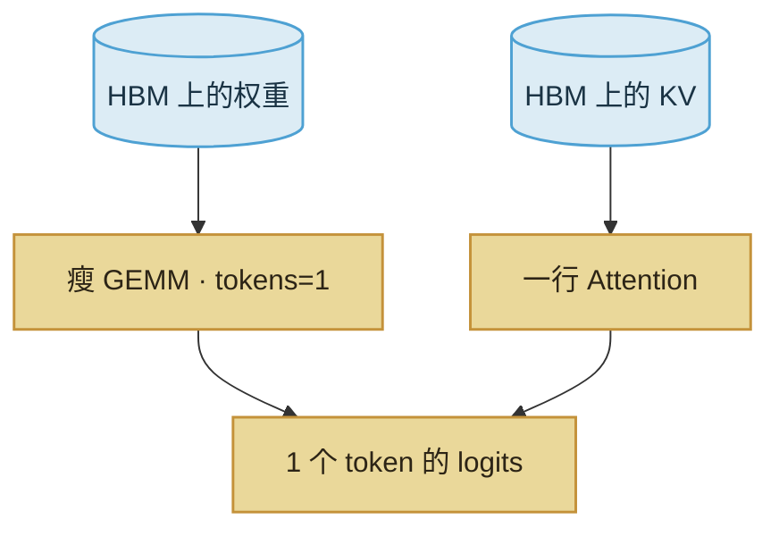

import ChapterMeta from "../../../components/ChapterMeta.astro";

<ChapterMeta
  section="3.4"
  difficulty={3}
  readingTime={16}
  prev={{ href: "/03-gpu/03-roofline/", title: "算力、带宽和算术强度" }}
  next={{ href: "/03-gpu/05-flashattention/", title: "FlashAttention 减少的是哪一次写回" }}
/>

## 本章目标

本章解决的问题：**Decode 一步算得并不多，为什么仍可能把 HBM 跑满、把 SM 晾在一边？**

读完应能：列出每步至少要读的两类数据；估算 70B 每步读权重的量级；说明加 batch 如何同时提高强度和 KV。

---

## 1. 为什么需要这个东西

线上常见现象：GPU 功率和利用率都不高，TPOT 却已经到了 SLA 边缘。若按“再买算力更强的卡”去治，可能买错列。

Decode 每步的有效计算大约是“每个参数两次浮点运算”这个量级，但要把**几乎全部权重**从 HBM 读到芯片上。70B BF16 ≈ 130.4 GiB。H100 3.35 TB/s 下，只扫权重的时间下界约 $130.4\ \text{GiB}/3.35\ \text{TB/s}\approx 42\ \text{ms}$。这是理想下界，不是承诺延迟；它说明：**一步一 token 先要付一遍读权重的税。**

:::tip[💡 核心概念]
Decode 的 Memory Bound 有两笔账：固定的权重流量，加上随长度增长的 KV 流量。
:::

---

## 2. 核心概念

每步大致要读：

| 数据 | 随什么变 | 70B 8K 单请求量级 |
| --- | --- | --- |
| 权重 | 模型大小、精度 | ~130 GiB / 步（未融合、未量化时的上界直觉） |
| KV | $L,H_{kv},S,B$ | 2.5 GiB 量级，且 $S$ 在涨 |

真实 Kernel 会融合、会驻留部分权重在缓存层次里，数字会小于“每步完整扫 130 GiB”。屋顶线仍然指出方向：tokens=1 时强度太低。

提高强度的办法：

- **更大的 decode batch**：同一份权重服务更多请求。第四篇的 Continuous Batching 就是为此。
- **量化权重**：每步字节变少（第八篇）。
- **投机解码**：一次 forward 接受多个 token（第十一篇）。

它们都不取消“必须读权重”这件事。

---

## 3. 工作原理

Prefill 的 GEMM“胖”，权重摊到 $S$ 行。Decode 的 GEMM“瘦”，摊不动。Attention 在 Decode 里是 $1\times S$，计算量通常仍小于读权重；但 $S$ 到 128K、KV 到 40 GiB 时，读 KV 会变成第二道带宽墙。

---

## 4. 常见误区

1. **“利用率 30% 说明 GPU 坏了。”** Decode 单请求上这很常见。
2. **“KV 才 2.5 GiB，所以带宽问题全是 KV。”** 先比权重大小。KV 是随长度长出来的第二项。
3. **“换 H200 算力没变，Decode 就不会更快。”** H200 加的是带宽和容量；若你卡在扫权重或装 KV，它可以对上。

---

## 5. 本章小结

1. Decode 每步都要为很少的计算支付读权重的成本。
2. KV 是第二笔、会生长的读。
3. 组 batch、量化、投机，都是在改这两笔账。
4. 下一节：注意力内部还有一次不该写回 HBM 的中间矩阵。
