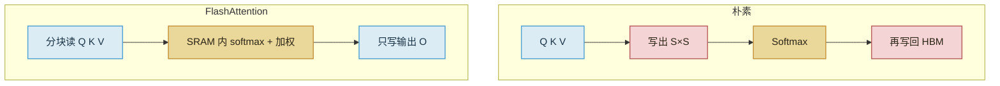

import ChapterMeta from "../../../components/ChapterMeta.astro";

<ChapterMeta
  section="3.5"
  difficulty={3}
  readingTime={18}
  prev={{ href: "/03-gpu/04-decode-memory-bound/", title: "Decode 为什么容易 Memory Bound" }}
  next={{ href: "/03-gpu/06-paged-vs-flash/", title: "和 PagedAttention 的分工" }}
/>

## 本章目标

本章解决的问题：**标准 Attention 慢，慢在多算了，还是多写了一次显存？**

读完应能：指出 $S\times S$ 矩阵不该成为 HBM 上的居民；用一句话概括 FlashAttention 的分块；列出它**不**负责的事（分页、调度、量化）。

---

## 1. 为什么需要这个东西

朴素实现：

1. 算 $S\times S$ 的 $QK^\top$ 并**写出**；
2. Softmax 再读再写；
3. 乘 $V$ 再读。

教学尺寸 $B=4,H=32,S=1024$，分数张量是 $4\times 32\times 1024\times 1024$ 个元素。FP32 累加时约 0.5 GiB **中间结果**，还没算更长的上下文。这些数据只活在这一层注意力里，却在 HBM 上走了一个来回。

Dao et al., 2022, *FlashAttention* 的核心不是新的数学公式，而是：**在 SRAM 里分块完成 Softmax 和加权，不把完整分数矩阵写回 HBM。**

:::tip[💡 核心概念]
FlashAttention 减少的是 Attention **中间矩阵**的 HBM 读写。它不把 KV Cache 从公式里删掉。
:::

---

## 2. 核心概念

**精确 Softmax 的障碍。** Softmax 要知道整行的最大值和指数和。分块算法用在线（online）统计量，一块一块更新，最终与一次性 Softmax 等价（在浮点误差范围内）。

**IO 复杂度。** 标准实现的 HBM 流量随 $S^2$ 涨。FlashAttention 把 $S^2$ 项留在片上，HBM 流量更接近读 $Q,K,V$ 和写输出。长 Prefill 受益最大。Decode 的 $Q$ 长度是 1，分数只是一行，收益相对 Prefill 小，但实现仍常走同一套 kernel。

本书不实现 Triton kernel（第七篇才写“能讲明白的 Attention”）。这里只要求能指认：省下的是哪一跳。

---

## 3. 工作原理

后续版本（FlashAttention-2/3）改的是并行切法和新硬件上的指令，目标仍是这一跳。引用时写论文或库版本，不要说“FlashAttention 等于 vLLM”。

---

## 4. 它不解决什么

| 问题 | 谁解决 |
| --- | --- |
| 按最大长度预留 KV 造成空洞 | Paged KV（4.5 / 第五篇） |
| 多人请求怎么组 batch | Scheduler（第四篇） |
| 权重 / KV 位数太多 | 量化（第八篇） |
| 一张卡放不下权重 | 多卡（第九篇） |

FlashAttention 是 **计算核**。PagedAttention 是 **KV 怎么寻址**。下一节对照。

---

## 5. 常见误区

1. **“FlashAttention 不需要 KV Cache。”** 仍需要 K/V；只是算注意力时不物化 $S\times S$。
2. **“它让 70B 的 2.5 GiB 变小。”** 不。那是 $H_{kv}$ 和 $S$ 的乘积。
3. **“不用 FlashAttention 就是算法错了。”** 教学 NumPy 为了可读会物化分数。那是教学，不是生产默认。

---

## 6. 本章小结

1. 朴素 Attention 把 $S\times S$ 写进 HBM。
2. FlashAttention 在片上分块，数学等价，IO 更少。
3. 它不管分页和调度。
4. 下一节：计算核和管理器不要叫成同一个东西。
