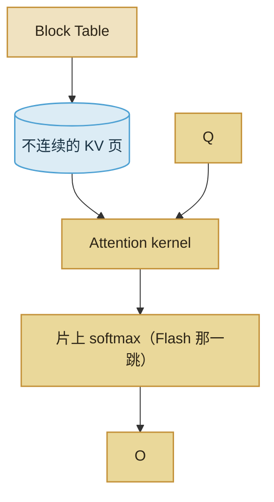

import ChapterMeta from "../../../components/ChapterMeta.astro";

<ChapterMeta
  section="3.6"
  difficulty={3}
  readingTime={14}
  prev={{ href: "/03-gpu/05-flashattention/", title: "FlashAttention 减少的是哪一次写回" }}
  next={{ href: "/04-batching-scheduler/01-static-batch/", title: "静态 batch 如何让短请求买单" }}
/>

## 本章目标

本章解决的问题：**两个带 Attention 的名字，到底谁管算、谁管存？**

读完应能：用一句话分开两者；说明可以同时存在；知道分页的细节在第四篇，Mini-vLLM 只做分配器、不做 CUDA kernel。

---

## 1. 为什么需要这个东西

资料里两个词经常连着出现，读者容易合成“一种更快的注意力”。合成之后，选型、读论文、读 vLLM 模块名都会错位。

:::tip[💡 核心概念]
FlashAttention：怎样算 Attention，少写 $S\times S$。PagedAttention：KV 按块存放，用块表间接寻址。一个是计算，一个是显存管理。
:::

---

## 2. 核心概念

| | FlashAttention | PagedAttention |
| --- | --- | --- |
| 要消灭的浪费 | 中间分数矩阵的 HBM IO | 按 `max_seq_len` 预留造成的空洞 |
| 主要改谁 | Attention kernel | KV 布局 + 读 KV 的 kernel / gather |
| 公式变了吗 | Softmax 仍等价 | $QK^\top$ 仍是那一句，只是 K/V 不连续 |
| 本书出现 | 3.5 | 4.5，第五篇用 NumPy 模拟分配 |

生产系统里两者常叠在一起：块表指出 K/V 在哪些页，Flash 风格的 kernel 按页读进片上再算。叠在一起不等于同一个发明。

Kwon et al., 2023, *Efficient Memory Management for Large Language Model Serving with PagedAttention* 讲的是分页。Dao et al., 2022 讲的是 Flash。读 issue 时看作者在改哪一层。

---

## 3. 工作原理

Mini-vLLM 把页 **gather 成稠密张量** 再算。这是为了让 Block Table 可见，不是在教 PagedAttention CUDA kernel。第七篇才碰间接层怎么进 kernel。

---

## 4. 常见误区

1. **“上了 Flash 就不用分页。”** 中间矩阵省了，按最大长度预留的 KV 空洞还在。
2. **“上了分页就不需要 Flash。”** 分页不自动取消 $S\times S$ 写回。
3. **“PagedAttention 是另一种 GQA。”** GQA 是模型头数；分页是分配器。

---

## 5. 本章小结

1. Flash = 计算 IO；Paged = KV 布局。
2. 第三篇从“卡上有什么”走到“一次 forward 和两种 Attention 名字”。
3. 下一篇：许多人同时来时，怎样组 batch、怎样切块、怎样分页。
