import ChapterMeta from "../../../components/ChapterMeta.astro";

<ChapterMeta
  section="4.1"
  difficulty={2}
  readingTime={14}
  prev={{ href: "/03-gpu/06-paged-vs-flash/", title: "和 PagedAttention 的分工" }}
  next={{ href: "/04-batching-scheduler/02-continuous-batching/", title: "Continuous Batching" }}
/>

## 本章目标

本章解决的问题：**把几个请求绑成一组一起算，为什么短的那个反而更慢？**

读完应能：指出两种浪费（pad 与空等）；用 `static_pad_tokens` / `static_wait_steps` 算出数字；知道这不是模型质量问题。

---

## 1. 为什么需要这个东西

训练常用固定长 batch：大家 pad 到同一长度，一起步进。推理若照搬：

- Prompt 8 / 32 / 4 要对齐到 32，白算 24+28 个 pad 位置。
- 回答 4 / 16 / 8 步时，先写完的请求仍占着 batch 位，直到第 16 步。

短请求在给长请求**买单**：多付计算，多付排队，多付 KV 预留（若按 max_len 分配）。

:::tip[💡 核心概念]
静态 batch 以最慢、最长的那条请求为时钟。其他人的 GPU 时间跟着它走。
:::

---

## 2. 核心概念

```mermaid
gantt
  title 静态 Decode：三人必须同时结束
  dateFormat X
  axisFormat %s
  section 请求 A
  有效 :a1, 0, 4
  空等 :a2, 4, 16
  section 请求 B
  有效 :b1, 0, 16
  section 请求 C
  有效 :c1, 0, 8
  空等 :c2, 8, 16
```



槽位步数：静态 $16\times 3=48$，各走各的则 $4+16+8=28$。省下的 20 步就是下一节 Continuous Batching 要回收的东西。

---

## 3. 代码实现

`examples/ch04/static_vs_continuous.py`：

```bash
python3 examples/ch04/static_vs_continuous.py
```

应打印 pad 52（对 Prompt 8/32/4）、wait `[12,0,8]`、slot 48 vs 28。

教学脚本不启动 GPU。它只让“买单”变成整数。

---

## 4. 常见误区

1. **“batch 越大一定越好。”** 静态大 batch 可能把 TTFT 和短请求延迟一起打爆。
2. **“pad 只浪费一点存储。”** Decode 空等浪费的是整步 forward。
3. **“这是 Tokenizer 的问题。”** 不是。是调度把异质长度绑死了。

---

## 5. 本章小结

1. 静态 batch 有 pad 空洞和结束时间空洞。
2. 短请求为长请求付 GPU 时间。
3. 下一节：每一步重新组一次 batch。
