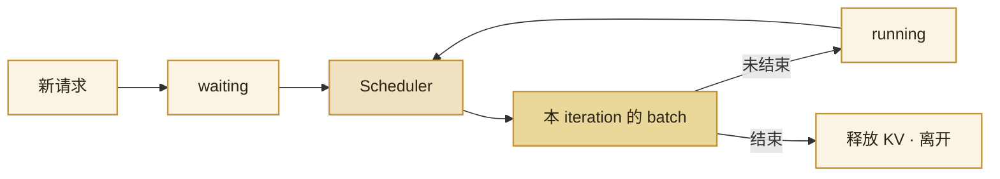

import ChapterMeta from "../../../components/ChapterMeta.astro";

<ChapterMeta
  section="4.2"
  difficulty={3}
  readingTime={16}
  prev={{ href: "/04-batching-scheduler/01-static-batch/", title: "静态 batch 如何让短请求买单" }}
  next={{ href: "/04-batching-scheduler/03-chunked-prefill/", title: "Chunked Prefill" }}
/>

## 本章目标

本章解决的问题：**能不能让 batch 的成员每一步都变？**

读完应能：画出 iteration 级加入/离开；说明 Decode 中插入新 Prefill 会伤害已在打字的人的 TPOT；知道 Mini-vLLM 用“有 waiting 先 Prefill，否则 Decode”演示这一点。

---

## 1. 为什么需要这个东西

Orca（Yu et al., 2022）把推理 batch 的时钟从“整段 sequence”改成“一次 iteration”。写完的请求当步离开，槽位下一步就能给别人。这就是 Continuous Batching（连续组批 / iteration-level scheduling）。

没有它，服务要么按静态 batch 空等，要么退化成一次只跑一个请求——权重每步只服务一个人，Decode 更 Memory Bound。

:::tip[💡 核心概念]
Continuous Batching 改变的是**谁在这一 iteration 里**，不是 Attention 公式。
:::

---

## 2. 工作原理

每一步：

1. 看有没有写完的人 → 离开、释放 KV。
2. 看有没有新人 → 在额度内加入。
3. 对还在场的人各做一步 Decode，或先做 Prefill。

生产引擎还能把 Prefill 和 Decode **混在一个 kernel**（hybrid）。Mini-vLLM **故意不混**：有 waiting 就整步 Prefill，否则整步 Decode。这样两段活在日志里分得开。混核是工程，不是另一套数学。

---

## 3. 和静态对照

同一组 Decode 长度 4 / 16 / 8：连续组批占用 28 个槽位步，静态 48。新人不必等当前这批全部写完才能开始 Prefill——这会改善队列里的 TTFT，同时可能推迟已经在 Decode 的人（抢带宽和步数）。调度策略在 4.4。

---

## 4. 常见误区

1. **“Continuous = 无限并发。”** 仍受 `max_num_seqs` 和 KV 块数限制。
2. **“这就是流式输出。”** 流式是每步把 token 发出去。连续组批是 GPU 上换人。可以同时有，不是一件事。
3. **“Orca / vLLM 源码必须长这样。”** 思想是 iteration 级成员变更。实现细节各不相同。

---

## 5. 本章小结

1. Batch 成员按 iteration 进出。
2. 短请求写完就离开，不再为空等付账。
3. 插入 Prefill 会占用本可给 Decode 的一步。
4. 下一节：Prompt 太长时，连 Prefill 自己也要切开。
