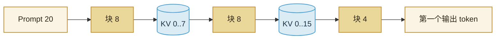

import ChapterMeta from "../../../components/ChapterMeta.astro";

<ChapterMeta
  section="4.3"
  difficulty={3}
  readingTime={14}
  prev={{ href: "/04-batching-scheduler/02-continuous-batching/", title: "Continuous Batching" }}
  next={{ href: "/04-batching-scheduler/04-scheduler/", title: "Scheduler：这一轮算谁" }}
/>

## 本章目标

本章解决的问题：**一段 8K Prompt 的 Prefill 会不会把正在打字的其他人卡住很久？**

读完应能：解释 token budget；把长度 20、预算 8 切成 `[8,8,4]`；说明切块不改变最终 K/V，只改变调度粒度。

---

## 1. 为什么需要这个东西

Prefill 的注意力是 $S\times S$ 量级，又偏向算力。一个 8K Prompt 可能独占许多毫秒。若调度只能“整段或没有”，正在 Decode 的请求会集体停住——他们的 TPOT 出现尖刺，TTFT 的改善也只惠及这一个新人。

Chunked Prefill：一次最多算 `max_prefill_tokens` 个新 Prompt token。剩下的下次再来。中间 K/V 已经写入的前缀可以留下。

:::tip[💡 核心概念]
切块改的是**调度量子**，不是模型对 Prompt 的定义。整段读完之前，不要把中间 logits 当成回答。
:::

---

## 2. 工作原理

第 $k$ 块的 $Q$ 长度等于本块，$K/V$ 长度等于前缀 + 本块。因果掩码仍然成立。Mini-vLLM 用 `Request.prompt_computed` 记下已经走完的前缀。

`chunk_plan(20, 8) == [8, 8, 4]`，见 `examples/ch04/static_vs_continuous.py`。

---

## 3. 和 TTFT / TPOT

切得越碎：

- 其他 Decode 请求越容易插空（TPOT 尖刺小）；
- 这个新人的 TTFT 可能变差（中间夹了别人的 Decode）。

预算是策略，不是常数真理。生产引擎还有“优先 Decode”或“优先把某个 Prefill 收尾”的开关。第五篇的教学调度固定为：有未完成 Prefill 就先走 Prefill 块。

---

## 4. 常见误区

1. **“切块等于丢失前文。”** 前文的 K/V 还在。
2. **“每块都采样一个用户可见 token。”** 只有 Prompt 走完才采样第一个回答。
3. **“chunk size = block size。”** 一个是调度预算，一个是 KV 页大小。可以碰巧相等，不是定义。

---

## 5. 本章小结

1. Token budget 把长 Prefill 切成可插入的步。
2. 数学仍是带前缀 KV 的 Prefill。
3. 碎与整是 TTFT / TPOT 的权衡。
4. 下一节：谁来决定这一轮的名单和 token 数。
