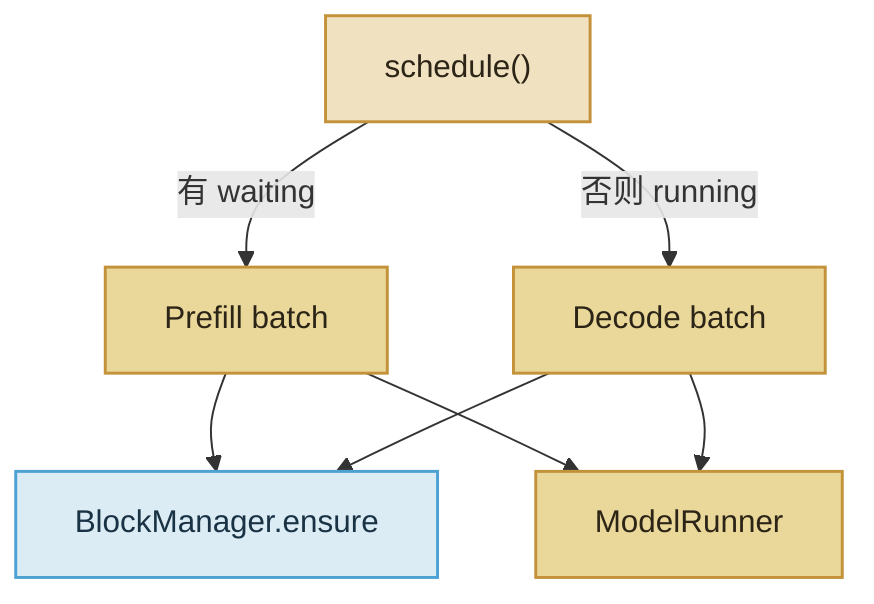

import ChapterMeta from "../../../components/ChapterMeta.astro";

<ChapterMeta
  section="4.4"
  difficulty={3}
  readingTime={16}
  prev={{ href: "/04-batching-scheduler/03-chunked-prefill/", title: "Chunked Prefill" }}
  next={{ href: "/04-batching-scheduler/05-paged-kv/", title: "Paged KV" }}
/>

## 本章目标

本章解决的问题：**引擎每一步怎样列出“现在算这些人、每人算几个 token”？**

读完应能：说出 Scheduler 的输入输出；解释 FCFS、序列上限、KV 不够时的拒绝/等待；标明教学策略不是 vLLM 的默认策略。

---

## 1. 为什么需要这个东西

没有 Scheduler，Continuous Batching 只是口号。真正要落地的是每一步的一张表：

- 哪些请求做 Prefill，各做多长一块；
- 哪些请求做 Decode（通常各 1 个 token）；
- 哪些请求因 KV 或并发上限留下一轮。

这张表在 CPU 上算，必须比 GPU 一步还快，否则自己变成瓶颈。

:::tip[💡 核心概念]
Scheduler 输出的是本 iteration 的工作集，不是最终文本。文本是 ModelRunner + Sampler 之后才有的。
:::

---

## 2. 核心概念

教学引擎里 Scheduler 看见：

| 输入 | 含义 |
| --- | --- |
| `waiting` | 还没读完 Prompt，或刚进来 |
| `running` | Prompt 已读完，正在写 |
| `max_num_seqs` | 同时占着 KV 的请求上限 |
| `max_prefill_tokens` | 本步 Prefill token 预算 |
| 空闲块数 | 能不能 `ensure` 新页 |

Mini-vLLM 策略（`mini_vllm/scheduler.py`）：

1. `waiting` 非空且能分配 → 组一个 **Prefill** batch（FCFS，切块）。
2. 否则对 `running` 组一个 **Decode** batch。
3. 写完的请求 `free` 块，从 running 消失。

这是为了让 2.1 / 2.2 的两段活在引擎里仍分得开。vLLM V1 的 Scheduler 还要处理抢占、优先级、Prefix Cache、混合 batch，第六篇再对照。

---

## 3. 工作原理

KV 不够：教学实现把请求留在队列，不抛异常给用户层（Engine 会空转直到有人结束）。生产系统还要有拒绝、抢占、KV 换出，见 4.6。

---

## 4. 常见误区

1. **“Scheduler 在 GPU 上。”** 决策在 CPU。GPU 只看见组好的 batch。
2. **“FCFS 一定公平。”** 长 Prefill 仍可能堵住后面的短请求；所以才要切块和抢占。
3. **“教学调度 = vLLM。”** 身份写在模块注释里。对照时列差异，不要抄函数名当源码。

---

## 5. 本章小结

1. Scheduler 每步选出人与 token 数。
2. 教学策略：先 Prefill 块，再 Decode；FCFS；受块数和并发上限约束。
3. 下一节：它申请的“块”在内存里长什么样。
