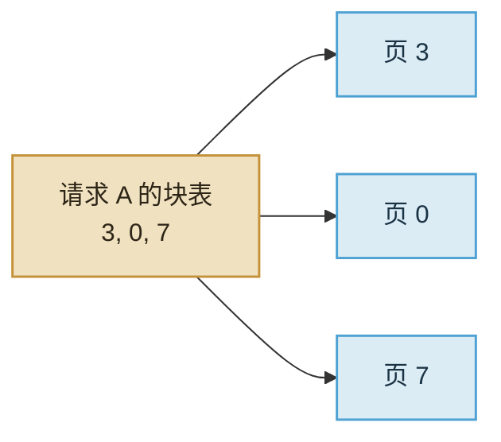

import ChapterMeta from "../../../components/ChapterMeta.astro";

<ChapterMeta
  section="4.5"
  difficulty={3}
  readingTime={16}
  prev={{ href: "/04-batching-scheduler/04-scheduler/", title: "Scheduler：这一轮算谁" }}
  next={{ href: "/04-batching-scheduler/06-prefix-preempt/", title: "Prefix Cache、抢占与拒绝" }}
/>

## 本章目标

本章解决的问题：**为什么按 `max_model_len` 给每个请求预留一整条 KV，会把卡“假装用满”？**

读完应能：画出块表；解释实际占用按**当前长度**向上取整到块；区分分页分配器和 PagedAttention kernel。

---

## 1. 为什么需要这个东西

静态预留：每个并发请求都按最大上下文申请。8 路、最大 8K，按 70B 公式是 $8\times 2.5=20$ GiB，即使实际平均只有 1K。空洞来自“预约了没用到的位置”，不是公式算错。

分页：把 KV 切成固定长度的 **block**（页）。请求只拿它现在需要的页，长度增长再 `grow`。思想来自操作系统的虚拟内存（Kwon et al., 2023）。

:::tip[💡 核心概念]
Block Table 是逻辑位置 → 物理页号的数组。Attention 要的是逻辑上连续的 K/V；物理上可以不连续。
:::

---

## 2. 核心概念

| 词 | 教学含义 |
| --- | --- |
| `block_size` | 一页装多少 token 的 K/V |
| `num_blocks` | 池子里一共几页 |
| `block_ids` | 这个请求的页号列表，即块表 |
| `blocks_for(S)` | $\lceil S / \mathrm{block\_size}\rceil$ |

内部碎片：一页没用满。比“整条 8K 预留”小一个数量级。`block_size` 太大碎得少但回收粗，太小则表长、间接层重。

Mini-vLLM 的池子是 `k,v` 数组，形状 `[num_blocks, block_size, hidden]`。`write` / `gather` 用 `divmod(index, block_size)`。这是分配器。它 **gather 成稠密张量** 再算 Attention，所以不是 CUDA 上的 PagedAttention kernel。

---

## 3. 工作原理



请求结束：`free` 把页号放回 `free_ids`，内容清零。下一请求可以拿到同一组物理页。Prefix Cache 会**不**立即释放被共享的前缀页，见下一节。

---

## 4. 代码实现

```bash
python3 -m unittest tests.test_mini_vllm.BlockManagerTests -v
```

`write` 再 `gather` 必须还原。这是分页的正确性断言：切块存放不能改数值。

---

## 5. 常见误区

1. **“分页减少了 2.5 GiB 这个理论值。”** 理论值按真实 $S$ 算。分页减少的是**预留空洞**。
2. **“block_size=1 最好。”** 表和间接层会变贵。
3. **“这就是 FlashAttention。”** 3.6 已经分开。

---

## 6. 本章小结

1. 按当前长度拿页，不按最大长度预留整条。
2. 块表做逻辑到物理的映射。
3. 教学实现用 gather 保正确，不冒充生产 kernel。
4. 下一节：前缀复用，以及人满了怎么办。
