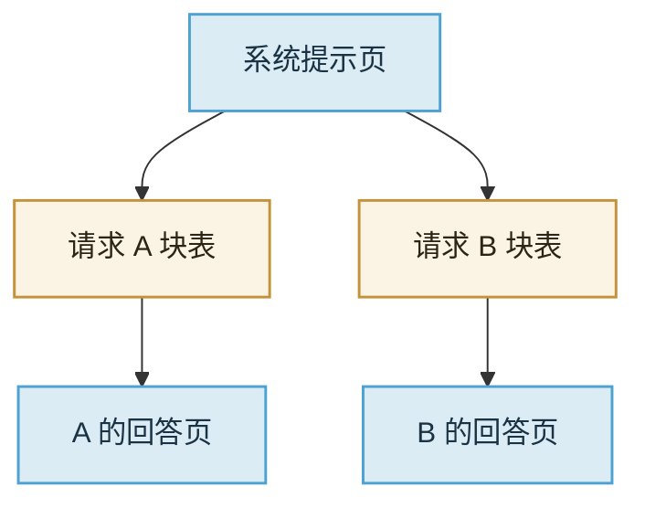

import ChapterMeta from "../../../components/ChapterMeta.astro";

<ChapterMeta
  section="4.6"
  difficulty={3}
  readingTime={16}
  prev={{ href: "/04-batching-scheduler/05-paged-kv/", title: "Paged KV" }}
  next={{ href: "/05-mini-vllm/01-five-blocks/", title: "最小引擎的五块" }}
/>

## 本章目标

本章解决的问题：**系统提示相同的一千个请求，KV 为什么不该存一千份？人满了又该踢谁？**

读完应能：说明前缀共享的条件；区分抢占、换出、拒绝；知道 Mini-vLLM **没有**实现这三项，只在队列里等待空页。

---

## 1. 为什么需要这个东西

同一条系统提示、同一段检索文档、多轮对话里尚未改动的历史，K/V 是相同的。分页让“同一页被多张块表指着”变得自然：引用计数 > 0 就不回收。这是 Prefix Cache（前缀缓存 / 自动前缀复用）。

另一面：页用完时必须有政策。否则新请求无限排队，或引擎死锁在 `can_cover == False`。

:::tip[💡 核心概念]
前缀能共享，当且仅当 token 序列的前缀**逐 id 相同**，并且层、精度、RoPE、LoRA 等计算身份相同。字符串像不等于 KV 能复用。
:::

---

## 2. 核心概念

| 政策 | 做什么 | 用户看见 |
| --- | --- | --- |
| Prefix Cache | 共享只读前缀页 | TTFT 下降（少做一段 Prefill） |
| 等待 | 留在 waiting | 延迟涨 |
| 拒绝 | 立刻失败 | 4xx/429，需重试 |
| 抢占 | 把某个 running 踢回 waiting，释放它的**后缀**页 | 该请求 TPOT 中断，可能重算 Decode |
| 换出 | 把 KV 写到 CPU / 盘再读回 | 延迟尖刺，容量假变大 |

教学引擎只做**等待**：页不够就本步不收这个人。死锁可能发生在“所有 running 也不能 grow”——第五篇会标出来，当作已知缺口，而不是悄悄当成 vLLM。

---

## 3. 工作原理

A 结束：只回收 A 的回答页。系统提示页若 B 还在用，留下。B 的 Prompt Prefill 可以从分叉点接着算。

多轮对话里，用户新说的一句话是新后缀；旧轮次的 KV 可以留作前缀。编辑中间历史则从编辑点作废——回到 2.4 的失效规则。

---

## 4. 常见误区

1. **“Prefix Cache 是磁盘上的提示词模板。”** 它是 GPU 上的 KV 页共享。
2. **“抢占就是取消。”** 取消丢请求；抢占还想稍后继续，通常要重算被丢掉的后缀。
3. **“拒绝不礼貌所以永远排队。”** 队列无限等于超时。SLA 里拒绝是一种保护。

---

## 5. 本章小结

1. 相同计算身份的前缀可以共享 KV 页。
2. 满员时要在等待、拒绝、抢占、换出里选。
3. Mini-vLLM 只等待，缺口写进第五篇。
4. 第四篇结束。下一篇把这些块收成能跑的教学引擎。
