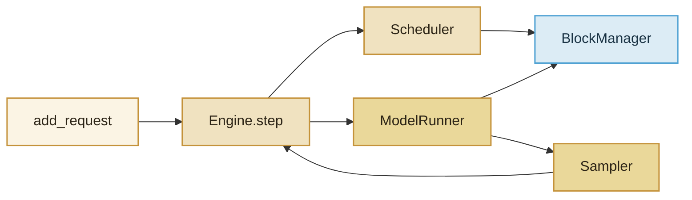

import ChapterMeta from "../../../components/ChapterMeta.astro";

<ChapterMeta
  section="5.1"
  difficulty={2}
  readingTime={14}
  prev={{ href: "/04-batching-scheduler/06-prefix-preempt/", title: "Prefix Cache、抢占与拒绝" }}
  next={{ href: "/05-mini-vllm/02-request/", title: "Request：一条生成的状态" }}
/>

## 本章目标

本章解决的问题：**前面四篇的名词怎样收成一个能 `generate()` 的程序？**

读完应能：按数据流列出五块；说明 Engine 只编排、不算矩阵；复述身份约定。

---

## 1. 身份

`mini-vllm/` 是 **NumPy 教学引擎**。它证明第四篇的调度和分页可以在几十行里跑通。它：

- **不是** vLLM、不是 SGLang、不是 TensorRT-LLM；
- **不是** Hugging Face `generate`；
- **没有** CUDA、CUDA Graph、Prefix Cache、抢占、真实词表或多卡。

对照生产系统时写“教学块 ↔ 生产职责”，不要写“这就是 `vllm/engine` 的源码”。

:::tip[💡 核心概念]
五块：Engine 编排；Scheduler 点名；BlockManager 发页；ModelRunner 做前向；Sampler 把 logits 变成 id。
:::

---

## 2. 工作原理



主循环就是一句人话：

**schedule → execute → sample → 更新请求状态。**

`Engine.generate` 把这个循环转到请求结束。`generate_batch` 先把多人放进 waiting，再转同一循环——Continuous Batching 从这里开始存在，而不是另写一套引擎。

---

## 3. 代码实现

入口：`mini_vllm.Engine`。包路径 `mini-vllm/mini_vllm/`。

```python
from mini_vllm import Engine
print(Engine(seed=0).generate([1, 3, 4], max_new_tokens=4))
```

```bash
PYTHONPATH=mini-vllm python3 -m mini_vllm.engine
python3 -m unittest tests.test_mini_vllm -v
```

---

## 4. 本章小结

1. 五块各管一件事，Engine 不兼做 GEMM。
2. 一步 = 调度 + 执行 + 采样。
3. 身份必须写在嘴里：教学引擎。
4. 下一节：一条请求在里面长什么样。
