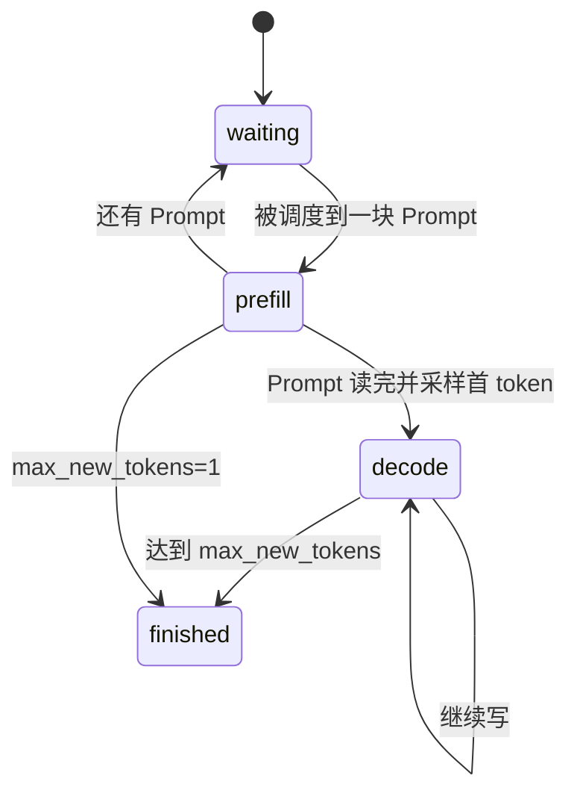

import ChapterMeta from "../../../components/ChapterMeta.astro";

<ChapterMeta
  section="5.2"
  difficulty={2}
  readingTime={14}
  prev={{ href: "/05-mini-vllm/01-five-blocks/", title: "最小引擎的五块" }}
  next={{ href: "/05-mini-vllm/03-scheduler/", title: "Scheduler：选出这一 iteration" }}
/>

## 本章目标

本章解决的问题：**引擎眼里的“一个用户请求”除了 Prompt，还要带哪些活状态？**

读完应能：列出 `Request` 字段；解释切块 Prefill 时 `prompt_computed` 为什么必要；分清“已采样的输出”和“已写入的 KV”。

---

## 1. 核心概念

`mini_vllm.request.Request` 不是 HTTP 对象。它是生成期状态。

| 字段 | 作用 |
| --- | --- |
| `prompt_ids` | 已分好词的 Prompt，不再变 |
| `output_ids` | 已经采样出的回答 |
| `max_new_tokens` | 结束条件（教学里只这一个；无 stop id） |
| `status` | waiting / prefill / decode / finished |
| `block_ids` | 这块请求的 KV 页表 |
| `prompt_computed` | Prompt 里已经做过 Prefill 的长度 |
| `prompt_chunk` | 本步打算再吃多长一块 |

`seq_len = len(prompt)+len(output)`。`kv_written` 比它少 1——因为刚采样出、还没 Decode 的那个 token 还没有 K/V。搞混这两个数，gather 会读到一页零。

:::tip[💡 核心概念]
Request 同时是进度条（算到哪）和资源句柄（占了哪些页）。
:::

---

## 2. 工作原理

结束时 Scheduler 调用 `BlockManager.free`。页回到池子，`block_ids` 清空。测试 `test_finished_request_releases_blocks` 断言池子大小回到原值。

---

## 3. 常见误区

1. **“output_ids 的长度等于 KV 长度。”** 差一个待写位置。
2. **“status=running 就够了。”** 教学里拆成 prefill/decode，是为了和 2.1 / 2.2 对上。
3. **“这是 vLLM 的 Request 枚举。”** 生产状态机更细，名字不要对号入座。

---

## 4. 本章小结

1. 请求 = 文本进度 + 页表 + 状态。
2. `prompt_computed` 让切块 Prefill 可恢复。
3. 下一节：谁根据这些字段点名。
